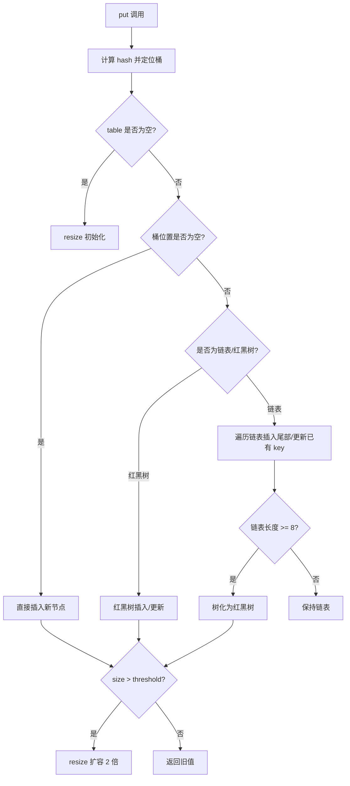
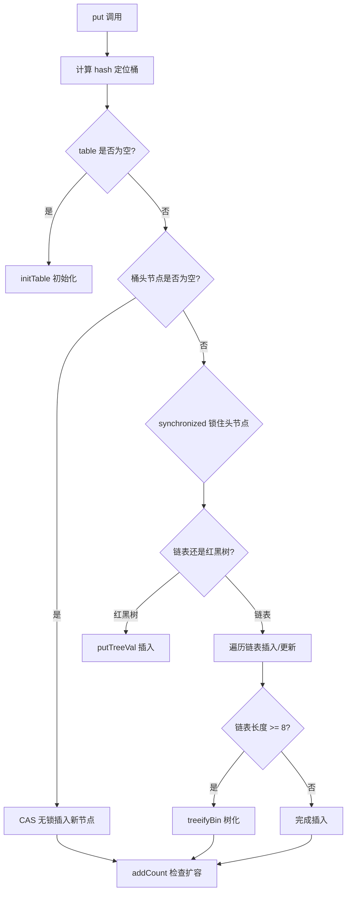

# Java 容器面试二

## Map

### 【简单】什么是 Hash 碰撞？如何解决 Hash 碰撞？⭐⭐⭐

**Hash 碰撞**是指：不同 key 经哈希函数计算后，得到相同结果。

Hash 碰撞解决方案：

- **开放寻址法**：碰撞时，按规则（如线性探测）寻找下一个空位存放。
- **链式地址法**：每个哈希桶存放链表，冲突元素追加到链表。

关键优化：

- **优秀哈希函数**：均匀分布，减少碰撞
- **动态扩容**：元素过多时，动态扩容
- **链表转树**：链表过长时转为红黑树（如Java HashMap）

### 【中等】HashMap 和 Hashtable 有什么区别？⭐⭐⭐

`HashMap` 更高效且灵活，`Hashtable` 线程安全但过时，推荐用 `ConcurrentHashMap` 替代。

| **对比项**         | **HashMap** (JDK 1.2+)                      | **Hashtable** (JDK 1.0)                   |
| ------------------ | ------------------------------------------- | ----------------------------------------- |
| **线程安全**       | ❌ 非线程安全（需额外同步）                 | ✔️ 线程安全（方法用 `synchronized` 修饰） |
| **性能**           | ⚡ 更高（无锁竞争）                         | ⏳ 较低（同步开销）                       |
| **Null 键/值**     | ✔️ 允许 `null` 键和值                       | ❌ 不允许 `null`                          |
| **迭代器**         | **`fail-fast`**（快速失败，并发修改抛异常） | **`enumerator`**（不抛异常）              |
| **继承体系**       | 继承 `AbstractMap`                          | 继承 `Dictionary`（已过时）               |
| **初始容量与扩容** | 默认 16，扩容为 2 倍                        | 默认 11，扩容为 2 倍 + 1                  |
| **哈希冲突解决**   | 链表 + 红黑树（JDK 8+）                     | 仅链表                                    |

**使用建议**：

- **优先用 `HashMap`**：大多数场景（性能更好），搭配 `Collections.synchronizedMap()` 或 `ConcurrentHashMap` 实现线程安全。
- **`Hashtable` 适用场景**：遗留系统兼容，或需要简单线程安全且不介意性能损耗时（现代开发已少用）。

### 【中等】对比一下 HashMap 和 HashSet？⭐⭐⭐

- `HashMap` 是 **键值对容器**，适合快速键值查询。
- `HashSet` 是 **唯一元素集合**，基于 `HashMap` 实现，仅关注元素是否存在。

**核心区别**

| **特性**      | **HashMap**                         | **HashSet**                                |
| ------------- | ----------------------------------- | ------------------------------------------ |
| **数据结构**  | 哈希表（键值对存储）                | 基于 `HashMap`（仅用键，值固定为虚拟对象） |
| **存储内容**  | 键（Key） + 值（Value）             | 仅存储元素（Key）                          |
| **重复规则**  | **Key 不可重复**（Value 可重复）    | **元素（Key）不可重复**                    |
| **Null 支持** | 允许 1 个 `null` 键和多个 `null` 值 | 允许 1 个 `null` 元素                      |

**常用方法对比**

| **操作**     | **HashMap**          | **HashSet**                       |
| ------------ | -------------------- | --------------------------------- |
| **添加元素** | `put(key, value)`    | `add(element)`                    |
| **查询元素** | `get(key)`（返回值） | `contains(element)`（返回布尔值） |
| **删除元素** | `remove(key)`        | `remove(element)`                 |

**底层机制**

`HashSet` 内部直接使用 `HashMap` 实现，元素作为 `Key`，值固定为一个虚拟的 `PRESENT` 对象（占位符）。

两者均依赖哈希表，平均时间复杂度为 `O(1)`（冲突时可能退化为 `O(n)`）。

```java
// HashSet 的简化实现（本质是 HashMap 的包装）
public class HashSet<E> {
    private HashMap<E, Object> map;  // 键存储元素，值固定为 PRESENT
    private static final Object PRESENT = new Object();
    public boolean add(E e) {
        return map.put(e, PRESENT) == null;  // 若 Key 已存在，返回 false
    }
}
```

**使用场景**

- **`HashMap`**：需通过键快速访问值的场景（如缓存、数据库索引）。 示例：`用户 ID → 用户详细信息`。
- **`HashSet`**： 需存储唯一元素的集合（如去重、黑名单）。示例：`IP 黑名单`、`单词去重`。

### 【中等】HashMap、TreeMap、LinkedHashMap 有什么区别？⭐⭐⭐⭐

**核心特性**

| **特性**       | **HashMap**                     | **TreeMap**                        | **LinkedHashMap**             |
| -------------- | ------------------------------- | ---------------------------------- | ----------------------------- |
| **底层结构**   | 哈希表（数组+链表/红黑树）      | 红黑树（平衡二叉搜索树）           | 哈希表 + 双向链表             |
| **顺序性**     | 无序                            | 按键的自然顺序或自定义顺序排序     | 保持插入顺序或访问顺序（LRU） |
| **null 支持**  | 允许 1 个 null 键和多个 null 值 | 不允许 null 键（除非自定义比较器） | 同 HashMap                    |
| **线程安全**   | 非线程安全                      | 非线程安全                         | 非线程安全                    |
| **时间复杂度** | 平均 O(1)                       | 增删查 O(log n)                    | 平均 O(1)                     |

**排序与顺序**

- **HashMap**：完全无序，迭代顺序不可预测。
- **TreeMap**：默认按键的自然顺序排序（Key 需实现`Comparable`）。可通过`Comparator`自定义排序规则。
- **LinkedHashMap**：默认保持**插入顺序**。可配置为**访问顺序**（最近最少使用 LRU）。

**使用场景**

- **HashMap**：
  - 需要最高效的查找、插入和删除操作。
  - 不关心元素的顺序。
  - 示例：缓存、快速查找表。
- **TreeMap**：
  - 需要元素按键排序。
  - 需要范围查询（如`subMap()`、`headMap()`、`tailMap()`）。
  - 示例：字典、有序事件调度。
- **LinkedHashMap**：
  - 需要保持插入顺序或实现 LRU 缓存。
  - 示例：记录访问顺序的缓存、需要按插入顺序迭代的场景。

**性能对比**

| **操作**     | **HashMap** | **TreeMap** | **LinkedHashMap** |
| ------------ | ----------- | ----------- | ----------------- |
| **插入**     | O(1)        | O(log n)    | O(1)              |
| **删除**     | O(1)        | O(log n)    | O(1)              |
| **查找**     | O(1)        | O(log n)    | O(1)              |
| **迭代顺序** | 无序        | 有序（Key） | 插入/访问顺序     |

**选择依据**

- 要**速度**：选`HashMap`。
- 要**排序**：选`TreeMap`。
- 要**顺序**（插入或访问顺序）：选`LinkedHashMap`。

**扩展**

- `LinkedHashMap`可通过`accessOrder`参数实现 LRU 缓存。
- `TreeMap`支持丰富的导航方法（如`ceilingKey()`、`floorKey()`）。

### 【困难】HashMap 底层实现原理是什么？⭐⭐⭐⭐⭐

HashMap 通过哈希函数定位桶，用链表和红黑树解决冲突，动态扩容平衡性能，但非线程安全。

**数据结构**

HashMap 的数据结构是：**JDK 8 以前，数组 + 链表** ；**JDK 8 及以后，数组 + 链表 或 数组 + 红黑树**

- **数组（桶）**：`Node<K,V>[] table`，初始长度默认为 `16`。
- **链表**：相同哈希值的元素组成链表，以解决哈希冲突（拉链地址法）。
- **红黑树**：当链表长度 ≥ 8 且数组长度 ≥ 64 时，链表转为红黑树（提升查询效率至 `O(log n)`）；当容量 < 6，由红黑树退化为链表。

**哈希计算**

- **计算桶索引**：

  ```java
  index = (table.length - 1) & hash;  // 等价于 hash % table.length，但更高效
  ```

- **扰动函数**：高位与低位异或，使哈希分布更均匀。

  ```java
  // JDK 8 的哈希扰动函数（减少碰撞）
  static final int hash(Object key) {
      int h;
      return (key == null) ? 0 : (h = key.hashCode()) ^ (h >>> 16);
  }
  ```

**解决哈希冲突**

- **拉链地址法**：冲突的键值对以链表形式存储在同一桶中。
- **红黑树优化**：长链表（≥8）转为红黑树，避免极端情况下性能退化至 `O(n)`。

**扩容机制（Rehash）**

- **触发条件**：当元素数量 > `容量 × 负载因子`（默认负载因子 0.75，容量 16 时阈值为 12）。
- **扩容操作**：
  - 新建 2 倍大小的数组（`newCap = oldCap << 1`）。
  - 重新计算键的索引位置（`newIndex = (newCap - 1) & hash`）。
  - **JDK 8 优化**：根据 hash & oldCap 是否为 1 来判断是否需要重计算 hash，不需要每个节点重新哈希计算。

**关键参数**

| **参数**                | **默认值**         | **说明**                                           |
| ----------------------- | ------------------ | -------------------------------------------------- |
| 初始容量                | 16                 | 必须为 2 的幂（方便位运算计算索引）。              |
| 负载因子（Load Factor） | 0.75               | 权衡空间与时间效率（过高增加冲突，过低浪费内存）。 |
| 树化阈值                | 8（链表 → 红黑树） | 需同时满足数组长度 ≥ 64，否则优先扩容。            |
| 退化阈值                | 6（红黑树 → 链表） | 扩容或删除节点时检查。                             |

> **📌 为什么负载因子是 0.75？** 这是基于**泊松分布**计算的结果。HashMap 源码注释中给出了数学推导：在负载因子为 0.75 时，哈希冲突导致单个桶中元素数达到 8 的概率约为 **0.00000006**（6 × 10⁻⁸），即几乎不可能发生。这是树化阈值设为 8 的数学依据——不是因为 8 是"大数"，而是因为 8 在 0.75 负载因子下是一个概率极小的事件边界。如果负载因子提升到 1.0，冲突概率激增；降低到 0.5，则浪费 50% 空间。0.75 是**空间换时间的帕累托最优解**。

**线程安全问题**

- **非线程安全**：多线程下可能导致：
  - **死循环**（JDK 7 头插法扩容时产生环形链表）。
  - **数据丢失**（并发插入覆盖节点）。
- **解决方案**：
  - 使用 `ConcurrentHashMap`。
  - 或通过 `Collections.synchronizedMap()` 包装。

**JDK 8 的优化**

- **链表 → 红黑树**：解决哈希攻击导致的性能退化。
- **尾插法**：扩容时保持链表顺序，避免环形链表。
- **高位掩码优化扩容**：减少哈希重计算开销。

**PUT 流程源码**



```java
final V putVal(int hash, K key, V value, boolean onlyIfAbsent) {
    Node<K,V>[] tab; Node<K,V> p; int n, i;
    // 1. 数组为空时初始化
    if ((tab = table) == null || (n = tab.length) == 0)
        n = (tab = resize()).length;
    // 2. 计算索引，若桶为空直接插入
    if ((p = tab[i = (n - 1) & hash]) == null)
        tab[i] = newNode(hash, key, value, null);
    else {
        // 3. 处理哈希冲突（链表/红黑树）
        // ...（省略冲突处理逻辑）
    }
    // 4. 检查扩容
    if (++size > threshold) resize();
}
```

### 【困难】JDK 1.8 对 HashMap 做了哪些改动？⭐⭐⭐⭐

- **底层结构优化**：
  - JDK 1.7，仅使用 **数组 + 链表** 的结构。当发生哈希冲突时，新元素会插入到链表的头部（头插法）。
  - JDK 1.8，使用 **数组 + 链表/红黑树** 的结构。链表长度超过一定阈值，会转换为红黑树。
    - **树化**：当**链表长度 ≥ 8 且数组长度 ≥ 64** 时，链表转为红黑树
    - **退化**：当红黑树节点数 ≤ 6 时，红黑树转为链表
- **插入元素方式改变**：**头插法改为尾插法**。
  - 头插法优点是无需遍历链表；
  - 缺点是逆序，在并发环境下，扩容时可能导致**循环链表**的问题，从而引发死循环。
- **rehash 优化**
  - JDK 1.7：扩容时，需重新计算每个键值对在新数组中的位置，然后使用头插法将它们转移到新数组中；
  - JDK 1.8：由于扩容时，容量总是原来的 2 倍，只需要根据最高位的值，即可判断元素的位置是否需要迁移。这样避免了重新计算全部 key 的哈希值。
- **哈希扰动因子**：
  - JDK 1.8 引入 `hash = (h = key.hashCode()) ^ (h >>> 16)`，将高 16 位与低 16 位异或，使 hash 分布更均匀，减少冲突。
  - JDK 1.7 的扰动更复杂（多次移位和按位与），JDK 1.8 简化为一次异或，性能更好。

### 【困难】HashMap 为什么线程不安全？⭐⭐⭐⭐

HashMap 在多线程环境下会出现：

- **JDK 7**：死循环 + 数据丢失（头插法导致）。
- **JDK 8+**：数据丢失 + 脏读（无死循环，但依然非线程安全）。
- **替代方案**：高并发场景始终优先选择 `ConcurrentHashMap`。

**一句话**：HashMap 的线程不安全源于非原子操作和并发修改冲突，多线程环境下必须使用同步机制。

**（1）并发修改导致数据丢失**

**问题场景（JDK 8+）**

- 两个线程同时执行 `put()`，计算出的 **桶索引相同**，且该位置为 `null`。
- **预期**：两个键值对都成功插入。
- **实际**：后一个线程的 `put` 可能覆盖前一个线程的写入，导致数据丢失。

示例代码（伪并发）：

```java
// 线程 1 和线程 2 同时执行：
if ((p = tab[i = (n - 1) & hash]) == null) {
    tab[i] = newNode(hash, key, value, null); // 可能被覆盖
}
```

**（2）JDK 7 扩容死循环问题**

**问题原因（仅 JDK 7）**

- 扩容时采用 **头插法** 迁移链表，多线程并发可能导致 **环形链表**。
- 后续调用 `get()` 或 `put()` 时，遍历链表进入死循环（CPU 100%）。

示意图：

```
线程 1：A -> B → null
线程 2：B -> A → null
最终：A ⇄ B（环形链表）
```

**（3）并发扩容导致数据错乱**

多个线程同时触发 `resize()`，可能导致：

- **部分节点丢失**（未正确迁移到新数组）。
- **链表断裂**（节点 `next` 指针被错误修改）。

**（4）非原子操作导致脏读**

`size++`、`modCount++` 等操作非原子性，可能导致：

- `size` 不准确（影响扩容判断）。
- 迭代时触发 `ConcurrentModificationException`（快速失败机制）。

**解决方案**

| **问题**        | **解决方案**                             |
| --------------- | ---------------------------------------- |
| 数据丢失/覆盖   | 使用 `ConcurrentHashMap`（CAS + 分段锁） |
| 死循环（JDK 7） | 升级到 JDK 8+（改用尾插法）              |
| 脏读            | 用 `Collections.synchronizedMap()` 包装  |

### 【中等】WeakHashMap 有什么用？⭐⭐

**当 key 对象仅被 WeakHashMap 引用时，会被 GC 自动回收**。

**基于弱引用的键（Key）管理**

- **键是弱引用**：WeakHashMap 的 key 是 WeakReference（弱引用），当 key 对象不再被其他强引用指向时，会被 GC 自动回收，避免内存泄漏。
- **适用场景**：适合存储与对象生命周期相关的临时数据（如缓存），当键对象外部不再使用时，自动清理对应条目。

```java
// WeakHashMap 的 key 是 WeakReference（弱引用）
private static class Entry<K,V> extends WeakReference<Object> {
    V value;
    int hash;
    Entry<K,V> next;
}
```

**自动清理无引用键值对**

- **依赖垃圾回收机制**：当键对象仅被 `WeakHashMap` 弱引用时，GC 会回收该键，并移除对应的键值对（通过内部 `ReferenceQueue` 机制触发清理）。
- **无需手动移除**：与普通 `HashMap` 不同，无需显式调用 `remove()` 方法避免内存泄漏。

```java
public class WeakHashMap<K,V> {
    private final ReferenceQueue<Object> queue = new ReferenceQueue<>();

    // 垃圾回收器将无其他引用的键放入队列
    // WeakHashMap 在操作时（put/get/size）会检查并清理
    private void expungeStaleEntries() {
        Reference<?> ref;
        while ((ref = queue.poll()) != null) {
            // 清理对应条目：移除Entry，value置null帮助GC
        }
    }
}
```

**典型应用场景**

- **缓存系统**：缓存数据时，若缓存键（如临时对象）不再使用，自动释放对应值（如大对象），防止内存堆积。
- **监听器/元数据存储**：存储对象的附加信息，当对象销毁时，关联数据自动清除。

**注意事项**

- **值（Value）不是弱引用**：仅键是弱引用，值仍可能因强引用导致内存泄漏（需确保值未在其他地方被强引用）。
- **非线程安全**：需外部同步（如使用 `Collections.synchronizedMap`）。
- **不可预测的清理时机**：依赖 GC 运行，条目移除时机不确定。

**示例代码**

```java
WeakHashMap<Object, String> weakMap = new WeakHashMap<>();
Object key = new Object();
weakMap.put(key, "Value");

// 当 key 的强引用置为 null，且发生 GC 后，weakMap 中的条目会被自动移除
key = null;
System.gc(); // 仅示例，实际中不推荐显式调用 GC

// 此时 weakMap 可能已为空（条目被回收）
```

### 【中等】ConcurrentHashMap 和 Hashtable 有什么区别？⭐⭐⭐

- **优先使用 `ConcurrentHashMap`**：适用于现代高并发程序，性能更优。
- **避免 `Hashtable`**：除非维护历史代码，否则建议替换为 `ConcurrentHashMap` 或 `Collections.synchronizedMap()`（非高并发场景）。

以下是 **ConcurrentHashMap 和 Hashtable 的区别对比表格**，清晰展示核心差异：

| **对比项**       | **Hashtable**                                          | **ConcurrentHashMap**                                   |
| ---------------- | ------------------------------------------------------ | ------------------------------------------------------- |
| **线程安全实现** | 全表锁（`synchronized` 方法）                          | **分段锁（JDK7）** 或 **CAS + `synchronized`（JDK8+）** |
| **并发性能**     | 低（串行化操作，高并发时阻塞严重）                     | 高（读写并发优化，锁粒度更细）                          |
| **Null 支持**    | **不允许** `null` 键或值（抛出异常）                   | **不允许** `null` 键或值（避免并发歧义）                |
| **迭代器行为**   | 强一致性（修改会抛 `ConcurrentModificationException`） | 弱一致性（可能部分反映修改，不抛异常）                  |
| **版本与演进**   | JDK1.0 遗留类，已过时                                  | JDK1.5 引入，持续优化（如 JDK8 改用 CAS）               |
| **适用场景**     | 旧代码兼容（不推荐新项目使用）                         | **高并发首选**（缓存、计数器等场景）                    |

### 【困难】ConcurrentHashMap 的底层实现原理是什么？⭐⭐⭐⭐⭐

`ConcurrentHashMap` 是 Java 并发编程中最常用的线程安全 `Map`，其底层实现经历了 **JDK7（分段锁）** 和 **JDK8+（CAS + `synchronized` 优化）** 两个重要阶段。以下是核心实现原理：

::: info JDK7 中，ConcurrentHashMap 的实现原理是什么？
:::

JDK7 中，`ConcurrentHashMap` 的核心实现思想是：将整个哈希表分成多个 `Segment`（默认 16 个），每个 `Segment` 是一个独立的 `HashEntry` 数组，**锁粒度细化到`Segment` 级别**，不同 `Segment` 可并发操作。

**数据结构**

```java
ConcurrentHashMap
  ├── Segment[]（默认 16 个，每个 Segment 继承 ReentrantLock）
  │    └── HashEntry[]（链表结构，存储键值对）
  └── 全局的并发控制参数（如 loadFactor）
```

**关键特点**

- **锁分段（Segment Locking）**
  - 写操作仅锁对应的 `Segment`，其他 `Segment` 仍可并发访问。
  - 读操作无锁（`HashEntry` 的 `value` 用 `volatile` 修饰，保证可见性）。
- **并发度（Concurrency Level）**
  - 默认 16 个 `Segment`，即最多支持 16 个线程并发写。

**缺点**

- 内存占用较高（每个 `Segment` 独立维护数组）。
- 查询时需要两次哈希计算（先定位 `Segment`，再定位 `HashEntry`）。

::: info JDK8 中，ConcurrentHashMap 的实现原理是什么？
:::

JDK8 中，`ConcurrentHashMap` 的核心实现思想是：抛弃 `Segment`，改用 **`Node` 数组 + 链表/红黑树**，锁粒度细化到 **单个桶（链表头节点）**，并引入 **CAS（无锁化）** 和 `synchronized` 结合的方式提升并发性能。

**数据结构**

```java
ConcurrentHashMap
  ├── Node[] table（数组 + 链表/红黑树）
  │    ├── Node（普通链表节点）
  │    └── TreeBin（红黑树封装，维护平衡）
  └── volatile 变量（如 sizeCtl，控制扩容）
```

**关键优化**

- **锁粒度更细（桶级别锁）**

  - 写操作仅锁当前桶（链表头节点），其他桶仍可并发访问。
  - 读操作完全无锁（`Node` 的 `value` 和 `next` 用 `volatile` 修饰）。

- **CAS + `synchronized` 结合**

  - **插入数据**：先尝试 CAS 无锁插入，失败后 `synchronized` 锁住头节点。
  - **扩容**：支持多线程协同扩容（通过 `sizeCtl` 标志位控制）。

- **链表转红黑树（优化查询）**

  - 当链表长度 ≥ 8 且数组长度 ≥ 64 时，链表转为红黑树（`TreeBin`），防止哈希冲突导致性能退化。

- **更高效的计算方式**
  - 使用 `spread()` 方法优化哈希计算，减少冲突。
  - `size()` 方法通过 `CounterCell` 分段统计，避免全局锁。

::: info JDK8 中，ConcurrentHashMap 关键操作流程是怎样的？
:::

**（1）PUT 操作（JDK8）**



1. 计算 `key` 的哈希，定位到桶（数组下标）。
2. 如果桶为空，**CAS 插入新节点**（无锁化）。
3. 如果桶不为空，`synchronized` 锁住头节点，处理链表或红黑树插入。
4. 如果链表长度 ≥ 8，尝试转红黑树。

**（2）GET 操作（完全无锁）**

1. 计算 `key` 的哈希，定位到桶。
2. 遍历链表或红黑树（依赖 `volatile` 保证可见性）。

**（3）渐进式扩容（多线程协同）**

1. 当元素数量超过阈值（`sizeCtl`），触发扩容。
2. 其他线程检测到扩容时，可协助迁移数据（`transfer` 方法）。

::: info ConcurrentHashMap 在 JDK7 和 JDK8 中的实现有哪些差异？
:::

| **对比项**       | **JDK7（分段锁）**            | **JDK8+（CAS + `synchronized`）** |
| ---------------- | ----------------------------- | --------------------------------- |
| **锁粒度**       | Segment 级别（粗粒度）        | 桶级别（更细粒度）                |
| **并发度**       | 固定 16 个 Segment            | 动态调整，更高并发                |
| **内存占用**     | 较高（每个 Segment 维护数组） | 更低（单层 Node 数组）            |
| **哈希冲突处理** | 链表                          | 链表 + 红黑树（优化查询）         |
| **扩容机制**     | 单 Segment 扩容               | 多线程协同扩容                    |

**小结**

**JDK7**：分段锁降低冲突，但并发度固定，内存开销大。

**JDK8+**：

- 更细粒度的锁（桶级别），CAS 无锁化优化。
- 红黑树优化极端哈希冲突场景。
- 多线程协同扩容，提升性能。

**适用场景**：高并发读写（如缓存、计数器），是 `Hashtable` 和 `Collections.synchronizedMap()` 的现代替代方案。

::: info 硬件视角：False Sharing 与 `@Contended` 注解

:::

**（1）什么是 False Sharing（伪共享）？**

现代 CPU 的缓存一致性以 Cache Line（64 字节）为最小单位。当两个线程分别修改位于**同一 Cache Line** 的不同变量时，即使这两个变量在逻辑上毫无关系，CPU 也会因为缓存一致性协议（MESI）而互相使对方的 Cache Line 失效，导致两个线程被迫频繁从 L3/主内存重新加载——这就是伪共享。

```
同一 Cache Line（64 字节）：
[ Core1 写 CounterCell[0] ][ Core2 写 CounterCell[1] ]
         ↑ 64 bytes →
→ Core1 写 → Core2 的 Cache Line 被 Invalidate
→ Core2 写 → Core1 的 Cache Line 被 Invalidate
→ 两个变量毫无关系，却互相造成 L1 Cache Miss，性能下降 10~100 倍
```

**（2）ConcurrentHashMap 的 `CounterCell` 如何避免？**

`ConcurrentHashMap` 在 JDK 8 中使用 `CounterCell` 数组来分段统计 `size()`，避免全局 CAS 竞争。每个 `CounterCell` 仅一个 `long value` 字段（8 字节），如果没有任何填充，相邻的两个 `CounterCell` 可能落在同一 Cache Line 中，引发伪共享。

```java
// ConcurrentHashMap 内部
@jdk.internal.vm.annotation.Contended  // JDK 8: sun.misc.Contended; JDK 9+: jdk.internal.vm.annotation.Contended
static final class CounterCell {
    volatile long value;
    CounterCell(long x) { value = x; }
}
```

**`@Contended` 注解**告诉 JVM 在对象前后添加**填充字节（padding）**，确保每个 `CounterCell` 独占一个 Cache Line（64 字节），从而完全消除伪共享。代价是内存开销——每个 `CounterCell` 从 8 字节膨胀到 64 字节，但换来了多线程并发更新 `CounterCell` 时无跨核心缓存颠簸。

**JVM 启动参数**：`-XX:-RestrictContended`（JDK 8/9 需要显式开启，JDK 11+ 默认开启）。`-XX:ContendedPaddingWidth=128` 可调整填充宽度。

**（3）还有哪些地方用了伪共享优化？**

| 类                  | 应用 `@Contended` 的位置                          | 目的                                             |
| :------------------ | :------------------------------------------------ | :----------------------------------------------- |
| `ConcurrentHashMap` | `CounterCell`                                     | `size()` 分段统计，避免伪共享                    |
| `Thread`            | `threadLocalRandomSeed` 等字段                    | 每个线程的随机数种子，避免跨线程 Cache Line 颠簸 |
| `Striped64`         | `Cell` 内部类（LongAdder/LongAccumulator 的基类） | 分段累加，避免 CAS 竞争                          |
| `ForkJoinPool`      | 内部工作队列字段                                  | 工作窃取时避免伪共享                             |

> **面试加分项**：能从 ConcurrentHashMap 的 `size()` 实现聊到 `CounterCell` 的 `@Contended` 注解，再聊到 CPU Cache Line 大小（64 字节）和 MESI 协议的 Invalidate 消息开销，说明你理解的不只是 API，而是**硬件如何倒逼软件设计**。

### 【中等】ConcurrentHashMap 为什么 key 和 value 不能为 null？⭐⭐⭐

`ConcurrentHashMap` 在设计上明确禁止 `null` 作为 **key** 或 **value**，而普通的 `HashMap` 是允许的。

**`ConcurrentHashMap` 禁止 `null` 是为了避免并发场景下的二义性问题**。

- **替代方案**：使用特殊标记（如 `Optional`）或额外方法（如 `containsKey()`）明确语义。
- **设计一致性**：延续 `Hashtable` 的严格约束，确保线程安全行为的清晰性。

如果业务必须使用 `null`，可以考虑：

- 使用 `HashMap` + 外部同步（如 `synchronized`）。
- 用 `Optional` 或自定义空对象代替 `null`。

`ConcurrentHashMap` 禁止 `null` 的详细原因如下：

**（1）并发场景下的歧义问题（核心原因）**

`ConcurrentHashMap` 是线程安全的，但在高并发环境下，`null` 值会导致 **二义性（Ambiguity）**，无法区分：

- **Key 不存在**（返回 `null`）。
- **Key 存在，但 Value 本身就是 `null`**。

示例场景：

```java
ConcurrentHashMap<String, String> map = new ConcurrentHashMap<>();
map.get("non_existent_key");  // 返回 null（表示 key 不存在）
map.put("key", null);        // 如果允许，这里存储 null 值
map.get("key");              // 仍然返回 null，无法区分是 "key 不存在" 还是 "value 是 null"
```

**问题**：在并发环境下，这种歧义会导致业务逻辑错误（比如缓存系统无法判断数据是否有效）。

**（2）`HashMap` 为什么允许 `null`？**

`HashMap` 是单线程使用的，开发者可以自行约束 `null` 的使用逻辑，例如：

```java
if (map.get(key) == null) {
    // 明确知道是 key 不存在，或者 value 是 null（需业务逻辑保证）
}
```

但在并发环境下，这种约束不可靠，因为其他线程可能同时修改数据。

**（3）`ConcurrentHashMap` 的设计哲学**

为了保证 **线程安全** 和 **明确语义**，`ConcurrentHashMap` 直接禁止 `null`，强制开发者：

- **用特殊占位符（如 `Optional.empty()`）代替 `null`**。
- **显式处理 `key` 不存在的情况**（如 `containsKey()` 检查）。

替代方案示例：

```java
ConcurrentHashMap<String, Optional<String>> map = new ConcurrentHashMap<>();
map.put("key", Optional.empty());  // 用 Optional 表示空值
if (!map.containsKey("key")) {
    // key 不存在
} else {
    Optional<String> value = map.get("key");
    if (value.isEmpty()) {
        // value 是 "逻辑上的 null"
    }
}
```

**（4）历史原因（兼容性）**

- `Hashtable`（早期线程安全 `Map`）也不允许 `null`，`ConcurrentHashMap` 延续了这一设计。
- 如果允许 `null`，会导致从 `Hashtable` 迁移到 `ConcurrentHashMap` 时出现兼容性问题。

（5）对比其他 Map

| **Map 类型**                  | **允许 `null` Key** | **允许 `null` Value** | **原因**                      |
| ----------------------------- | ------------------- | --------------------- | ----------------------------- |
| `HashMap`                     | ✔️ 是               | ✔️ 是                 | 单线程使用，无并发歧义        |
| `Hashtable`                   | ❌ 否               | ❌ 否                 | 线程安全，避免歧义            |
| `ConcurrentHashMap`           | ❌ 否               | ❌ 否                 | 并发安全，避免歧义            |
| `Collections.synchronizedMap` | 取决于底层 Map      | 取决于底层 Map        | 包装类，行为与被包装 Map 一致 |

### 【中等】ConcurrentHashMap 能保证复合操作的原子性吗？⭐⭐⭐

**ConcurrentHashMap 不能保证复合操作的原子性**，尽管它本身提供了高并发性能和线程安全的单个操作。

**说明如下**：

**单个操作的原子性**：

- `put()`, `get()`, `remove()` 等单个操作是线程安全的
- 这些操作在内部使用分段锁或 CAS 操作保证原子性

**复合操作的非原子性**：

像【检查然后执行（check-then-act）】这样的复合操作不是原子的。例如：`if (!map.containsKey(key)) { map.put(key, value); }`，在检查和方法调用之间，其他线程可能已经修改了 `map`。

**解决方案**：

- 使用 `putIfAbsent()`, `computeIfAbsent()`, `computeIfPresent()` 等原子性复合方法
- 使用显式同步（但会降低并发性能）
- 使用 `compute()` 方法原子性地更新值

示例：

```java
ConcurrentHashMap<String, Integer> map = new ConcurrentHashMap<>();

// 非原子性复合操作 - 不安全
if (!map.containsKey("key")) {
    map.put("key", 1);  // 可能有竞态条件
}

// 原子性替代方案
map.putIfAbsent("key", 1);

// 或者使用 computeIfAbsent
map.computeIfAbsent("key", k -> 1);
```

总结：ConcurrentHashMap 只保证单个方法的原子性，复合操作需要特别处理才能保证线程安全。

### 【困难】HashMap 的扩容（resize）源码分析⭐⭐⭐

HashMap 扩容是面试高频考点，理解 JDK 8 的优化至关重要。

**触发条件**：`++size > threshold`（threshold = capacity × loadFactor）。

**JDK 8 扩容的核心优化**：

由于容量始终是 2 的幂，扩容后新容量 = 旧容量 × 2，元素在新数组中的位置只有两种可能：

- **原索引**（hash 的高位为 0）
- **原索引 + 旧容量**（hash 的高位为 1）

```java
// 扩容时的元素迁移逻辑（简化）
if ((e.hash & oldCap) == 0) {
    // 低位链：位置不变
    loTail.next = e;
} else {
    // 高位链：位置 = 原索引 + oldCap
    hiTail.next = e;
}
```

**JDK 7 vs JDK 8 扩容对比**：

| **维度**     | **JDK 7**                  | **JDK 8**                   |
| ------------ | -------------------------- | --------------------------- |
| **链表迁移** | 头插法（逆序）             | 尾插法（保序）              |
| **索引计算** | 重新 `hash & (newCap-1)`   | 根据 `hash & oldCap` 分两组 |
| **并发问题** | 可能形成环形链表导致死循环 | 无环（但仍有数据丢失风险）  |
| **性能**     | O(n) 重哈希                | O(n) 但减少 hash 计算       |

**为什么容量必须是 2 的幂？**

- `(n - 1) & hash` 等价于 `hash % n`，但位运算更快。
- 扩容时只需判断最高位，简化迁移逻辑。
- 保证桶分布均匀（n-1 的二进制全为 1）。

### 【中等】HashMap 的负载因子为什么是 0.75？⭐⭐⭐

负载因子（loadFactor）是时间与空间的权衡，0.75 是统计学上的经验最优值。

**0.75 的选择依据**：

1. **空间与时间的平衡**：
   - 过低（如 0.5）：空间浪费大，但冲突少，查询快。
   - 过高（如 1.0）：空间利用率高，但冲突增多，链表变长，查询慢。
   - 0.75 是数学上的"甜点"，平均每个桶 0.75 个元素。

2. **泊松分布依据**：
   - 在负载因子 0.75 时，桶中元素数量符合泊松分布，λ ≈ 0.5。
   - 桶中链表长度 ≥ 8 的概率约为 0.00000006（千万分之一），所以树化阈值选 8。

3. **2 的幂兼容**：
   - `threshold = capacity × 0.75`，当 capacity 是 2 的幂时，threshold 是整数（如 16×0.75=12）。

**自定义负载因子的场景**：

| **场景**           | **推荐 loadFactor** | **原因**           |
| ------------------ | ------------------- | ------------------ |
| 内存敏感（嵌入式） | 0.8 ~ 1.0           | 减少桶数量，省内存 |
| 查询性能优先       | 0.5 ~ 0.7           | 减少冲突，加快查询 |
| 通用场景           | 0.75（默认）        | 平衡               |

### 【中等】ConcurrentHashMap 的 size() 方法如何实现？⭐⭐

`ConcurrentHashMap` 的 `size()` 不像 `HashMap` 那样直接返回一个 `size` 字段，而是采用**分段计数**策略。

**JDK 8 的实现（CounterCell）**：

```java
// 基础计数
private transient volatile long baseCount;
// 计数单元数组（分散热点）
private transient volatile CounterCell[] counterCells;

// size() 实现
public int size() {
    long n = sumCount();
    return (n < 0L) ? 0 : (n > Integer.MAX_VALUE) ? Integer.MAX_VALUE : (int) n;
}

final long sumCount() {
    CounterCell[] as = counterCells;
    long sum = baseCount;
    if (as != null) {
        for (CounterCell a : as) {
            if (a != null) sum += a.value;
        }
    }
    return sum;
}
```

**设计思想（@Contended 注解 + 分段计数）**：

- **问题**：多线程同时更新一个 `size` 字段会导致严重的 CAS 竞争（缓存行失效）。
- **解决**：使用 `CounterCell[]` 数组，每个线程根据 hash 分配到不同 cell，减少竞争。
- **@Contended**：注解消除**伪共享**（padding 填充缓存行）。

**addCount 流程**：

```java
private final void addCount(long x, int check) {
    CounterCell[] as; long b, s;
    // 1. 优先尝试 CAS 更新 baseCount
    if ((as = counterCells) != null ||
        !U.compareAndSetLong(this, BASECOUNT, b = baseCount, s = b + x)) {
        // 2. 失败则更新 CounterCell
        CounterCell a; long v; int m;
        // ... 分配 cell 并 CAS
    }
    // 3. 检查是否需要扩容
    if (check >= 0) { /* 扩容逻辑 */ }
}
```

**size() 的弱一致性**：

- `size()` 是**弱一致**的：遍历 `counterCells` 期间可能有更新，结果不一定精确。
- `isEmpty()` 同样基于 `sumCount() <= 0`，也是弱一致。

### 【中等】HashMap 和 TreeMap 何时该用哪个？⭐⭐⭐

| **维度**       | **HashMap**        | **TreeMap**                     |
| -------------- | ------------------ | ------------------------------- |
| **底层结构**   | 数组 + 链表/红黑树 | 红黑树                          |
| **时间复杂度** | O(1) 平均          | O(log n)                        |
| **顺序性**     | 无序               | 有序（自然/Comparator）         |
| **null 键**    | 允许 1 个          | 不允许（除非自定义 Comparator） |
| **内存占用**   | 较低               | 较高（树节点开销）              |
| **范围查询**   | 不支持             | `subMap`/`headMap`/`tailMap`    |

**选择建议**：

- **不需要排序** → `HashMap`（绝大多数场景）
- **需要按键排序** → `TreeMap`
- **需要范围查询**（如找出 100-200 之间的 key） → `TreeMap`
- **需要访问顺序（LRU）** → `LinkedHashMap`

### 【困难】ConcurrentSkipListMap 的原理是什么？⭐⭐⭐⭐

`ConcurrentSkipListMap` 是基于**跳表（Skip List）** 实现的**高并发有序 Map**。与 `TreeMap`（红黑树）不同，跳表通过多层索引实现 O(log n) 的查找，并通过 **CAS + volatile** 实现无全局锁的并发安全，适合高并发下需要有序遍历的场景。

::: info 跳表数据结构

**跳表（Skip List）** 是一种**多层有序链表**：

- **最底层（Level 0）**：包含所有元素的完整链表
- **上层索引**：通过随机算法建立多层"快速通道"，逐层跳过部分元素
- **查找过程**：从顶层索引开始，向右找到小于等于目标的最后一个节点，然后下降一层继续查找，直到在底层找到目标或确认不存在

```
Level 2:  Head ──────→ 30 ──────────→ 70 ──→ null
Level 1:  Head → 10 ─→ 30 ──→ 50 ──→ 70 ──→ null
Level 0:  Head → 10 → 20 → 30 → 40 → 50 → 60 → 70 → null
```

**查找 40 的路径**：Level 2: Head→30（40>30，继续）→70（40<70，下降）→ Level 1: 30→50（40<50，下降）→ Level 0: 30→40 ✓

:::

::: info 并发安全实现

**ConcurrentSkipListMap 如何实现无全局锁？**

| 机制                        | 说明                                                                                                        |
| --------------------------- | ----------------------------------------------------------------------------------------------------------- |
| **CAS（Compare-And-Swap）** | 插入/删除索引节点时，用 CAS 原子更新前后指针                                                                |
| **volatile**                | 所有节点指针都用 `volatile` 修饰，保证修改对其他线程立即可见                                                |
| **无全局锁**                | 不同于 `TreeMap` 需要全局加锁（如 `Collections.synchronizedSortedMap`），跳表只在局部节点上 CAS，并发度更高 |
| **弱一致性**                | `size()` 不维护精确计数（遍历计算），`iterator` 是弱一致的（不抛 `ConcurrentModificationException`）        |

:::

**ConcurrentSkipListMap vs TreeMap vs ConcurrentHashMap**

| 维度           | ConcurrentSkipListMap           | TreeMap       | ConcurrentHashMap     |
| -------------- | ------------------------------- | ------------- | --------------------- |
| **底层结构**   | 跳表                            | 红黑树        | 数组+链表/红黑树      |
| **有序性**     | ✔️ 有序（自然/Comparator）      | ✔️ 有序       | ❌ 无序               |
| **时间复杂度** | O(log n)                        | O(log n)      | O(1) 平均             |
| **并发安全**   | ✔️ CAS + volatile（无全局锁）   | ❌ 需外部同步 | ✔️ CAS + synchronized |
| **范围查询**   | ✔️ `subMap`/`headMap`/`tailMap` | ✔️            | ❌                    |
| **内存占用**   | 较高（多级索引）                | 较低          | 较低                  |

**选择建议**：

- **高并发 + 需要有序** → `ConcurrentSkipListMap`（唯一选择）
- **不需要排序** → `ConcurrentHashMap`（性能更好）
- **单线程有序** → `TreeMap`

::: info L4 扩展：跳表的跨语言/跨系统应用

**（1）为什么数据库/中间件偏爱跳表而非红黑树？**

跳表在工业界的应用远超红黑树：

| 系统/组件                      | 使用的数据结构                | 原因                                      |
| ------------------------------ | ----------------------------- | ----------------------------------------- |
| **Redis ZSet**（有序集合）     | 跳表                          | 范围查询 O(log n + m)，实现简单，易于并发 |
| **LevelDB / RocksDB MemTable** | 跳表                          | 内存中的有序写入缓冲，CAS 友好            |
| **Apache HBase MemStore**      | 跳表（ConcurrentSkipListMap） | 高并发写入 + 有序刷盘                     |
| **Java ConcurrentSkipListMap** | 跳表                          | J.U.C 的标准实现                          |
| **Lucene 倒排索引**            | 跳表（Skip List）             | 跳跃遍历倒排链合并（Term Dictionary）     |

**跳表 vs 红黑树的本质差异**：

- **并发友好度**：跳表天然支持粒度更细的锁/CAS（只影响局部节点），红黑树插入可能触发旋转影响整棵树
- **实现复杂度**：跳表 ~200 行代码，红黑树 ~500 行 + 大量边界 case
- **范围查询**：跳表找到起点后直接沿 Level 0 链表遍历，红黑树需要中序遍历（栈状态维护）

**（2）Redis ZSet 跳表 vs Java ConcurrentSkipListMap**

- Redis 的跳表每个节点同时存在于多层（`level[]` 数组），层数随机（幂次定律，平均 1/(1-p) 层）
- Java 的 `ConcurrentSkipListMap` 使用 `Index` 节点作为独立对象挂载在数据节点上，便于 CAS 操作
- 两者核心算法一致，但 Java 版本因需要无锁并发而设计得更复杂

:::

### 【中等】IdentityHashMap 和 HashMap 有什么区别？⭐⭐⭐

`IdentityHashMap` 与 `HashMap` 的核心区别在于**键的比较方式**：`IdentityHashMap` 使用 `==`（引用相等）比较 key，而 `HashMap` 使用 `equals()`（内容相等）。

| 维度          | IdentityHashMap                                      | HashMap                          |
| ------------- | ---------------------------------------------------- | -------------------------------- |
| **Key 比较**  | `==`（引用相等，identity）                           | `equals()`（内容相等，equality） |
| **Hash 计算** | `System.identityHashCode()`                          | `key.hashCode()`                 |
| **null 键**   | ✔️ 允许（按 `==` 处理）                              | ✔️ 允许（单独处理）              |
| **底层实现**  | 开放寻址法（线性探测，**数组存 key 和 value 交替**） | 数组+链表/红黑树（链式地址）     |
| **线程安全**  | ❌ 非线程安全                                        | ❌ 非线程安全                    |

::: info IdentityHashMap 内部实现

`IdentityHashMap` 采用**开放寻址法**，内部用一个 `Object[]` 交替存储 key 和 value（`table[0]=key1, table[1]=value1, table[2]=key2, table[3]=value2...`），冲突时线性探测。这与 `HashMap` 的链式地址完全不同。

**为什么用开放寻址？** 因为 `IdentityHashMap` 的场景通常数据量不大，开放寻址缓存友好、无链表节点开销，更适合。

:::

::: info 使用场景与陷阱

**典型使用场景**：

- **序列化框架**（如 `ObjectOutputStream`）：跟踪已序列化对象，避免重复序列化同一对象引用
- **代理对象跟踪**：需要区分不同代理实例（即使 `equals()` 返回 true）
- **JVM 内部**：`ThreadLocal` 的内部实现借用了类似思路（虽然不等同于 IdentityHashMap）

**常见陷阱**：

```java
IdentityHashMap<String, String> map = new IdentityHashMap<>();
map.put(new String("key"), "value1");
map.put(new String("key"), "value2");
// map.size() == 2！因为两个 new String("key") 是不同的对象引用

// 正确用法：key 是同一个对象引用
String key = "key";
map.put(key, "value1");
map.put(key, "value2");
// map.size() == 1，key 是同一个对象
```

> **记忆要点**：`IdentityHashMap` 中不能用 `new String("key")` 当 key，因为每次 new 都是新对象，`==` 比较会失败。应该使用同一引用或 `intern()` 后的字符串。

:::

### 【中等】EnumMap 和 EnumSet 的实现原理是什么？⭐⭐⭐

`EnumMap` 和 `EnumSet` 是专门为**枚举类型**设计的高性能容器，利用枚举的**固定、有限、有序**特性，将时间复杂度优化到 O(1) 且常数因子极小。

**核心思想**：用**数组索引**（EnumMap）或**位向量**（EnumSet）替代哈希表/红黑树，消除哈希计算和冲突处理开销。

::: info EnumMap 实现原理

`EnumMap` 内部是一个**紧凑的 Object 数组**，大小等于枚举常量数。

```java
// 伪代码：EnumMap 的核心结构
class EnumMap<K extends Enum<K>, V> {
    final Class<K> keyType;      // 枚举类
    final K[] keyUniverse;        // 所有枚举常量（从 Class.getEnumConstants() 获取）
    final Object[] vals;          // 值数组，vals[enum.ordinal()] = value
    int size;

    public V put(K key, V value) {
        int index = key.ordinal();  // 直接用 ordinal() 做索引，O(1) 无哈希！
        V old = (V) vals[index];
        vals[index] = value;
        return old;
    }
}
```

- **key 就是数组下标**：`enum.ordinal()` 返回枚举在声明中的顺序，天然 0~N-1 不重复
- **无哈希计算、无冲突**：比 `HashMap` 快 5~10 倍
- **迭代顺序 = 枚举声明顺序**：天然有序
- **不允许 null key**（但允许 null value）

:::

::: info EnumSet 实现原理

`EnumSet` 使用**位向量（Bit Vector）** 表示集合：

- **RegularEnumSet**（≤64 个枚举常量）：用一个 `long` 的 64 个 bit 位表示元素是否存在
- **JumboEnumSet**（>64 个）：用 `long[]` 数组

```java
// 伪代码：RegularEnumSet 的核心结构
class RegularEnumSet<E extends Enum<E>> {
    private long elements = 0L;  // 位向量，bit n = 1 表示第 n 个枚举常量在集合中

    public boolean add(E e) {
        long old = elements;
        elements |= (1L << e.ordinal());  // 位或运算，O(1)
        return elements != old;
    }

    public boolean contains(Object e) {
        return (elements & (1L << ((Enum<?>) e).ordinal())) != 0;  // 位与运算，O(1)
    }

    public boolean remove(Object e) {
        long old = elements;
        elements &= ~(1L << ((Enum<?>) e).ordinal());  // 位与非，O(1)
        return elements != old;
    }
}
```

- **add/remove/contains** 都是单个位运算，O(1) 且常数<1ns
- **求交集/并集/差集** 也是位运算：`a & b` / `a | b` / `a & ~b`
- **空间占用**：≤64 个枚举的 EnumSet 只占 8 字节（一个 long）！

:::

**EnumMap/EnumSet vs HashMap/HashSet 性能对比**

| 维度             | EnumMap             | HashMap           | EnumSet         | HashSet       |
| ---------------- | ------------------- | ----------------- | --------------- | ------------- |
| **底层**         | 数组 (ordinal 索引) | 哈希表            | 位向量 (long)   | HashMap 包装  |
| **put/add**      | O(1) 数组赋值       | O(1) 哈希+链表    | O(1) 位或运算   | O(1) HashMap  |
| **get/contains** | O(1) 数组访问       | O(1) 哈希查找     | O(1) 位与运算   | O(1) HashMap  |
| **内存**         | N 个引用 (~N×4/8B)  | 桶数组+节点~N×32B | 1 个 long (8B!) | HashMap~N×32B |
| **批量操作**     | 需遍历              | 需遍历            | 位运算，极快    | 需遍历        |

**使用建议**：

- **EnumMap**：当 key 是枚举类型且需要 key-value 映射时，**永远优先** EnumMap（比 HashMap 快一个数量级）
- **EnumSet**：当存储枚举集合且需要批量操作（如并集/交集）时，**永远优先** EnumSet
- **不要用 ordinal() 自己建数组**：直接用 EnumMap，语义更清晰且类型安全

> **记忆要点**：`EnumMap` = 数组映射（ordinal 当 index），`EnumSet` = 位掩码运算（用 long 的 bit 位）。两者利用枚举的固定性和有序性，把 O(1) 做到了极致——不仅没有哈希开销，连冲突都不存在。
