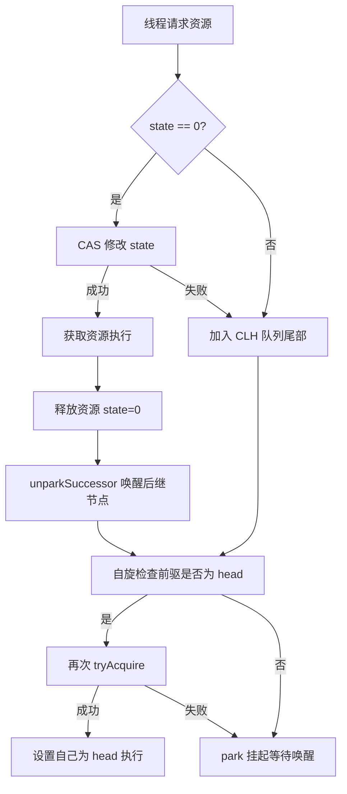
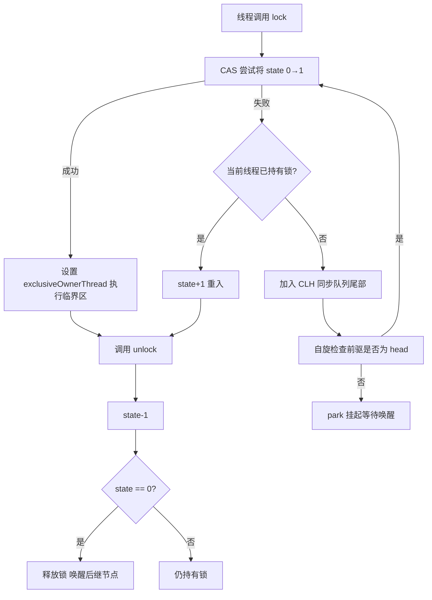
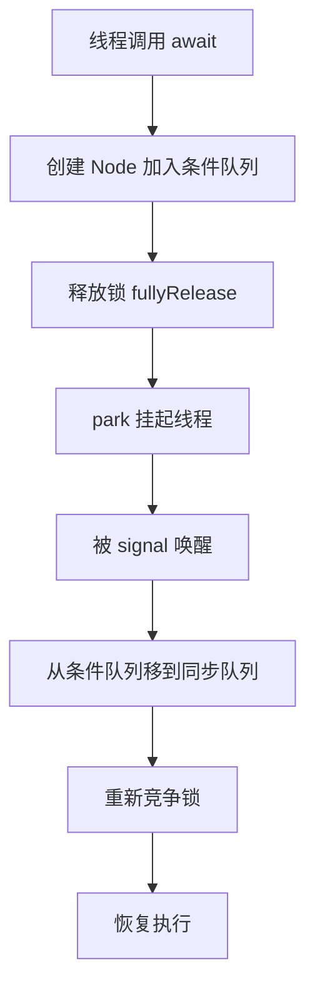
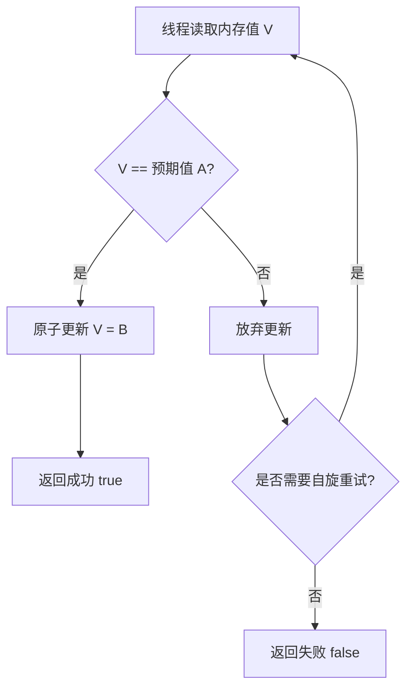
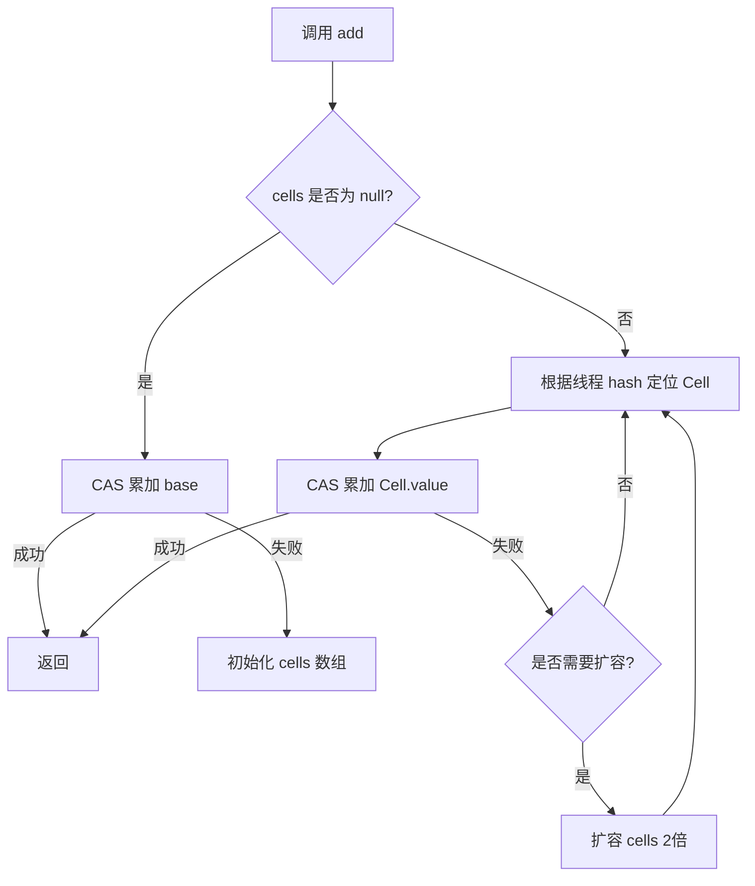

# Java 并发面试二

## Java 锁

### 【中等】Java 中，根据不同维度划分，锁有哪些分类？⭐⭐⭐

在 Java 中，锁可以按照 **多个维度** 进行分类，不同维度的锁适用于不同的并发场景。以下是详细的分类：

**按锁的公平性划分**

| **锁类型**   | **特点**                                                                         | **实现类/关键字**                      |
| ------------ | -------------------------------------------------------------------------------- | -------------------------------------- |
| **公平锁**   | 严格按照线程请求顺序（FIFO）分配锁，避免线程饥饿，但性能较低。                   | `ReentrantLock(true)`                  |
| **非公平锁** | 允许插队，新请求的线程可能直接抢到锁，吞吐量高，但可能导致线程饥饿（默认方式）。 | `ReentrantLock(false)`、`synchronized` |

**按锁的获取方式划分**

| **锁类型** | **特点**                                                   | **实现类/关键字**               |
| ---------- | ---------------------------------------------------------- | ------------------------------- |
| **悲观锁** | 认为并发冲突必然发生，先加锁再操作（阻塞其他线程）。       | `synchronized`、`ReentrantLock` |
| **乐观锁** | 认为并发冲突较少，不加锁，更新时检查（CAS 或版本号机制）。 | `AtomicInteger`、`StampedLock`  |

**按锁的可重入性划分**

| **锁类型**     | **特点**                                                          | **实现类/关键字**               |
| -------------- | ----------------------------------------------------------------- | ------------------------------- |
| **可重入锁**   | 同一线程可多次获取同一把锁（避免死锁）。                          | `ReentrantLock`、`synchronized` |
| **不可重入锁** | 同一线程重复获取同一把锁会导致死锁（Java 无原生实现，需自定义）。 | 无（需自行实现）                |

**按锁的共享性划分**

| **锁类型**           | **特点**                                                             | **实现类/关键字**               |
| -------------------- | -------------------------------------------------------------------- | ------------------------------- |
| **独占锁（排他锁）** | 同一时间只有一个线程能持有锁（如 `synchronized`、`ReentrantLock`）。 | `synchronized`、`ReentrantLock` |
| **共享锁**           | 允许多个线程同时读取，但写入时独占（如 `ReadWriteLock`）。           | `ReentrantReadWriteLock`        |

**按锁的阻塞方式划分**

| **锁类型**       | **特点**                                                     | **实现类/关键字**               |
| ---------------- | ------------------------------------------------------------ | ------------------------------- |
| **阻塞锁**       | 获取不到锁时，线程进入阻塞状态（如 `synchronized`）。        | `synchronized`、`ReentrantLock` |
| **自旋锁**       | 获取不到锁时，线程循环尝试（避免线程切换，但消耗 CPU）。     | `AtomicInteger`（CAS 自旋）     |
| **适应性自旋锁** | JVM 自动优化自旋次数（如 `synchronized` 在 JDK 6+ 的优化）。 | JVM 内部优化                    |

**按锁的优化策略划分**

| **锁类型**   | **特点**                                                         | **实现类/关键字**              |
| ------------ | ---------------------------------------------------------------- | ------------------------------ |
| **偏向锁**   | 单线程访问时无同步开销（JDK 6+ 对 `synchronized` 的优化）。      | JVM 自动优化（`synchronized`） |
| **轻量级锁** | 多线程无竞争时，使用 CAS 代替阻塞（JDK 6+ 优化）。               | JVM 自动优化（`synchronized`） |
| **重量级锁** | 真正的互斥锁，涉及 OS 线程阻塞（如 `synchronized` 竞争激烈时）。 | JVM 自动升级（`synchronized`） |

**按锁的实现方式划分**

| **锁类型**           | **特点**                                  | **实现类/关键字**                |
| -------------------- | ----------------------------------------- | -------------------------------- |
| **内置锁（JVM 锁）** | 由 JVM 实现（如 `synchronized`）。        | `synchronized`                   |
| **显式锁**           | 由 Java API 提供（如 `ReentrantLock`）。  | `ReentrantLock`、`ReadWriteLock` |
| **分布式锁**         | 跨 JVM 的锁（如 Redis、ZooKeeper 实现）。 | `Redisson`、`Curator`            |

**总结**

| **分类维度** | **锁类型**                                                                  |
| ------------ | --------------------------------------------------------------------------- |
| **公平性**   | 公平锁、非公平锁                                                            |
| **获取方式** | 悲观锁、乐观锁                                                              |
| **可重入性** | 可重入锁、不可重入锁                                                        |
| **共享性**   | 独占锁、共享锁                                                              |
| **阻塞方式** | 阻塞锁、自旋锁、适应性自旋锁                                                |
| **优化策略** | 偏向锁、轻量级锁、重量级锁                                                  |
| **实现方式** | 内置锁（`synchronized`）、显式锁（`ReentrantLock`）、分布式锁（`Redisson`） |

**选择合适的锁取决于：**

- **并发竞争程度**（高竞争→悲观锁，低竞争→乐观锁）
- **任务执行时间**（长任务→公平锁，短任务→非公平锁）
- **读写比例**（读多→共享锁，写多→独占锁）
- **是否需要跨 JVM**（是→分布式锁）

这些分类帮助开发者根据业务场景选择最优的锁策略，平衡 **性能、公平性、一致性**。

### 【中等】悲观锁和乐观锁有什么区别？⭐⭐⭐⭐

**悲观锁假定会冲突，提前加锁阻塞；乐观锁假定不冲突，提交时检测版本，冲突则重试。**

- **悲观锁**：先加锁再操作，适合写多读少的高并发场景，保证安全但性能较低，如金融交易。
- **乐观锁**：通过版本号或 CAS 机制实现，提交时检查数据是否被修改，适合读多写少的场景，如电商库存。

以下是悲观锁与乐观锁的详细对比：

| **对比维度**   | **悲观锁**                                                         | **乐观锁**                                              |
| -------------- | ------------------------------------------------------------------ | ------------------------------------------------------- |
| **核心思想**   | 假定并发冲突必然发生，先加锁再访问数据                             | 假定并发冲突较少，先操作再检测冲突                      |
| **锁机制**     | 显式加锁（阻塞其他线程）                                           | 无锁机制（依赖 CAS 或版本号控制）                       |
| **实现方式**   | `synchronized`、`ReentrantLock`、数据库`SELECT FOR UPDATE`         | `Atomic`类（CAS）、版本号机制、数据库乐观锁（如 MVCC）  |
| **线程阻塞**   | 会阻塞竞争线程（线程挂起）                                         | 不阻塞线程，但可能自旋重试或失败                        |
| **数据一致性** | 强一致性（独占访问）                                               | 最终一致性（可能需重试）                                |
| **适用场景**   | - 写操作频繁<br>- 临界区代码执行时间长<br>- 强一致性要求高         | - 读多写少<br>- 短平快操作<br>- 高吞吐量需求            |
| **性能特点**   | - 高竞争时性能下降明显（线程切换开销）<br>- 低竞争时仍有固定锁开销 | - 低竞争时性能极佳（无阻塞）<br>- 高竞争时 CPU 自旋浪费 |
| **冲突处理**   | 通过锁排队避免冲突                                                 | 通过重试或放弃处理冲突                                  |
| **典型应用**   | - 银行转账<br>- 订单支付<br>- 数据库行级锁                         | - 库存扣减<br>- 计数器<br>- 点赞系统                    |
| **优缺点**     | ✔️ 强一致性<br>❌ 吞吐量低、死锁风险                               | ✔️ 高并发性能好<br>❌ 实现复杂、可能 ABA 问题           |

### 【中等】公平锁和非公平锁有什么区别？⭐⭐⭐

**公平锁按请求顺序分配，非公平锁允许插队，可能让先到的线程等待。**

- **公平锁**：线程获取锁的顺序严格遵循请求的先后顺序，保证公平性但可能降低吞吐量。
- **非公平锁**：允许后请求的线程“插队”抢先获取锁，虽可能造成饥饿但通常能提高系统整体性能。

公平锁和非公平锁的详细对比：

| **对比维度**         | **公平锁 (Fair Lock)**                               | **非公平锁 (Nonfair Lock)**                |
| -------------------- | ---------------------------------------------------- | ------------------------------------------ |
| **锁获取顺序**       | 严格按照线程请求顺序（FIFO）分配锁                   | 允许插队，新请求的线程可能直接抢到锁       |
| **性能表现**         | 吞吐量较低（上下文切换频繁）                         | 吞吐量较高（减少线程切换，但可能线程饥饿） |
| **响应时间**         | 等待时间稳定（适合长任务）                           | 短任务可能更快获取锁（适合高并发短任务）   |
| **适用场景**         | - 需要严格公平性<br>- 线程执行时间差异大（避免饥饿） | - 高并发短任务<br>- 追求吞吐量             |
| **锁实现类**         | `ReentrantLock(true)`                                | `ReentrantLock(false)`（默认）             |
| **实现**             | 依赖 AQS 维护等待线程，先到先得                      | 先尝试 CAS 抢锁，失败后进入 AQS 队列       |
| **线程饥饿**         | 不会发生                                             | 可能发生（高并发时某些线程长期无法获取锁） |
| **操作系统调度影响** | 依赖系统线程调度，可能因优先级反转影响公平性         | 更依赖 JVM 的锁优化策略                    |
| **锁重入性**         | 支持（与公平性无关）                                 | 支持（与公平性无关）                       |
| **适用并发模型**     | 适合任务执行时间不均衡的场景                         | 适合任务执行时间短的场景                   |

**如何选择？**

- **选公平锁**：

  - 需要严格顺序执行（如订单处理）
  - 避免低优先级线程饥饿
  - 线程任务执行时间差异大

- **选非公平锁**：
  - 追求高吞吐量（如秒杀系统）
  - 任务执行时间短且均匀
  - 能接受偶尔的线程饥饿

**注意事项：**

- **默认行为**：`ReentrantLock` 和 `synchronized` 默认都是**非公平锁**（因为性能更好）。
- **性能差异**：非公平锁在高并发下吞吐量可提升 **10%~30%**，但可能增加延迟方差。
- **synchronized 的公平性**：Java 的 `synchronized` **不支持公平锁**，仅 `ReentrantLock` 可配置。

### 【困难】AQS 的实现原理是什么？⭐⭐⭐⭐⭐

AQS（**AbstractQueuedSynchronizer**）是 Java 并发包（`java.util.concurrent.locks`）的核心框架，用于构建锁（如 `ReentrantLock`）和同步器（如 `CountDownLatch`、`Semaphore`）。

**AQS 用一个 volatile int 状态值 + 一个双向链表队列（CLH），通过 CAS 自旋实现线程的排队与唤醒，是 Java 并发锁的“骨架引擎”。**

::: info AQS 要点

:::

AQS 原理可归纳为：**2 种模式，3 大核心，4 步操作**

**2 种模式**

- **独占模式（Exclusive）**：同一时刻只有一个线程能获取资源（如 `ReentrantLock`）。
- **共享模式（Shared）**：多个线程可同时获取资源（如 `Semaphore`, `CountDownLatch`）。

**3 大核心**

1. **状态（State）**：一个 `volatile` 整型变量，用于表示同步状态。`state` 在不同的同步组件中意义不同。
   - **锁的意义**：0 代表无锁，>0 代表有锁（可重入时累加）。例如在 `ReentrantLock` 里，`state` 为 0 表示锁未被持有，大于 0 表示锁已被持有，且重入次数就是 `state` 的值。
   - **信号量/CountDownLatch 等意义**：state 表示可用资源数或倒数计数。
2. **同步队列（CLH 变体）**：一个**双链表**，存放等待获取资源的线程。`Node` 包含以下重要属性：
   - **`thread`**：指向等待获取同步状态的线程。
   - **`prev` 和 `next`**：分别指向前一个节点和后一个节点，从而形成双向链表。
   - **`waitStatus`**：表示节点的等待状态，常见的状态有：
     - `CANCELLED`（1）：表示该节点对应的线程已取消等待。
     - `SIGNAL`（-1）：表示该节点的后继节点需要被唤醒。
     - `CONDITION`（-2）：表示该节点处于条件队列中。
     - `PROPAGATE`（-3）：用于共享模式下，表明状态需要向后传播。
   - 每个线程被封装为一个 **Node 节点**。
   - 队列头节点（head）是当前持有资源的线程（独占模式）或已唤醒的节点。
3. **CAS 操作**：所有对 `state` 和队列头的修改，都通过 **`Unsafe.compareAndSwap`** 原子完成，保证线程安全。

**4 步关键操作**

可以把一个线程获取锁到释放锁的过程，想象成**“尝试加锁 → 排队等候 → 被唤醒 → 解锁”**的流程。



**源码锚点（资深面试加分项）**

（1）**head 是 dummy node（哨兵节点）**：CLH 队列的 head 不保存有效线程（`node.thread == null`），它代表「最近一次成功获取锁」的位置占位。这样设计让 `acquireQueued` 的自旋条件统一为「我的前驱是 head 就再试一次 `tryAcquire`」，无需对队首做特判。

（2）**`acquireQueued` 的自旋条件**：

```java
final boolean acquireQueued(final Node node, int arg) {
    for (;;) {
        final Node p = node.predecessor();
        if (p == head && tryAcquire(arg)) { // 只有前驱是 head 才允许抢锁
            setHead(node);                  // 自己成为新的 dummy head
            p.next = null;                  // 帮助 GC
            return false;
        }
        if (shouldParkAfterFailedAcquire(p, node) &&
            parkAndCheckInterrupt()) {      // 否则 park 挂起
            ...
        }
    }
}
```

关键设计：**只有 head 的后继节点才允许 `tryAcquire`**，其余节点直接 park。这把「队列中所有线程都在 CAS 抢锁」退化为「至多一个线程在抢」，将竞争收敛到队首，避免惊群效应。

（3）**`hasQueuedPredecessors` 是公平锁的核心**：`FairSync.tryAcquire` 在 CAS 前先调用它检查队列中是否有等待者，有才放弃抢锁去排队；`NonfairSync` 不检查直接 CAS。一个方法区分了公平与非公平。

（4）**`SIGNAL` 状态的责任转移**：线程 park 前会把前驱节点的 `waitStatus` 置为 `SIGNAL`（「我睡了，你释放锁时记得叫醒我」），把唤醒责任挂到前驱身上；`CANCELLED`（=1，如 `tryLock` 超时）节点在遍历中被跳过并清理。

::: info L4 深度：CLH 队列 vs MCS 队列的设计差异

:::

**CLH 队列 vs MCS 队列：为什么 AQS 选择 CLH 变体？**

CLH（Craig, Landin, and Hagersten）和 MCS（Mellor-Crummey and Scott）是两种经典的 FIFO 自旋锁队列算法，两者的核心差异决定了 AQS 的设计选择：

| 维度             | CLH 队列                                      | MCS 队列                              | AQS 的 CLH 变体                  |
| :--------------- | :-------------------------------------------- | :------------------------------------ | :------------------------------- |
| **自旋位置**     | 在前驱节点上自旋（`pred.locked`）             | 在本地节点上自旋（`myNode.locked`）   | 不自旋，`park()` 挂起            |
| **链表方向**     | 隐式单向链表（通过 `tail` + 前驱指针遍历）    | 显式双向链表（`prev` + `next`）       | 显式双向链表                     |
| **本地 vs 远程** | 远程自旋：每个线程 watch 前驱节点状态         | 本地自旋：每个线程 watch 自身节点状态 | 本地阻塞：自身 park/unpark       |
| **适配阻塞**     | 原生不适合阻塞，若挂起则 successor 不知唤醒谁 | 天然适合：本地节点被前驱唤醒          | AQS 采用 MCS 思想 + CLH 队列结构 |

**AQS 为什么用 CLH 变体而非纯 CLH/MCS？**

1. **CLH 的自旋问题**：纯 CLH 每个线程在前驱节点上自旋（`while (pred.locked)`），在 Java 层面，CPU 空转会浪费资源。AQS 将其改为 `park()` 挂起，由前驱释放锁时 `unpark` 后继——这个「唤醒链」本质是将 CLH 的自旋检测替换为 OS 级阻塞。

2. **CLH 的单向链表问题**：纯 CLH 只有隐式单向链表（通过 tail CAS + 前驱引用），无法支持取消操作和条件队列。AQS 将其改造为显式双向链表（`prev` + `next`），以便：取消节点时通过 `next` 快速找到后继、条件队列信号时能反向找到自身在同步队列的位置。

3. **MCS 的冗余开销**：MCS 本身是双向链表 + 本地自旋，更接近 AQS 的最终形态。但 MCS 需要每个节点有 `locked` 标志位，而 AQS 通过 `waitStatus` 中的 `SIGNAL` 状态实现了更丰富的语义（取消、条件、传播），因此 AQS 本质上是「CLH 的队列结构 + MCS 的阻塞思想 + AQS 的状态机」。

> **面试记忆点**：AQS = CLH 的 FIFO 队列骨架 + MCS 的「前驱唤醒后继」阻塞机制 + 双向链表改造（取消/条件队列需求）。

::: info L4 深度：Linux futex 与 park/unpark 的关系

:::

**`LockSupport.park()` / `unpark()` 与 Linux futex 的对应关系**

Java 的 `LockSupport.park()` / `unpark()` 最终依赖操作系统的线程阻塞原语，在 Linux 上通过 `futex`（Fast Userspace muTEX）系统调用实现。

**futex 的核心设计**：futex 是 Linux 内核提供的混合同步原语——低竞争时在用户空间通过 CAS 完成（零系统调用），高竞争时才陷入内核阻塞线程。这正是 AQS 的「先 CAS 抢锁，抢不到再 park 入队」策略的 OS 层基础。

```
Java 层: LockSupport.park(this)  /  LockSupport.unpark(thread)
            │
   JVM 层:  Unsafe_Park / Unsafe_Unpark (HotSpot)
            │
   OS  层:  pthread_cond_wait / pthread_cond_signal (POSIX)
            │ 或
           futex(FUTEX_WAIT, ...) / futex(FUTEX_WAKE, ...) (Linux)
```

**关键机制对比**：

| 维度         | `park()`/`unpark()`                                                                               | Linux futex                                     | pthread mutex                  |
| :----------- | :------------------------------------------------------------------------------------------------ | :---------------------------------------------- | :----------------------------- |
| **许可机制** | `unpark()` 先于 `park()` 调用时，`permit` 被记录，后续 `park()` 立即返回（类似 binary semaphore） | `FUTEX_WAIT` 严格在值相等时才等待（无许可累积） | 无许可累积，严格互斥           |
| **唤醒语义** | `unpark()` 针对特定线程（一对一）                                                                 | `FUTEX_WAKE` 可唤醒 N 个等待者（一对多）        | `pthread_cond_signal` 唤醒一个 |
| **超时支持** | `parkNanos()` / `parkUntil()`                                                                     | `FUTEX_WAIT` 自带 timeout 参数                  | `pthread_cond_timedwait`       |

**为什么 `unpark()` 可以先于 `park()` 调用？**

这是一个面试高频细节：`LockSupport` 内部维护每个线程的 `permit` 标志（boolean）。`unpark(t)` 将 `permit` 设为 1（如果已是 1 则不变），`park()` 将 `permit` 设为 0 并返回（如果已是 0 则阻塞）。因此 `unpark()` → `park()` 的顺序不阻塞，而 `park()` → `unpark()` 的顺序正常唤醒。

这与 futex 的 `FUTEX_WAIT` 行为不同——`FUTEX_WAIT` 要求 `*addr == val`（原子比较），若值已被修改则不等待。AQS 的 `SIGNAL → unpark` 正是利用了这一语义：释放线程 CAS 修改 `state` 后再 `unpark`，被唤醒线程重新 `tryAcquire` 时能立刻感知状态变化。

> **面试记忆点**：`park/unpark` = `permit` 机制（类似信号量）+ futex 内核阻塞；`SIGNAL` 状态是 AQS 层对 futex 的适配，确保「先改 state 再唤醒」的可见性顺序。

::: info AQS 独占模式工作流程

:::

**独占模式**：同一时刻仅允许一个线程获取同步状态，例如 `ReentrantLock`。

1. **tryAcquire**：线程尝试直接获取锁（CAS 修改 state）。
   - **成功**：拿到锁，设置自己为独占线程。
   - **失败**：进入第 2 步。
2. **addWaiter**：将当前线程包装成 Node 节点，**用 CAS 快速插入**到同步队列尾部。
3. **acquireQueued**：在队列中进入“**自旋-检测-挂起**”循环。
   - 检查自己是不是第二个节点（即 head 的下一个），如果是则再次尝试获取锁（tryAcquire）。
   - 如果获取失败，则根据前驱节点的状态，决定是否将自己挂起（`LockSupport.park`）。
4. **release & unparkSuccessor**：持有锁的线程释放锁时。
   - `tryRelease`：修改 state。
   - 唤醒（`LockSupport.unpark`）队列中下一个等待的节点（后继节点），让它重新尝试获取锁。

::: info AQS 共享模式工作流程

:::

**共享模式**：同一时刻允许多个线程获取同步状态，例如 `CountDownLatch` 和 `Semaphore`。

- **获取锁**：
  - 线程调用 `acquireShared(int)` → `tryAcquireShared(int)`（子类实现）。
  - 如果成功（返回 `≥0`），获取锁；否则进入队列等待。
- **释放锁**：
  - 线程调用 `releaseShared(int)` → `tryReleaseShared(int)`（子类实现）。
  - 如果成功，唤醒后续等待的线程（可能多个）。

::: info AQS 关键方法

:::

AQS 的关键方法采用模板方法设计模式串联起来：

- **独占模式**
  - **`tryAcquire(int arg)`**：尝试以独占模式获取同步状态，此方法需由子类实现。
  - **`acquire(int arg)`**：以独占模式获取同步状态，若获取失败则将线程加入队列并阻塞。
  - **`tryRelease(int arg)`**：尝试以独占模式释放同步状态，需子类实现。
  - **`release(int arg)`**：以独占模式释放同步状态，若释放成功则唤醒队列中的后继节点。
- **共享模式**
  - **`tryAcquireShared(int arg)`**：尝试以共享模式获取同步状态，需子类实现。
  - **`acquireShared(int arg)`**：以共享模式获取同步状态，若获取失败则将线程加入队列并阻塞。
  - **`tryReleaseShared(int arg)`**：尝试以共享模式释放同步状态，需子类实现。
  - **`releaseShared(int arg)`**：以共享模式释放同步状态，若释放成功则唤醒队列中的后继节点。

::: tip 扩展

[从 ReentrantLock 的实现看 AQS 的原理及应用](https://tech.meituan.com/2019/12/05/aqs-theory-and-apply.html)

:::

### 【中等】synchronized 和 ReentrantLock 有什么区别？⭐⭐⭐⭐⭐

- `ReentrantLock` **更强大**：支持公平锁、可中断、超时、多条件变量。`ReentrantLock` **必须手动释放锁**，否则会导致死锁！
- `synchronized` **更简单**：自动管理锁，适合基础同步需求。
- **性能差异**：JDK 6 后，synchronized 经过一系列优化，两者性能接近，但 `ReentrantLock` 在高竞争场景仍略有优势。


:::info synchronized 和 ReentrantLock 详细对比

:::

以下是 **`synchronized`** 和 **`ReentrantLock`** 的详细对比表格，涵盖 **锁机制、功能、性能、使用场景** 等核心维度：

---

| **对比维度**       | **`synchronized`**                                                | **`ReentrantLock`**                                                 |
| ------------------ | ----------------------------------------------------------------- | ------------------------------------------------------------------- |
| **锁类型**         | JVM 内置关键字（隐式锁）                                          | JDK 提供的类（显式锁）                                              |
| **加锁解锁方式**   | 自动加锁/释放锁（进入同步代码块加锁，退出时释放）                 | 需手动调用 `lock()` 和 `unlock()`（必须配合 `try-finally` 使用）    |
| **是否可重入**     | 支持（同一线程可重复获取）                                        | 支持（同一线程可重复获取）                                          |
| **是否支持公平**   | 仅支持非公平锁                                                    | 可配置公平锁或非公平锁（构造函数传参 `true/false`）                 |
| **是否可中断**     | 不支持中断                                                        | 支持 `lockInterruptibly()`，可响应中断                              |
| **是否支持超时**   | 不支持超时                                                        | 支持 `tryLock(timeout, unit)`，可设置超时时间                       |
| **是否支持多条件** | 通过 `wait()`/`notify()` 实现，单一等待队列                       | 支持多个 `Condition`，可精确控制线程唤醒（如 `await()`/`signal()`） |
| **性能**           | JDK 6+ 优化后（偏向锁→轻量级锁→重量级锁）性能接近 `ReentrantLock` | 在高竞争场景下性能略优（减少上下文切换）                            |
| **死锁检测**       | 无内置死锁检测                                                    | 可通过 `tryLock` 避免死锁                                           |
| **适用场景**       | 简单同步场景（如单方法同步）                                      | 复杂同步需求（如公平锁、可中断锁、超时锁）                          |
| **底层实现**       | JVM 通过 `monitorenter`/`monitorexit` 字节码实现                  | 基于 `AbstractQueuedSynchronizer (AQS)` 实现                        |

:::info synchronized 和 ReentrantLock 的使用差异

:::

::: code-tabs#synchronized 和 ReentrantLock 使用差异

@tab synchronized 使用

```java
// 1. 用于代码块
synchronized (this) {}
// 2. 用于对象
synchronized (object) {}
// 3. 用于方法
public synchronized void test () {}
// 4. 可重入
for (int i = 0; i < 100; i++) {
	synchronized (this) {}
}
```

@tab ReentrantLock 使用

```java
public void test () throw Exception {
	// 1. 初始化选择公平锁、非公平锁
	ReentrantLock lock = new ReentrantLock(true);
	// 2. 可用于代码块
	lock.lock();
	try {
		try {
			// 3. 支持多种加锁方式，比较灵活；具有可重入特性
			if(lock.tryLock(100, TimeUnit.MILLISECONDS)){ }
		} finally {
			// 4. 手动释放锁
			lock.unlock()
		}
	} finally {
		lock.unlock();
	}
}
```

:::

:::info synchronized 和 ReentrantLock 的适用场景

:::

- **`synchronized` 适用场景**：单例模式的双重检查锁、简单的线程安全计数器。
- **`ReentrantLock` 适用场景**：
  - 需要公平性的任务队列（如订单处理）。
  - 需要超时控制的资源争用（如避免死锁）。
  - 复杂的多条件线程协调（如生产者-消费者模型）。

**使用选择建议**

- **选择 `synchronized`**：
  - 需要简单的代码块同步。
  - 不需要高级功能（如超时、公平锁）。
- **选择 `ReentrantLock`**：
  - 需要精细控制（如公平性、可中断）。
  - 需要避免死锁（`tryLock`）。

### 【困难】ReentrantLock 的实现原理是什么？⭐⭐⭐⭐

本质上，**ReentrantLock 是 AQS 在独占模式下的一个经典实现**。

**ReentrantLock 以 AQS 的 state 和同步队列为基础，通过 NonfairSync / FairSync 实现（非）公平策略，并内置可重入计数和条件队列机制的互斥锁实现**。

- **核心依赖**：`ReentrantLock` 通过内部类 `Sync`（继承 `AQS`）实现锁机制。
- **AQS 作用**：提供线程阻塞/唤醒的队列管理（CLH 变体）和状态（`state`）的原子操作。

:::info 两种模式

:::

ReentrantLock 内部有两个主要的静态内部类，决定了其抢占行为：

1. **`NonfairSync`（非公平锁，默认）**：**允许插队**
   - 新线程来了直接尝试 CAS 抢锁（插队），抢不到才排队。
   - **优点**：吞吐量高。
   - **缺点**：可能导致饥饿问题。
2. **`FairSync`（公平锁）**：**先到先得**
   - 新线程来了先检查同步队列是否为空，有排队者则直接去队尾排队。
   - **优点**：公平，无饥饿问题。
   - **缺点**：上下文切换多，吞吐量相对低。

二者核心区别就在 `lock()` 方法中，尝试获取锁前**是否检查同步队列中有等待者**（`hasQueuedPredecessors()`）。

:::info 三大核心

:::

```java
ReentrantLock
    │
    ├── Sync (extends AQS)
    │    ├── state （锁计数器）
    │    ├── exclusiveOwnerThread （当前持有线程）
    │    └── CLH Queue （等待锁的线程队列）
    │
    ├── NonfairSync （默认，插队抢锁）
    ├── FairSync （先来后到）
    │
    └── ConditionObject
         └── Condition Queue （等待特定条件的线程队列）
```

1. **AQS 同步器（Sync）**：继承自 AQS。
   - **状态 (`state`)**：`volatile int`，表示锁被持有的次数。`0`=空闲，`N`=被同一个线程重入了 `N` 次。
   - **同步队列**：存储等待线程的 CLH 变体队列。
   - **独占线程**：记录当前持有锁的线程 (`exclusiveOwnerThread`)。
2. **可重入机制**：
   - **加锁**：若当前线程是持有者，则 `state` 加 1（无需 CAS）。
   - **解锁**：`state` 减 1，减到 0 时才完全释放，唤醒后继节点。
3. **条件变量 (`ConditionObject`)**：
   - 每个 `Condition` 对象内部维护一个 **独立的等待队列**。
   - `await()` 将当前线程从**锁的同步队列**移到**条件等待队列**，并释放锁。
   - `signal()` 将条件等待队列的头节点移到**锁的同步队列**中，重新等待获取锁。

:::info 关键步骤

:::

**🔒 加锁四步曲**



1. **快速抢票**：新线程直接 CAS 尝试将 `state` 从 0 改为 1（插队）。
2. **抢到则坐**：成功则设置自己为独占线程，进入临界区。
3. **没抢则排**：失败则调用 AQS 的 `acquire(1)`，进入同步队列队尾。
4. **队列中等**：在队列中进入“自旋-检查-挂起”循环，等待被前驱节点唤醒。

**🔓 解锁两步曲**（`unlock()` 本质是两个关键操作）

1. **尝试释放**：调用 `tryRelease(1)`，将 `state` 减 1。如果 `state` 减到 0，则清空独占线程标记。
2. **唤醒后继**：如果锁完全释放（`state == 0`），则唤醒同步队列中下一个符合条件的等待线程。

::: info L4 深度：C++ std::mutex 与 Java ReentrantLock 的跨语言对比

:::

**C++ std::mutex vs Java ReentrantLock：设计哲学的核心分歧**

| 维度                | C++ `std::mutex`                                          | Java `ReentrantLock`                             |
| :------------------ | :-------------------------------------------------------- | :----------------------------------------------- |
| **可重入性**        | **不可重入**（同一线程重复 lock 是 UB，通常死锁）         | **可重入**（`state` 累加计数）                   |
| **公平性**          | 标准不规定（通常实现为非公平，无公平模式 API）            | 构造参数控制公平/非公平                          |
| **条件变量**        | 分离设计：`std::condition_variable` + `std::unique_lock`  | 内聚设计：`lock.newCondition()` 返回 `Condition` |
| **超时机制**        | `std::timed_mutex`（独立类型）；`std::unique_lock` 不参与 | `tryLock(long, TimeUnit)` 直接内置               |
| **RAII 封装**       | `std::lock_guard` / `std::unique_lock`（C++ 核心惯用法）  | 无标准 RAII wrapper（需手动 try-finally）        |
| **底层实现**        | Linux：`futex`（低竞争用户态 CAS，高竞争内核阻塞）        | 同样基于 futex（通过 `park`/`unpark`）           |
| **recursive_mutex** | 需显式使用 `std::recursive_mutex`（独立类型）             | 默认即可重入（同类型）                           |

**C++ 为什么把 mutex 和 condition_variable 分开？**

C++ 遵循「单一职责」原则：

- `std::mutex` 只负责互斥（lock/unlock）
- `std::condition_variable` 只负责等待-通知（wait/notify）
- `std::unique_lock` 负责 RAII 式的锁生命周期管理

三者组合使用：

```cpp
std::mutex mtx;
std::condition_variable cv;
std::queue<int> queue;

// 生产者
{
    std::lock_guard<std::mutex> lock(mtx);   // RAII 自动释放
    queue.push(data);
}
cv.notify_one();  // 通知在锁外，避免「惊群」

// 消费者
std::unique_lock<std::mutex> lock(mtx);      // 可手动 unlock
cv.wait(lock, [&]{ return !queue.empty(); }); // 谓词检查防虚假唤醒
```

**Java ReentrantLock 为什么把 Condition 内聚在锁中？**

Java 的设计哲学是「便利性 + 正确性优先」：

1. **`newCondition()` 绑定锁实例**：避免 C++ 中 `condition_variable` 与错误的 `mutex` 搭配使用。Java 的 `Condition` 在 `await()` 时必须持有关联锁，编译期 + 运行期双重校验，杜绝 C++ 中「condition_variable 用错 mutex」的未定义行为。

2. **`await()` 原子释放锁再阻塞**：Java 的 `await()` 内部自动完成「原子释放锁 → 加入条件队列 → park 阻塞」的三步操作，而 C++ 的 `wait()` 需要外部先 `unique_lock` 再传入——虽然效果等价，但 Java 的内聚设计降低了误用概率。

3. **`signal()` 到 `lock` 的转移链**：被 `signal()` 的线程从条件队列移至 AQS 同步队列，等待重新获取锁——这个转移在 AQS 内部原子完成。C++ 无此机制，被 notify 的线程需重新竞争锁，可能面临优先级反转。

**`std::unique_lock` vs Java ReentrantLock 的设计哲学**

| 维度           | C++ `std::unique_lock`              | Java `ReentrantLock`                                               |
| :------------- | :---------------------------------- | :----------------------------------------------------------------- |
| **所有权模型** | move-only（所有权可转移）           | 无所有权转移概念（任意线程可 unlock，但语义上只有持有者应 unlock） |
| **生命周期**   | RAII 自动管理（构造加锁，析构释放） | 手动 try-finally（无析构保证）                                     |
| **灵活性**     | 可延迟加锁、提前解锁、转移所有权    | `tryLock` 支持超时/非阻塞，但无所有权转移                          |
| **性能**       | 零开销抽象（编译期内联，无虚函数）  | JIT 优化 + 偏向锁消除，热点路径可达 native                         |

> **面试记忆点**：C++ 是「积木式组合」——mutex + condition_variable + unique_lock 三者松耦合换取最大灵活性；Java 是「一体化工具」——ReentrantLock 内置公平性、可重入、Condition、超时，牺牲部分灵活性换取开箱即用的正确性。C++ 的 `recursive_mutex` 独立成类型说明可重入是有代价的（通常暗示设计问题），而 Java 默认支持可重入反映了「方便优先」的实用主义。

### 【困难】ReentrantReadWriteLock 的实现原理是什么？⭐⭐⭐

::: info ReentrantReadWriteLock 的特性

:::

**ReentrantReadWriteLock 是为【读多写少】的并发场景设计的锁实现**。

**ReentrantReadWriteLock 允许多个线程同时持有读锁，但同一时刻只允许一个线程持有写锁**。此外，存在读锁时无法获取写锁，存在写锁时无法获取读锁。

ReentrantReadWriteLock 有以下特性：

- **可重入**：读写锁都支持可重入。
- **支持公平锁**，默认为非公平锁。
- **支持锁降级**：**持有写锁可以获取读锁；反之不允许**。

::: info ReentrantReadWriteLock 的核心设计

:::

**ReentrantReadWriteLock 基于 AQS 实现的读写锁**。

`ReentrantReadWriteLock` 的**核心设计思想**是**将一个 32 位的 int 状态变量拆分为两部分**：`state = (readCount << 16) | writeCount`

虽然提供了两个锁对象（`readLock`, `writeLock`），但底层共享同一个 AQS 同步器。

| 视角           | 读锁 (`ReadLock`)      | 写锁 (`WriteLock`)         |
| :------------- | :--------------------- | :------------------------- |
| **行为**       | 共享锁                 | 独占锁                     |
| **占用 state** | 高 16 位               | 低 16 位                   |
| **互斥规则**   | 与**写锁**互斥         | 与**所有锁**（读、写）互斥 |
| **重入计数**   | 所有读线程的总重入次数 | 单个写线程的重入次数       |
| **条件变量**   | **不支持** `Condition` | **支持** `Condition`       |

::: info ReentrantReadWriteLock 写锁实现（WriteLock）

:::

**ReentrantReadWriteLock 写锁基于 AQS 的独占模式实现**。

写锁获取步骤：

1. 线程申请写锁（`writeLock.lock()`）
2. 检查有没有读锁或写锁（`state != 0`）
3. 没有，**CAS 设置 state 的低 16 为 1**（获得写锁）
4. 有，当前线程是否已持有写锁（可重入）
   - 是：CAS 将 state 的低 16 加 1（获得写锁）
   - 否：排队等待（进入 AQS 同步队列挂起）

实现方法：

```java
protected final boolean tryAcquire(int acquires) {
    // 检查是否有读锁或其他线程持有写锁
    if (c != 0 && w == 0) return false;
    // 检查重入或 CAS 设置状态
    // ...
}
```

::: info ReentrantReadWriteLock 读锁实现（ReadLock）

:::

**ReentrantReadWriteLock 读锁基于 AQS 的共享模式实现**。

1. 线程申请读锁（`readLock.lock()`）
2. 检查有没有写锁（`(state & 0xFFFF) != 0`）
3. 没有，CAS 将 state 的高 16 加 1（获得读锁）
4. 有，排队等待（进入 AQS 同步队列挂起）

::: info ReentrantReadWriteLock 锁降级实现

:::

1. **线程持有写锁**
2. **直接申请读锁**：因为线程有写锁，因此一定成功（高 16 位加 1）
3. **释放写锁**
4. 锁状态从 **“独占写”** 降级为 **“共享读”**。

```java
// 锁降级示例代码
writeLock.lock();         // 获取写锁
try {
    // 修改数据。..
    readLock.lock();      // 在保持写锁的情况下获取读锁（锁降级关键步骤）
} finally {
    writeLock.unlock();  // 释放写锁，降级为读锁
}
// 此时仍持有读锁，其他线程可以获取读锁但不能获取写锁
```

**性能优化技巧**

- **firstReader 优化**：记录第一个获取读锁的线程，避免 ThreadLocal 查找
- **cachedHoldCounter**：缓存最近一个获取读锁的线程计数器
- **读锁计数存储**：使用 ThreadLocal 保存每个线程的重入次数，避免竞争

### 【困难】StampedLock 的实现原理是什么？⭐⭐

`StampedLock`是 JDK8 引入的高性能锁，**适合读多写少且追求极致吞吐的场景**，但需谨慎处理乐观读失败和死锁风险。

StampedLock 是 **通过一个 64 位 long 值同时编码版本号、读计数和写标记，并利用戳记（Stamp）实现乐观读、锁升级等高级并发控制，在牺牲部分易用性和重入性的前提下，提供极高读性能的同步器**。

::: info StampedLock 三种模式

:::

StampedLock 的状态存储在一个 `long` 型（64 位）变量中，分为三个逻辑部分：

| 模式       | 占用位       | 作用                                                                                |
| :--------- | :----------- | :---------------------------------------------------------------------------------- |
| **读锁**   | 低 7 位      | 读线程计数（实际是`readerCount+1`）                                                 |
| **写锁**   | 第 8 位      | 独占标记，0 未占用，1 已占用                                                        |
| **版本号** | 未使用的高位 | 加锁返回有效戳，解锁需验证戳；<br/>戳无效 = 状态变更（有写操作），戳有效 = 数据一致 |

状态流转：

```
初始状态：state = (version: 0, readCount: 0, write: 0)

[操作与状态变化示例]
1. 写锁获取 (`writeLock()`)
   -> state 低 8 位置 1，同时整个 long 值改变 (version++)
   -> 返回 stamp W1

2. 乐观读 (`tryOptimisticRead()`)
   -> 不修改 state！仅记录当前 state 值作为 stamp O1
   -> 校验时：比较当前 state 是否等于 O1

3. 读锁获取 (`readLock()`)
   -> 高 56 位读计数+1 （如果写锁未被占用）d
   -> 返回 stamp R1

4. 锁升级 (`tryConvertToWriteLock(R1)`)
   -> 原子操作：读计数-1，同时写标记置 1
   -> 成功返回新 stamp W2，失败返回 0
```

::: info StampedLock 乐观锁

:::

StampedLock 乐观锁是一种 **“读时复制+版本校验”** 的乐观并发控制。

乐观锁在读远多于写且写操作不频繁的场景下，性能极高（完全无锁）。

StampedLock 乐观锁流程

1. 调用 `tryOptimisticRead()` 获取一个**戳记（Stamp）**，此时**完全不阻塞**。
2. 读取共享数据到局部变量。
3. 调用 `validate(stamp)` 校验：**自获取戳记以来，是否有写锁被获取过？**
   - **无变化**：数据有效，直接使用。
   - **有变化**：升级为**悲观读锁**，重新读取数据。

::: info StampedLock 锁升级

:::

**读锁 → 写锁升级**：`tryConvertToWriteLock(stamp)`

- **前提**：当前线程已持有读锁（`stamp` 是有效的读锁戳记）。
- **过程**：原子地尝试释放读计数，获取写锁标记。
- **结果**：成功返回新写戳记，失败返回 0。
- **注意**：**可能死锁**！如果当前还有其他读锁持有者，升级会失败（因为读写互斥）。

**乐观读 → 写锁升级**：

- 乐观读戳记本身不代表持有锁，升级失败是常态。
- 通常先获取悲观读锁，再进行升级尝试。

::: info StampedLock vs. ReentrantReadWriteLock

:::

| 特性         | `StampedLock`        | `ReentrantReadWriteLock` |
| ------------ | -------------------- | ------------------------ |
| **读并发度** | 最高（乐观读无阻塞） | 高（悲观读阻塞写）       |
| **写饥饿**   | 可能发生             | 非公平模式下可能发生     |
| **锁重入**   | 不支持               | 支持                     |
| **公平性**   | 仅非公平             | 支持公平/非公平          |
| **条件变量** | 不支持               | 支持                     |

::: info StampedLock 使用示例

:::

```java
StampedLock lock = new StampedLock();

// 乐观读示例
long stamp = lock.tryOptimisticRead();
// 读取共享数据。..
if (!lock.validate(stamp)) {
    // 版本失效，转悲观读
    stamp = lock.readLock();
    try {
        // 重新读取数据。..
    } finally {
        lock.unlockRead(stamp);
    }
}

// 写锁示例
long stamp = lock.writeLock();
try {
    // 修改数据。..
} finally {
    lock.unlockWrite(stamp);
}
```

### 【中等】Condition 的原理是什么？与 Object.wait/notify 有什么区别？⭐⭐⭐

**Condition 是 Lock 接口的条件变量，提供比 Object.wait/notify 更灵活的线程等待/通知机制**。一个 Lock 可以创建多个 Condition，实现精确唤醒。

**（1）Condition 的核心结构**

`ConditionObject` 是 AQS 的内部类，维护一个**独立的等待队列**（单向链表）：

```java
public class ConditionObject implements Condition {
    private transient Node firstWaiter;  // 等待队列首节点
    private transient Node lastWaiter;   // 等待队列尾节点
}
```

**（2）核心机制**



- **`await()`**：当前线程包装为 Node 加入条件队列，**完全释放锁**，park 挂起。被唤醒后从条件队列转移到同步队列，重新竞争锁。
- **`signal()`**：将条件队列的首节点转移到同步队列，唤醒该线程（注意只是转移，线程需重新竞争锁）。

**（3）与 Object.wait/notify 的对比**

| 特性             | `Condition`                         | `Object.wait/notify`       |
| ---------------- | ----------------------------------- | -------------------------- |
| **依赖**         | `Lock`（如 ReentrantLock）          | `synchronized`             |
| **等待队列数量** | 可创建多个，支持精确唤醒            | 仅一个，notifyAll 唤醒所有 |
| **中断响应**     | `awaitUninterruptibly()` 不响应中断 | `wait()` 必响应中断        |
| **超时**         | `awaitUntil(date)` 支持截止时间     | `wait(timeout)` 支持超时   |
| **不释放锁场景** | 无（await 必释放锁）                | 无（wait 必释放锁）        |

**（4）典型应用：生产者-消费者精确唤醒**

```java
ReentrantLock lock = new ReentrantLock();
Condition notFull = lock.newCondition();   // 队列未满条件
Condition notEmpty = lock.newCondition();  // 队列非空条件

// 生产者：队列满时等待 notFull，生产后唤醒 notEmpty
// 消费者：队列空时等待 notEmpty，消费后唤醒 notFull
```

### 【困难】AQS 的 CLH 队列与原始 CLH 队列有什么区别？⭐⭐

AQS 的等待队列是 **CLH（Craig, Landin, and Hagersten）队列的变体**，并非原始 CLH 队列。

**（1）原始 CLH 队列**

- 基于隐式链表，每个节点只持有前驱节点的引用。
- 自旋等待：线程在前驱节点的状态上自旋（spin on predecessor）。
- 只支持独占模式。

**（2）AQS 的 CLH 变体**

| 特性         | 原始 CLH           | AQS CLH 变体                      |
| ------------ | ------------------ | --------------------------------- |
| **队列结构** | 隐式链表（仅前驱） | 显式双向链表（prev + next）       |
| **等待方式** | 自旋               | park 阻塞（避免 CPU 浪费）        |
| **模式**     | 仅独占             | 独占 + 共享                       |
| **状态判断** | 前驱节点的状态     | 前驱节点的 waitStatus             |
| **取消处理** | 无                 | 支持 CANCELLED 状态，节点可被清理 |
| **条件队列** | 无                 | ConditionObject 独立的条件队列    |

**（3）为什么选择阻塞而非自旋？**

- 自旋在**等待时间长**的场景浪费 CPU。
- AQS 通过 `LockSupport.park()` 挂起线程，`unpark()` 唤醒，交由 OS 调度。
- 仅在「自旋检查前驱状态」时短暂自旋，避免不必要的 park/unpark 开销。

**（4）入队与出队的关键逻辑**

```java
// 入队：CAS 设置 tail
Node node = new Node(thread);
node.prev = pred;
if (compareAndSetTail(pred, node)) {
    pred.next = node;
    return node;
}

// 出队：head 指向新节点，旧 head 被 GC
setHead(node);
node.prev = null;
```

**（5）为什么是双向链表？**

- 取消节点时需找到前驱来断开链接（单向链表需遍历，O(n)）。
- 检查是否为 head 的后继时需要反向遍历。
- 共享模式唤醒需要向后传播。

## Java 无锁

### 【中等】什么是 CAS？CAS 的实现原理是什么？⭐⭐⭐⭐⭐

::: info 什么是 CAS？

:::

CAS 是 **Compare-And-Swap（比较并交换）** 的缩写，是实现并发编程的**无锁原子操作**核心。

CAS 核心规则是：先比较内存中某个值是否等于预期值，若相等则将其更新为新值；若不等则不操作，整个过程原子性完成。

CAS 操作伪代码

```java
boolean CAS(Variable var, int expected, int newValue) {
    if (var.value == expected) {  // 比较当前值是否等于预期值
        var.value = newValue;     // 如果相等，更新为新值
        return true;
    }
    return false;  // 否则失败
}
```

说明：

1. 读取内存值 `V`。
2. 比较 `V` 和预期值 `A`：
   - 如果 `V == A`，说明没有其他线程修改过，更新为 `B`。
   - 如果 `V != A`，说明值已被修改，放弃更新。
3. 返回操作是否成功。



::: info CAS 特性

:::

- **无锁**：无需加 synchronized/Lock，减少线程阻塞 / 唤醒开销，性能更高；
- **原子性**：CPU 指令级保证，比手动加锁更可靠；
- **ABA 问题**：V 先从 A 变 B 再变回 A，CAS 会误判为未修改（解决：加版本号，如 `AtomicStampedReference`）。

::: info CAS 的实现原理是什么？

:::

**Java 层面，通过 `Unsafe` 类调用 native 方法（如 `compareAndSwapInt()`）实现 CAS**。

```java
public final native boolean compareAndSwapInt(Object o, long offset, int expected, int newValue);
```

更底层（CPU 层面），CAS 实现依赖于 CPU 提供的原子指令（如 x86 的 `cmpxchg` 指令）。

**从 native 到硬件的完整链路**：

- HotSpot 为 `compareAndSwapInt` 生成的机器码是 `lock cmpxchg`（x86）：`cmpxchg` 本身只保证单次比较交换的语义，**`lock` 前缀锁总线/锁缓存行**，保证多核下的原子性。
- `lock` 前缀同时带来两个副作用：将当前核心缓存行写回主内存并使其他核心的缓存行失效（可见性）；充当全量内存屏障，禁止指令重排序（有序性）。这就是为什么 CAS 变量不需要再叠加 `volatile` 做读写同步——但 Atomic 类的 `value` 字段本身仍是 `volatile`，保证普通 `get()` 的可见性。
- 高竞争下 `lock cmpxchg` 的缓存行乒乓（cache line bouncing）是性能瓶颈根源，`LongAdder` 的分段 Cell 正是为此而生（见下文 LongAdder 题）。

::: info CAS 典型应用

:::

**（1）原子类**

```java
AtomicInteger atomicInt = new AtomicInteger(0);
atomicInt.incrementAndGet();  // CAS 实现原子自增
```

**底层实现**：

```java
public final int incrementAndGet() {
    return unsafe.getAndAddInt(this, valueOffset, 1) + 1;
}
```

**（2）自旋锁**

```java
while (!CAS(lock, 0, 1)) {  // 尝试获取锁
    // 自旋等待
}
```

**（3）无锁数据结构**

- `ConcurrentHashMap`（JDK 8 使用 CAS + `synchronized` 替代分段锁）。
- `CopyOnWriteArrayList`（CAS 保证写入原子性）。

::: info L4 深度：x86 CMPXCHG 指令 + LOCK 前缀详解

:::

**x86 `CMPXCHG` 指令的微架构执行流程**

`CMPXCHG` 是 x86 架构的核心原子指令，其语义是：比较 `EAX`（累加器）与目标内存操作数，若相等则将源操作数写入目标，否则将目标值加载到 `EAX`。

```asm
; CMPXCHG [mem], r  （Intel 语法）
; 伪代码：
TEMP = [mem]
IF EAX == TEMP:
    ZF = 1          ; 设置零标志
    [mem] = r       ; 写入新值
ELSE:
    ZF = 0          ; 清除零标志
    EAX = TEMP      ; 将旧值加载到 EAX
```

**`LOCK` 前缀的硬件行为**（多核原子性保证）：

`CMPXCHG` 本身不是原子的！在多核环境下，若无 `LOCK` 前缀，两个核心可能同时执行 `CMPXCHG` 并都认为自己成功。`LOCK` 前缀通过以下机制保证原子性：

1. **锁缓存行（Cache Lock）**：现代 CPU（P6 之后）通过 MESI 协议锁定目标地址所在的缓存行（断言 `#LOCK` 信号），而非锁整个总线。锁期间该缓存行在其它核心处于 `Invalid` 状态。

2. **总线锁兜底**：当操作数跨缓存行边界（非对齐）或无法锁缓存行时，回退到锁整个前端总线（bus lock），代价极高（~100 cycles+ vs ~20-40 cycles）。

3. **内存屏障效应**：`LOCK` 前缀隐式充当全量内存屏障（full fence）——所有之前的 load/store 对之后可见，禁止 StoreLoad 重排序。这是 CAS 提供 `volatile`-like 可见性的硬件根源。

**`lock cmpxchg` 的完整时序**（x86 多核视角）：

```
Core-0                                Core-1
  │                                     │
  ├─ lock cmpxchg [addr], r            │
  ├─ 发出 RFO（Read-For-Ownership）     │
  ├─ 获取 addr 所在缓存行的独占权        │
  ├─ MESI: E → M（Modified）           │ 缓存行被 Invalidate
  ├─ EAX vs [addr] 比较并写入           │
  ├─ 缓存行写回（或保持 M 状态）         │
  └─ 释放 lock 信号                     ├─ 下次访问 addr 时 Cache Miss
                                        └─ 重新从 Core-0 获取最新值
```

**x86 vs ARM（LDREX/STREX / LL/SC）的 CAS 实现差异**

| 维度           | x86（CMPXCHG）                               | ARM（LDREX/STREX）                                                           |
| :------------- | :------------------------------------------- | :--------------------------------------------------------------------------- |
| **指令模式**   | 单指令（CMPXCHG 一条完成比较+交换）          | 双指令：`LDREX`（加载+标记）→ `STREX`（条件存储）                            |
| **原子性保证** | `LOCK` 前缀锁总线/缓存行                     | **Exclusive Monitor**（硬件监视器）检测 LDREX→STREX 之间是否有其他写入       |
| **ABA 敏感性** | 值与预期相同即成功（ABA 不感知）             | `STREX` 失败即表示有他人写入（中间状态变化感知）                             |
| **限制**       | 操作数必须对齐，跨缓存行退化为总线锁         | `LDREX/STREX` 之间不能有复杂操作（通常几十条指令内），否则硬件监视器可能超时 |
| **Java 适配**  | `Unsafe::compareAndSwapInt` → `lock cmpxchg` | `Unsafe::compareAndSwapInt` → `ldrex/strex` 循环（LL/SC 循环）               |

**ARM LL/SC 的 CAS 模拟**：由于 ARM 没有单指令 CAS，HotSpot 用 LL/SC 循环模拟：

```asm
// ARM 上的 CAS 伪汇编
retry:
    LDREX  r1, [r0]         // Load-Link: 加载值并标记地址
    CMP    r1, r2           // 比较期望值
    BNE    fail             // 不相等则失败
    STREX  r3, r3, [r0]    // Store-Conditional: 条件存储
    CMP    r3, #0           // 检查 STREX 是否成功
    BNE    retry            // 失败则重试（被其他核心打断）
fail:
    // 返回结果
```

`STREX` 的返回值（r3）为 0 表示成功；非 0 表示 Exclusive Monitor 检测到地址被修改（其他核心写入、中断、上下文切换都可能导致 Monitor 清除），需重试整个 LL/SC 序列。

::: info L4 深度：ABA 问题在 C++ shared_ptr 中的表现

:::

**ABA 问题的跨语言视角：C++ `std::shared_ptr` 的 ABA 陷阱**

`std::shared_ptr` 是 C++ 的引用计数智能指针，当它与无锁数据结构结合时，ABA 问题会以更危险的形式出现。

**场景：lock-free stack 的 ABA 致危代码**

```cpp
template<typename T>
class LockFreeStack {
    struct Node { T data; Node* next; };
    std::atomic<Node*> head;

    void push(T val) {
        Node* n = new Node{val};
        do {
            n->next = head.load();
        } while (!head.compare_exchange_weak(n->next, n));
    }

    std::shared_ptr<T> pop() {                              // ← 危险！
        Node* old_head;
        do {
            old_head = head.load();
            if (!old_head) return nullptr;
        } while (!head.compare_exchange_weak(old_head, old_head->next));

        auto res = std::make_shared<T>(old_head->data);
        delete old_head;  // ← 问题核心：直接 delete
        return res;
    }
};
```

**ABA 攻击时序**：

```
时刻 T1: Thread-A 读到 head = Node-A（next = Node-B）
时刻 T2: Thread-A 被挂起（操作系统调度）
时刻 T3: Thread-B pop 了 Node-A，delete Node-A，再 pop 了 Node-B
时刻 T4: Thread-B push 新节点，恰好分配到已释放 Node-A 的内存地址 → head = Node-C(address==&Node-A)
时刻 T5: Thread-A 恢复，CAS(head, Node-A, Node-B) → 成功！但 head 应指向 Node-C...
         结果：Node-C 丢失，内存泄漏 + 数据丢失
```

**C++ 的解法**：`hazard pointer`（危险指针）或 `epoch-based reclamation`（基于 epoch 的回收）。核心思想：延迟释放内存直到确认没有线程持有该指针。

**Java 的 `AtomicStampedReference` vs C++ `shared_ptr` 思路对比**：

| 维度                | Java `AtomicStampedReference`              | C++ `std::shared_ptr`                                          |
| :------------------ | :----------------------------------------- | :------------------------------------------------------------- |
| **解决 ABA 的方式** | 版本号/时间戳（显式 stamp，每次 CAS 校验） | 引用计数（内存不被释放就不会被复用）                           |
| **额外开销**        | stamp 需要额外 4/8 字节 + CAS 双字操作     | 引用计数原子操作（inc/dec）                                    |
| **局限性**          | 只防值层面的 ABA，不防指针复用             | 性能开销大（atomic inc/dec + 内存分配），不适用于高频 CAS 路径 |

> **面试记忆点**：ABA 问题分两层面——「值 ABA」（值从 A→B→A，如 `AtomicInteger`，用版本号解决）和「指针 ABA」（指针地址被释放后重用，如 `shared_ptr` lock-free 场景，用延迟回收/引用计数解决）。Java 的 `AtomicStampedReference` 解决值 ABA，C++ 的 `shared_ptr` 通过保证内存不被释放来间接解决指针 ABA，但代价是引用计数的原子操作开销。

### 【中等】CAS 算法存在哪些问题？⭐⭐⭐⭐

CAS（Compare-And-Swap）是一种无锁并发编程技术，广泛用于 Java 的 `Atomic` 类、AQS、`ConcurrentHashMap` 等并发工具中。但它也存在一些问题和限制：

**ABA 问题**

- **问题描述**：变量值从 `A` → `B` → `A`，CAS 检查时认为没有变化，但实际上已经被修改过。

- **影响**：可能导致数据不一致（如链表操作时节点被替换但指针仍有效）。

  

- **解决方案**：
  - 使用 **版本号/时间戳**（如 `AtomicStampedReference`）。
  - 使用 `boolean` 标记（如 `AtomicMarkableReference`）。

**自旋产生的 CPU 空转**

- **问题描述**：如果 CAS 长时间失败，线程会持续自旋（`while` 循环），占用 CPU 资源。
- **影响**：高并发竞争时，可能导致 CPU 使用率飙升。
- **解决方案**：
  - 限制自旋次数（如 `LongAdder` 改用分段 CAS）。
  - 结合 `yield()` 或 `Thread.sleep()` 减少竞争。

**只能保证单个变量的原子性**

- **问题描述**：CAS 只能对一个变量进行原子操作，无法保证多个变量的复合操作（如 `i++` 和 `j--`）。
- **影响**：需要额外同步机制（如锁）来保证多变量一致性。
- **解决方案**：
  - 使用 `synchronized` 或 `ReentrantLock`。
  - 设计不可变对象（如 `String`、`BigInteger`）。

**公平性问题**

- **问题描述**：CAS 是非公平的，新线程可能比等待队列中的线程更快获取锁。
- **影响**：可能导致线程饥饿（某些线程长期得不到执行）。
- **解决方案**：
  - 使用公平锁（如 `ReentrantLock(true)`）。
  - 结合队列调度（如 AQS 的 CLH 队列）。

**不适用于复杂操作**

- **问题描述**：CAS 适合简单操作（如 `count++`），但不适合复杂逻辑（如数据库事务）。
- **影响**：需要拆分为多个 CAS 步骤，可能引入中间状态不一致。
- **解决方案**：
  - 使用锁（如 `synchronized`）。
  - 改用事务内存（如 Clojure STM）。

**平台依赖性**

- **问题描述**：CAS 依赖底层 CPU 指令（如 `CMPXCHG`），不同架构性能可能差异较大。
- **影响**：在 ARM 等弱内存模型平台可能出现意外行为。
- **解决方案**：使用 JVM 内置原子类（如 `AtomicInteger`），而非手动实现。

**总结**

| 问题           | 影响           | 解决方案                 |
| -------------- | -------------- | ------------------------ |
| **ABA 问题**   | 数据不一致     | `AtomicStampedReference` |
| **自旋开销**   | CPU 占用高     | 限制自旋次数 / 退让策略  |
| **单变量限制** | 复合操作不安全 | 锁 / 不可变对象          |
| **公平性**     | 线程饥饿       | 公平锁 / 队列调度        |
| **复杂操作**   | 难以实现       | 锁 / 事务内存            |
| **平台依赖**   | 跨平台兼容性差 | 使用标准库               |

CAS 在无锁编程中非常高效，但需结合场景权衡利弊。在高竞争环境下，可能需要改用锁或其他并发策略。

### 【困难】LongAdder 的原理是什么？为什么高并发下比 AtomicLong 快？⭐⭐⭐

`LongAdder` 是 JDK8 引入的高性能累加器，**在超高并发场景下性能比 `AtomicLong` 高数倍**，核心思想是**分段累加（Cell）+ 合并求和**。

**（1）AtomicLong 的瓶颈**

`AtomicLong` 基于 CAS 自旋，高并发下大量线程同时竞争同一个 `value` 字段：

- CAS 失败率高，自旋浪费 CPU。
- 所有线程竞争同一缓存行，**缓存一致性流量大**（MESI 协议频繁失效）。

**（2）LongAdder 的分段设计**

`LongAdder` 继承 `Striped64`，核心结构：

```java
transient volatile long base;        // 基础值，无竞争时直接 CAS 累加
transient volatile Cell[] cells;     // 分段数组，竞争时分散到不同 Cell
```

每个 `Cell` 封装一个 `volatile long value`，并通过 `@Contended` 注解避免伪共享（padding 填充缓存行）。

**（3）累加流程**



1. 无竞争时：直接 CAS 累加 `base`（类似 AtomicLong）。
2. 有竞争时：根据线程的 hash 定位到某个 `Cell`，CAS 累加该 Cell 的 value。
3. Cell 竞争激烈时：rehash（重新计算 hash）或扩容 cells 数组（最大为 CPU 核心数的 2 的幂次）。

**（4）求和**

`sum()` 遍历所有 Cell 并加上 base，**非原子操作**，适合统计场景而非精确计数。

```java
public long sum() {
    Cell[] as = cells;
    long sum = base;
    if (as != null) {
        for (Cell a : as) {
            if (a != null) sum += a.value;
        }
    }
    return sum;
}
```

**（5）性能对比**

| 并发度        | AtomicLong | LongAdder | 提升倍数 |
| ------------- | ---------- | --------- | -------- |
| 低（1 线程）  | 基准       | 略慢      | 0.9x     |
| 中（8 线程）  | 基准       | 2-3x      | 2-3x     |
| 高（64 线程） | 基准       | 5-10x     | 5-10x    |

**（6）选型建议**

- **需要精确值**（如序列号生成）→ `AtomicLong`
- **统计场景**（如 QPS、PV 计数）→ `LongAdder`
- **自定义累加规则**（如求最大值）→ `LongAccumulator`

### 【中等】Java 中支持哪些原子类？⭐⭐

Java 原子类底层基于 **CAS 指令（CPU 级原子操作）+ 自旋重试** 实现无锁原子操作。部分高性能原子类（如 LongAdder）采用**分段累加**优化高并发性能。

原子类相当于一种泛化的 volatile 变量，能够支持原子的、有条件的读/改/写操作。

::: info 原子类分类

:::

| 分类               | 核心类                                                                         | 作用                                                                            |
| :----------------- | :----------------------------------------------------------------------------- | :------------------------------------------------------------------------------ |
| **基本类型原子类** | AtomicInteger、AtomicLong、AtomicBoolean                                       | 对 `int` / `long` / `boolean` 做原子增删改查，替代加锁                          |
| **引用类型原子类** | AtomicReference、AtomicStampedReference、AtomicMarkableReference               | 对引用类型做原子操作，解决 CAS 的 ABA 问题                                      |
| **数组类型原子类** | AtomicIntegerArray、AtomicLongArray、AtomicReferenceArray                      | 对数组元素做原子操作（数组本身不原子，元素原子）                                |
| **字段更新器**     | AtomicIntegerFieldUpdater、AtomicLongFieldUpdater、AtomicReferenceFieldUpdater | 对字段做原子更新，无需改字段类型                                                |
| **累加器**         | LongAdder、DoubleAdder、LongAccumulator、DoubleAccumulator                     | 高并发下替代 AtomicLong/Double，分段累加提性能<br/>适合统计，但不保证实时精确值 |

::: info 核心原子类

:::

**（1）基础类**

|       类        |                   核心特性                    |      典型场景      |
| :-------------: | :-------------------------------------------: | :----------------: |
|  AtomicInteger  | 支持 getAndIncrement（i++）、compareAndSet 等 | 计数器、序列号生成 |
|  AtomicBoolean  |    原子更新布尔值，底层用 int 存储（0/1）     | 状态标记（如开关） |
| AtomicReference |               原子更新对象引用                |  原子替换对象实例  |

**（2）解决 ABA 问题**

|           类            |                核心特性                |              记忆点               |
| :---------------------: | :------------------------------------: | :-------------------------------: |
| AtomicStampedReference  |  加版本号（戳），CAS 时校验值 + 版本   |     彻底解决 ABA（版本唯一）      |
| AtomicMarkableReference | 加标记位（boolean），CAS 校验值 + 标记 | 简化版 ABA 解决（仅标记是否修改） |

**（3）高性能累加器**

|       类        |                         核心特性                          |             记忆点              |
| :-------------: | :-------------------------------------------------------: | :-----------------------------: |
|    LongAdder    | 分段累加（base+cells 数组），低竞争用 base，高竞争分 cell | 高并发计数性能≈10 倍 AtomicLong |
| LongAccumulator |   自定义累加规则（如乘法、最大值），比 LongAdder 更灵活   |      支持非加减的原子计算       |

**（4）灵活类**

|            类             |               核心特性                |            记忆点            |
| :-----------------------: | :-----------------------------------: | :--------------------------: |
| AtomicIntegerFieldUpdater | 需通过静态方法创建，字段必须 volatile | 不改原有类结构，原子更新字段 |
|   AtomicReferenceArray    |     索引操作原子，数组长度不可变      |       原子更新数组元素       |

::: info 原子类选型

:::

- **低并发计数（如普通计数器）**→ 基本类型原子类（AtomicInteger 等）
- **高并发计数（如接口 QPS 统计）**→ 累加器（LongAdder 等）
- **操作引用对象 + 防 ABA** → 引用类型原子类（AtomicStampedReference 等）
- **操作对象的普通字段** → 字段更新器（AtomicIntegerFieldUpdater 等）
- **操作数组元素** → 数组类型原子类（AtomicIntegerArray 等）

### 【中等】什么是 ThreadLocal？⭐⭐⭐⭐⭐

::: info 什么是 ThreadLocal？

:::

在多线程环境下，共享变量存在并发安全问题。换个思路，如果变量非共享，而是各个线程独享，就不会有并发安全问题。这种思想有个术语叫**线程封闭**，其本质上就是避免共享。没有共享，自然也就没有并发安全问题。在 Java 中，`ThreadLocal` 正是根据这个思路而设计的。

**`ThreadLocal` 为每个线程都创建了一个本地副本**，这个副本只能被当前线程访问，其他线程无法访问，那么自然是线程安全的。

::: info ThreadLocal 有哪些应用场景？

:::

**（1）存储线程私有数据**

- **用户会话（Session）管理**：每个请求线程存储当前用户的 `Session`。

  ```java
  private static final ThreadLocal<User> currentUser = ThreadLocal.withInitial(() -> null);

  // 设置当前用户
  currentUser.set(user);
  // 获取当前用户
  User user = currentUser.get();
  ```

- **数据库连接（Connection）管理**：避免传递 `Connection` 参数。
  ```java
  private static final ThreadLocal<Connection> connectionHolder =
      ThreadLocal.withInitial(() -> dataSource.getConnection());
  ```

**（2）避免参数透传**

**问题**：多层方法调用需要透传某个上下文参数（如 `traceId`）。

**解决**：使用 `ThreadLocal` 存储，避免方法参数传递。

```java
private static final ThreadLocal<String> traceIdHolder = new ThreadLocal<>();

// 在入口处设置 traceId
traceIdHolder.set("req-123");

// 在任意深层方法获取
String traceId = traceIdHolder.get(); // 无需透传参数
```

**（3）线程安全的工具类**

**例如**：`SimpleDateFormat` 是线程不安全的，但可以用 `ThreadLocal` 包装：

```java
private static final ThreadLocal<SimpleDateFormat> dateFormatHolder =
    ThreadLocal.withInitial(() -> new SimpleDateFormat("yyyy-MM-dd"));

// 线程安全地使用
String formattedDate = dateFormatHolder.get().format(new Date());
```

**最佳实践**

（1）**尽量用 `static final`**

```java
private static final ThreadLocal<User> userHolder = new ThreadLocal<>();
```

避免重复创建 `ThreadLocal` 实例。

（2）**必须调用 `remove()`**

尤其在线程池场景，否则会导致内存泄漏。

（3）**推荐初始化默认值**

```java
ThreadLocal<User> userHolder = ThreadLocal.withInitial(() -> new User());
```

（4）**避免在父子线程间传递**

`ThreadLocal` 不能自动继承，需手动处理（可用 `InheritableThreadLocal`）。

### 【中等】`ThreadLocal` 的原理是什么？⭐⭐⭐⭐⭐

ThreadLocal 是**线程本地变量**，核心作用是为每个线程创建独立的变量副本，实现线程间数据隔离。

::: info 核心结构

:::


|      角色      |              作用（记忆点）              |                  核心关系                   |
| :------------: | :--------------------------------------: | :-----------------------------------------: |
|  ThreadLocal   |   对外暴露的操作入口（get/set/remove）   |        作为 Key，关联线程的变量副本         |
|     Thread     | 线程对象，内置 `ThreadLocalMap` 成员变量 |       每个线程有专属的 ThreadLocalMap       |
| ThreadLocalMap |     线程内部的哈希表（类似 HashMap）     | Key=ThreadLocal（弱引用），Value = 变量副本 |

::: info 核心机制

:::

1. 弱引用解决内存泄漏（关键）
   - ThreadLocalMap 的 Key 是 ThreadLocal 的**弱引用**。
   - 当 ThreadLocal 无强引用时，GC 会回收 Key。
   - 仅回收 Key 仍会残留 Value（强引用），需手动调用 `remove()` 清空，避免内存泄漏；
2. 线程隔离本质：变量副本存在 Thread 自身的 Map 中，而非 ThreadLocal 里，ThreadLocal 仅作为 “索引”；
3. 初始化机制：重写 `initialValue()` 可指定初始值，也可通过 `setInitialValue()` 手动初始化。

::: info 源码锚点

:::

（1）**Entry 的弱引用设计**：

```java
static class Entry extends WeakReference<ThreadLocal<?>> {
    Object value;
    Entry(ThreadLocal<?> k, Object v) {
        super(k);      // key 是弱引用
        value = v;     // value 是强引用
    }
}
```

（2）**散列与寻址**：`ThreadLocal.threadLocalHashCode` 由 `AtomicInteger` 按 **斐波那契散列（黄金分割数 0x61c88647）** 递增生成，让 key 在 2 的幂次数组中均匀分布；冲突时采用**线性探测**（`nextIndex` 顺移），而非 HashMap 的链地址法。

（3）**泄漏因果链（面试必背）**：

`ThreadLocal 实例失去强引用` → GC 回收弱引用 key（Entry.key 变 null）→ **value 仍是强引用**，被 `Thread → threadLocals → table[i].value` 这条引用链牢牢拽住 → 线程不死（线程池复用），value 永远无法回收 → 内存泄漏。

（4）**JDK 的三道防线**：

- `set()`：线性探测途中遇到 key==null 的 Entry 时触发 `replaceStaleEntry` 清理；
- `get()`：未命中时触发 `expungeStaleEntry` 清理；
- `remove()`：直接清理（唯一治本手段）。
- 前两道是「顺路清理」，线程池空闲线程长期不操作 Map 时完全失效，所以**必须 finally 中 remove()**。

::: info L4 深度：Go context.Context 替代 ThreadLocal 的设计哲学

:::

**隐式线程局部存储 vs 显式上下文传递：两种范式的根本分歧**

Go 语言从设计之初就**刻意不提供** goroutine-local storage（类似 `ThreadLocal` 的机制），而是通过 `context.Context` 显式传递请求级上下文。这体现了两种截然不同的并发编程哲学。

| 维度              | Java `ThreadLocal`                            | Go `context.Context`                                      |
| :---------------- | :-------------------------------------------- | :-------------------------------------------------------- |
| **传递方式**      | 隐式获取：任意深层方法直接 `get()`，无需参数  | 显式传递：每个函数签名需 `ctx context.Context` 参数       |
| **线程/协程模型** | 1:1 内核线程绑定，`ThreadLocal` 随线程存活    | M:N 协程调度，goroutine 频繁创建/切换，线程局部存储无意义 |
| **耦合度**        | 隐式依赖全局状态（测试需 mock `ThreadLocal`） | 显式依赖参数（测试直接传 ctx）                            |
| **内存管理**      | 线程池场景需手动 `remove()` 防泄漏            | GC 自动回收（ctx 随请求结束释放）                         |
| **超时/取消**     | 无内置传播（需自行实现）                      | `context.WithTimeout`/`WithCancel` 沿调用链自动传播       |
| **可追溯性**      | 隐式上下文难以从代码推断数据流                | 显式 ctx 让依赖链一目了然                                 |

**Go 为什么不提供 goroutine-local storage？**

1. **goroutine 的轻量性**：goroutine 创建成本极低（~2KB 栈空间），生命周期短暂，随请求结束即销毁。`ThreadLocal` 依赖线程长期存活才有意义，而 Go 中一个请求可能横跨多个 goroutine（如 `go func()` 子协程），线程局部存储无法随协程迁移。

2. **M:N 调度的复杂性**：goroutine 在 OS 线程间动态迁移（work-stealing），若存在 goroutine-local storage，调度器每次迁移都需搬运上下文，与 Go 的「轻量调度」理念冲突。

3. **显式优于隐式**（Go 的哲学口号 "Explicit is better than implicit"）：`context.Context` 强制将追踪信息（trace_id、超时、取消信号）写入函数签名，代码审查时能一眼看到依赖链。Java 中 `ThreadLocal` 的隐式获取可能导致「远距离幽灵操作」——一个深层方法偷偷读取了 10 层调用前的 `traceId`，却不在任何函数签名中体现。

**Go context.Context 的实现机制**

```go
type Context interface {
    Deadline() (deadline time.Time, ok bool)
    Done() <-chan struct{}
    Err() error
    Value(key any) any
}

// 典型用法：沿调用链传递 traceId
func HandleRequest(ctx context.Context, req *Request) {
    ctx = context.WithValue(ctx, "traceId", uuid.New())
    processOrder(ctx, req.Order)
}

func processOrder(ctx context.Context, order Order) {
    traceId := ctx.Value("traceId").(string)  // 显式取，但仍需参数传递
    // ...
}
```

**各自的优缺点**

|          | Java `ThreadLocal`                                   | Go `context.Context`                                           |
| :------- | :--------------------------------------------------- | :------------------------------------------------------------- |
| **优点** | 无需改函数签名，深度调用链方便；线程绑定天然隔离     | 显式依赖，可测试性强；支持超时/取消传播；无泄漏风险            |
| **缺点** | 隐式耦合，测试困难；线程池需手动清理；不支持取消传播 | 函数签名污染（每个函数都要 ctx）；性能略低（值查找是链表遍历） |

**设计权衡总结**：

| 维度             | 选择 ThreadLocal          | 选择 context.Context       |
| :--------------- | :------------------------ | :------------------------- |
| **并发模型**     | 1:1 线程模型（Java）      | M:N 协程模型（Go）         |
| **请求生命周期** | 长生命周期（线程池复用）  | 短生命周期（请求即来即走） |
| **架构哲学**     | 框架/中间件拦截，隐式注入 | 显式传参，依赖清晰         |

> **面试记忆点**：Java 的 `ThreadLocal` 本质是「用空间换方便」——把上下文绑定到 OS 线程上，隐式获取，代价是内存管理复杂度；Go 的 `context.Context` 是「用签名换清晰」——强制显式传递，代价是每个函数多一个参数。选择取决于并发模型（线程 vs 协程）和团队对「隐式魔法 vs 显式啰嗦」的偏好。当你看到 `ThreadLocal` 的内存泄漏问题时，Go 的方式天然免疫——因为 ctx 的生命周期与请求绑定，请求结束即 GC。

::: info 应用场景

:::

|     场景     | 核心用法                                                       |
| :----------: | :------------------------------------------------------------- |
| **资源隔离** | 数据库连接、Session、用户上下文（如登录态），避免线程共享冲突  |
| **性能优化** | 替代方法传参，减少多线程下锁的使用（如 SimpleDateFormat 隔离） |
| **链路追踪** | 存储线程专属的追踪 ID（TraceID），全链路日志关联               |

### 【中等】如何解决 `ThreadLocal` 内存泄漏问题？⭐⭐⭐⭐⭐

**ThreadLocal 的内存泄漏问题源于其特殊的 "弱引用 Key + 强引用 Value" 存储结构**。

| 泄漏原因 | 核心逻辑                                                                                                                 |
| :------- | :----------------------------------------------------------------------------------------------------------------------- |
| 核心矛盾 | ThreadLocalMap 的 Key 是弱引用（GC 回收），Value 是强引用（绑定线程），导致 Key 回收后 Value 成 “僵尸值”，随线程长期存活 |
| 高危场景 | 线程池（线程复用）+ 未手动清理 → 僵尸值累积，内存持续泄漏                                                                |

**泄漏的完整因果链**：

```
ThreadLocal 失去强引用（如局部变量出作用域）
  → GC 回收弱引用 key（Entry.key == null）
  → value 仍被引用链 Thread → threadLocals → Entry.value 强引用
  → 线程池线程复用不死 → value 永远无法回收 → 泄漏
```

**为什么线程池场景「必现」**：普通线程执行完即销毁，`threadLocals` 随线程对象一起被 GC，泄漏窗口很短；线程池的核心线程**与 JVM 同生命周期**，一个未 remove 的 value 会随线程无限期存活，且每次任务叠加新的 value，泄漏持续累积。线上典型症状：老年代缓慢爬升、Full GC 后回落不明显，MAT 分析可见 `ThreadLocalMap$Entry` retained 大对象。


::: info ThreadLocal 内存泄露场景

:::

::: code-tabs#内存泄漏的具体场景

@tab 线程池环境未清理

```java
ExecutorService pool = Executors.newFixedThreadPool(5);
ThreadLocal<BigObject> tl = new ThreadLocal<>();

pool.execute(() -> {
    tl.set(new BigObject());  // 存储大对象
    // 业务逻辑。..
    // 缺少 tl.remove()！线程复用后旧 Value 仍然存在
});
```

**后果**：线程被重复使用时，之前的 `BigObject` 实例无法被回收

@tab `remove()` 未放 finally 块

异常时 `remove()` 不执行

```java
ThreadLocal<String> tl = new ThreadLocal<>();
tl.set("数据");
if （业务异常） {
    throw new Exception(); // 跳过 remove()
}
tl.remove();
```

:::

::: info ThreadLocal 内存泄露解决方案

:::

**（1）最核心：用完必在 finally 调用 `remove()`（治标治本）**

在业务代码结束处（finally 块）调用 `threadLocal.remove()`，清空当前线程的 Value；

```java
ThreadLocal<String> tl = new ThreadLocal<>();
try {
    tl.set("业务数据");
    // 业务逻辑执行
} finally {
    tl.remove(); // 无论是否异常，必清理
}
```

**（2）兜底：依赖 Key 的弱引用特性（被动防护）**

`ThreadLocalMap` 会在 `set()`/`get()`/`remove()` 时，自动清理 “Key 为 null” 的 Entry（僵尸值）。

弱引用是 JDK 层面的兜底，但若长期不操作 `Map`（如线程池空闲），仍会泄漏，需配合主动 `remove`。

**（3）高危场景：线程池使用必规范（重点避坑）**

线程池线程复用，若前一个任务未清理 `ThreadLocal`，后一个任务会读取到脏数据 + 内存泄漏；

线程池任务中，ThreadLocal 必须在 finally 中 remove，或使用线程池的任务包装器统一清理。

**（4）辅助：规范初始化（减少泄漏风险）**

规范初始化可减少无效 set 操作，降低僵尸值产生概率。

- **方式 1**：重写 `initialValue()` 初始化，避免多次 set 导致旧值残留；
- **方式 2**：使用 `ThreadLocal.withInitial()`（Java 8+），初始化逻辑更清晰，减少空值操作；

::: info ThreadLocal 使用避坑

:::

|            常见误区            |                     正确做法                     |
| :----------------------------: | :----------------------------------------------: |
|        依赖 GC 自动回收        |  GC 仅回收 Key，无法回收 Value，必须手动 remove  |
| 线程池只初始化一次 ThreadLocal |     每次任务执行完都要 remove，而非仅初始化      |
| 认为 ThreadLocal 静态化会泄漏  | 静态化本身不泄漏，泄漏根源是未 remove + 线程复用 |

### 【中等】虚拟线程环境下 ThreadLocal 有什么问题？ScopedValue 如何解决？⭐⭐⭐

**核心结论**：虚拟线程把线程数量从数千放大到百万级，ThreadLocal 的三大旧疾被同时放大——**内存开销**（百万线程 × 每线程副本 = 内存爆炸）、**线程池污染**（`Executors.newVirtualThreadPerTaskExecutor()` 每任务新线程，Inherited 语义失效）、**不可变上下文传递**（TraceID 这类「传下去不许改」的场景，ThreadLocal 全靠约定）。JDK 21 引入的 **ScopedValue（JEP 446，JDK 21 预览 / JDK 25 转正）** 就是为虚拟线程时代设计的替代品。

**（1）ThreadLocal 在虚拟线程下的三个致命问题**

| 问题             | 平台线程时代                                           | 虚拟线程时代                                       |
| :--------------- | :----------------------------------------------------- | :------------------------------------------------- |
| **内存占用**     | 数千线程 × 副本，可接受                                | 百万线程 × 副本，可能直接 OOM                      |
| **生命周期管理** | 线程池复用，忘记 remove 会脏读                         | 每任务新线程，无脏读但创建/销毁副本的开销被放大    |
| **上下文传递**   | InheritableThreadLocal 在线程池失效，靠 TTL 等第三方库 | 任务即线程，需要一等公民的「作用域内只读共享」机制 |

**（2）ScopedValue 的设计思想**

`ScopedValue` 与 ThreadLocal 的根本差异是**绑定模型**：ThreadLocal 把值绑定到**线程的整个生命周期**（可随时 set/remove，可写）；ScopedValue 把值绑定到**一段代码的作用域**（作用域内可读、不可变，作用域结束自动失效，无需手动 remove）：

```java
// ScopedValue（JDK 21 预览引入，JDK 22 起使用 Carrier 链式 API，JDK 25 转正）
private static final ScopedValue<String> TRACE_ID = ScopedValue.newInstance();

void handleRequest() {
    ScopedValue.where(TRACE_ID, "req-123")   // 绑定值
               .run(() -> {                   // 在作用域内执行
                   service();                 // 任意深层调用都能读到
               });                            // 作用域结束自动解绑，无需 remove
}

void service() {
    String id = TRACE_ID.get();               // "req-123"
}
```

**（3）与虚拟线程的协同：结构化并发下自动继承**

配合 `StructuredTaskScope` 时，**子虚拟线程自动继承父线程作用域内绑定的 ScopedValue**——这正是 ThreadLocal/InheritableThreadLocal 在线程池场景一直没能干净解决的问题：

```java
ScopedValue.where(TRACE_ID, "req-123").run(() -> {
    try (var scope = new StructuredTaskScope<>()) {
        var user  = scope.fork(() -> loadUser());   // 子虚拟线程内 TRACE_ID 可读
        var order = scope.fork(() -> loadOrder());  // 同样继承
        scope.join();
    }
});
```

**（4）选型对比**

| 维度         | ThreadLocal                   | ScopedValue               |
| :----------- | :---------------------------- | :------------------------ |
| 绑定目标     | 线程整个生命周期              | 一段代码作用域            |
| 可变性       | 随时 set/remove               | 作用域内只读（不可变）    |
| 清理方式     | 手动 remove（易遗漏）         | 作用域结束自动解绑        |
| 子线程继承   | 需 InheritableThreadLocal/TTL | 结构化并发下自动继承      |
| 虚拟线程适配 | 不推荐（内存与开销）          | 官方推荐                  |
| 版本         | JDK 1.2+                      | JDK 21 预览 / JDK 25 转正 |

**面试回答要点**：先点明「ThreadLocal 的问题不是新 bug，而是设计模型与虚拟线程的规模不匹配」，再给出 ScopedValue 的「作用域绑定 + 不可变 + 自动解绑 + 结构化继承」四个关键词，最后落到「新项目用虚拟线程时应优先 ScopedValue，存量 ThreadLocal 代码不必强迁」。

### 【中等】InheritableThreadLocal 的实现原理是什么？⭐⭐⭐

**核心设计目标**

- **线程间值继承**：子线程自动继承父线程的 ThreadLocal 值
- **与 ThreadLocal 兼容**：继承自`ThreadLocal`，保持相同 API

**数据存储位置**

继承自`ThreadLocal`，但使用线程对象的**独立字段**；`Thread.inheritableThreadLocals`（专门存储可继承的变量）

**线程创建时的值拷贝**

- **触发时机**：当父线程创建子线程（`Thread.init()`方法）
- **拷贝逻辑**：

  ```java
  if (parent.inheritableThreadLocals != null) {
      this.inheritableThreadLocals =
          ThreadLocal.createInheritedMap(parent.inheritableThreadLocals);
  }
  ```

- **深拷贝保证隔离**：子线程获得父线程值的独立副本（修改互不影响）

**值传递规则**

- **仅初始化时拷贝**：子线程创建后父线程对值的修改不再影响子线程
- **浅拷贝问题**：若存储引用对象，父子线程仍共享同一对象（需开发者自行处理线程安全）

**与 ThreadLocal 的对比**

| 特性         | `InheritableThreadLocal`           | `ThreadLocal`         |
| ------------ | ---------------------------------- | --------------------- |
| **继承性**   | 子线程自动继承父线程值             | 完全隔离              |
| **存储字段** | `Thread.inheritableThreadLocals`   | `Thread.threadLocals` |
| **性能开销** | 略高（需初始化时拷贝数据）         | 更低                  |
| **使用场景** | 需要跨线程传递上下文（如 TraceID） | 线程私有数据          |

**使用注意事项**

- **对象共享风险**：若值是可变的引用对象，需自行保证线程安全
- **线程池陷阱**：线程池复用线程时会导致旧值残留（需手动清理）
- **性能影响**：大量线程创建时，值拷贝可能成为瓶颈

**典型应用场景**

```java
// 父线程设置值
InheritableThreadLocal<String> itl = new InheritableThreadLocal<>();
itl.set("parent_value");

new Thread(() -> {
    // 子线程自动读取到父线程设置的值
    System.out.println(itl.get()); // 输出：parent_value
}).start();
```

**实现局限**

- **不支持动态更新**：子线程启动后父线程的修改不可见
- **无回调机制**：无法像`ThreadLocal`的`initialValue()`那样自定义子线程初始值

### 【中等】TransmittableThreadLocal 是什么？解决了什么问题？⭐⭐⭐

**`TransmittableThreadLocal`（TTL）** 是阿里巴巴开源的 [transmittable-thread-local](https://github.com/alibaba/transmittable-thread-local) 项目，**解决线程池场景下 ThreadLocal 值传递的问题**。

**（1）问题背景**

| 场景               | `ThreadLocal` | `InheritableThreadLocal` | TTL |
| ------------------ | ------------- | ------------------------ | --- |
| 子线程继承父线程值 | ❌            | ✔️                       | ✔️  |
| 线程池复用线程传递 | ❌            | ❌（仅创建时拷贝一次）   | ✔️  |
| 提交任务时动态传递 | ❌            | ❌                       | ✔️  |

`InheritableThreadLocal` 只在**线程创建时**拷贝父线程的值，线程池复用线程时，后续提交的任务无法获取提交者的上下文。

**（2）TTL 的核心原理**

TTL 通过 **装饰 Runnable + 任务提交时快照** 实现值传递：

1. **提交任务时**：通过 `TtlRunnable.get(runnable)` 包装任务，捕获当前线程的所有 TTL 值快照。
2. **任务执行前**：在执行线程中，将快照值设置到执行线程的 TTL 中（backup 旧值）。
3. **任务执行后**：恢复执行线程的旧值，避免污染线程池中的其他任务。

```java
// 使用示例
TransmittableThreadLocal<String> context = new TransmittableThreadLocal<>();
context.set("parent-value");

ExecutorService executor = Executors.newFixedThreadPool(2);
// 关键：用 TtlRunnable 包装，或使用 TtlExecutors.getTtlExecutorService(executor)
executor.submit(TtlRunnable.get(() -> {
    System.out.println(context.get());  // 输出 parent-value
}));
```

**（3）典型应用场景**

- **链路追踪**：TraceID 跨线程池传递。
- **用户上下文**：登录态、租户 ID 在异步任务中传递。
- **日志 MDC**：MDC 上下文跨线程传递。

**（4）使用建议**

- 优先使用 `TtlExecutors.getTtlExecutorService(executor)` 装饰线程池，自动包装所有任务。
- TTL 值同样需要 `remove()`，避免内存泄漏。
- 对于 Java Agent 方式接入（无代码侵入），适合大型项目快速接入。
