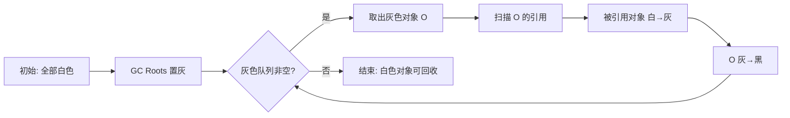

# Java 虚拟机面试二

## 垃圾收集

### 【困难】如何判断 Java 对象是否可以被回收？⭐⭐⭐⭐⭐

判断 Java 对象是否可以被回收有两种方法：

- **引用计数法**
- **可达性分析法**

#### 引用计数法

引用计数算法（Reference Counting）的原理是：在对象中添加一个引用计数器，每当有一个地方引用它时，计数器值就加一；当引用失效时，计数器值就减一；任何时刻计数器为零的对象就是不可能再被使用的。

引用计数算法**简单高效**，但是**存在循环引用问题**——两个对象出现循环引用的情况下，此时引用计数器永远不为 0，导致无法对它们进行回收。

```java
public class ReferenceCountingGC {
    public Object instance = null;

    public static void main(String[] args) {
        ReferenceCountingGC objectA = new ReferenceCountingGC();
        ReferenceCountingGC objectB = new ReferenceCountingGC();
        objectA.instance = objectB;
        objectB.instance = objectA;
    }
}
```

因为循环引用的存在，所以 **Java 虚拟机不适用引用计数算法**。

#### 可达性分析法

通过 **GC Roots** 作为起始点进行搜索，JVM 将能够到达到的对象视为**存活**，不可达的对象视为**死亡**。


**可作为 GC Roots 的对象**包括下面几种：

- 虚拟机栈（栈帧中的局部变量表）中引用的对象（如当前方法局部变量）。
- 本地方法栈（JNI）中引用的 Native 对象。
- 方法区中静态属性（`static`字段）引用的对象。
- 方法区中常量（`final`常量）引用的对象。
- Java 虚拟机内部的引用（如基本数据类型对应的 Class 对象、常驻的异常对象如 `NullPointerException`、系统类加载器）。
- 所有被同步锁（`synchronized` 关键字）持有的对象。
- 反映 Java 虚拟机内部情况的 JMXBean、JVMTI 中注册的回调、本地代码缓存等。

#### 方法区的回收条件

主要回收**废弃常量**和**不再使用的类**。

不再使用的类定义如下：

- Java 堆中不存在该类的任何实例。
- 加载该类的 `ClassLoader` 已被回收。
- 该类对应的 `Class` 对象无任何地方引用（如反射）。

以上为**类卸载必要条件，且全部满足也不一定被卸载**。

#### 常见内存泄漏场景

**内存泄漏的本质是对象无法回收**，常见的有以下情况：

- 静态容器（如 `static HashMap`）持有对象。
- 未关闭的资源（如数据库连接、流）。
- 监听器未注销。
- 不合理使用 `finalize()` 导致对象复活。

### 【中等】为什么不建议使用 finalize()？⭐⭐

`finalize()` 类似 C++ 的析构函数，用来做关闭外部资源等工作。`finalize()` 方法是 Java 提供的对象被垃圾回收前最后的自救机会（在 GC 时被调用一次）。

- **调用时机**：对象被标记为垃圾后、实际回收前，由 JVM 的垃圾回收线程触发（不保证立即执行）。
- **自救机制**：在 `finalize()` 中重新让对象被引用（如赋值给静态变量），可避免本次回收。
- **风险**：
  - **执行时机不确定，可能永远不调用**。
  - **性能差（延迟回收），易导致内存泄漏**。

**不要使用 finalize()**！在 Java 9 后，`finalize()` 直接被标记为 `@Deprecated`。推荐用 `try-with-resources` 或显式调用 `close()` 管理资源。

:::: tip JDK 9+ 的替代方案：Cleaner

::::

JDK 9 引入了 `java.lang.ref.Cleaner`，基于**虚引用 + ReferenceQueue** 实现更安全的资源清理：

```java
// Cleaner 使用示例
public class ResourceHolder implements AutoCloseable {
    private static final Cleaner cleaner = Cleaner.create();
    private final Cleaner.Cleanable cleanable;

    public ResourceHolder() {
        this.cleanable = cleaner.register(this, new CleanupAction());
    }

    @Override
    public void close() {
        cleanable.clean();  // 显式清理
    }

    private static class CleanupAction implements Runnable {
        @Override
        public void run() {
            // 资源清理逻辑（在 Cleaner 线程中执行）
        }
    }
}
```

**Cleaner vs finalize()**：

- Cleaner 在**专用线程**中执行，不影响 GC 进度。
- Cleaner 基于虚引用，对象已被回收后才触发清理，不会"复活"对象。
- Cleaner 仍是**兜底机制**，应优先使用 `try-with-resources` 显式释放。

### 【困难】什么是三色标记？如何解决漏标问题？⭐⭐⭐⭐

三色标记（Tri-color Marking）是现代并发垃圾收集器（CMS、G1、ZGC、Shenandoah）的**核心标记算法**，用于在用户线程并发运行时准确标记存活对象。

:::: info 三色定义

::::

| 颜色     | 含义                                                                                     |
| :------- | :--------------------------------------------------------------------------------------- |
| **白色** | 尚未被垃圾收集器访问的对象。GC 开始时所有对象均为白色；GC 结束后仍为白色的对象将被回收。 |
| **黑色** | 已被垃圾收集器访问过，且该对象的所有引用都已扫描过。黑色对象是存活对象，不会被回收。     |
| **灰色** | 已被垃圾收集器访问过，但其引用至少还有一个未被扫描。灰色是"待处理"队列中的对象。         |

**标记过程**：



:::: info 漏标问题（核心难点）

::::

在**并发标记**过程中，用户线程可能修改对象引用关系，导致"漏标"——原本存活的对象被误判为可回收。漏标发生在以下**两个条件同时满足**时：

1. **赋值器插入了一条或多条从黑色对象到白色对象的新引用**（黑色对象不再扫描引用）。
2. **赋值器删除了全部从灰色对象到该白色对象的直接或间接引用**（灰色对象还没扫描到白色对象）。

```java
// 漏标示例（假设 GC 已并发标记）
Object G = ...;  // 灰色（未扫描完引用）
Object B = ...;  // 黑色（已扫描完引用）
Object W = ...;  // 白色

// 用户线程并发执行：
B.field = W;  // 黑色 B 引用白色 W（条件1：黑色引用白色）
G.field = null;  // 灰色 G 断开引用 W（条件2：灰色删除引用）
// 结果：W 被漏标，GC 认为它是垃圾 → 误回收！
```

:::: info 解决漏标的两大方案

::::

**只要破坏漏标的两个条件之一，即可避免漏标**：

| 方案                                            | 破坏条件 | 原理                                                                                | 实现者         |
| :---------------------------------------------- | :------- | :---------------------------------------------------------------------------------- | :------------- |
| **增量更新（Incremental Update）**              | 条件 1   | 黑色对象新增引用白色对象时，通过**写屏障**记录该黑色对象，重新标为灰色              | CMS            |
| **原始快照（SATB，Snapshot-At-The-Beginning）** | 条件 2   | 灰色对象删除引用白色对象时，通过**写屏障**记录该引用，GC 结束时重新扫描这些白色对象 | G1、Shenandoah |

**写屏障（Write Barrier）**：在对象引用被修改时，JVM 通过写屏障拦截，记录引用变更。

```java
// SATB 写屏障伪代码（G1 使用）
void oop_field_store(oop* field, oop new_value) {
    oop old_value = *field;  // 保存旧值
    satb_mark_queue.add(old_value);  // 加入 SATB 队列，GC 结束时重新扫描
    *field = new_value;
}
```

:::: info 不同 GC 对比

::::

| GC             | 标记算法             | 解决漏标方案 | 特点                            |
| :------------- | :------------------- | :----------- | :------------------------------ |
| **CMS**        | 三色标记             | 增量更新     | 重新标记阶段 STW 较长           |
| **G1**         | 三色标记             | SATB         | 重新标记阶段短，但浮动垃圾稍多  |
| **ZGC**        | 三色标记（染色指针） | 读屏障       | 无 STW 标记，靠读屏障保证一致性 |
| **Shenandoah** | 三色标记（转发指针） | 读屏障       | 并发整理，无 STW                |

### 【中等】什么是安全点和安全区域？⭐⭐⭐

GC 进行垃圾回收时，需要确保**所有线程都在安全的位置暂停**（STW），否则可能因为引用关系正在变化导致标记错误。这个"安全的位置"就是**安全点（Safepoint）**和**安全区域（Safe Region）**。

:::: info 安全点（Safepoint）

::::

- **定义**：程序执行过程中的特定位置，线程在此处挂起时，GC 可以安全地进行堆操作（引用关系稳定）。
- **位置**：通常设置在**方法调用、循环跳转、异常跳转**等指令处（长时间执行的代码不会缺少安全点）。
- **Safepoint 机制**：
  - GC 发起时，JVM 设置" pollsafepoint "标志。
  - 用户线程运行到安全点时**主动检查**该标志，若为 true 则挂起等待。
  - 所有线程都到达安全点后，GC 才真正开始。
- **问题**：如果某个线程长时间不经过安全点（如大循环），会导致其他线程等待，即"**STW 延迟"。

```java
// 大循环可能不进入安全点，导致其他线程被阻塞
for (int i = 0; i < Integer.MAX_VALUE; i++) {
    count++;  // 若 JIT 将其优化为计数循环，可能不检查安全点
}
```

:::: info 安全区域（Safe Region）

::::

- **解决的问题**：当线程处于**Sleep、Blocked、等待 I/O** 等状态时，无法主动走到安全点。
- **定义**：一段代码区域，线程在其中执行时引用关系不会发生变化，相当于"扩展的安全点"。
- **机制**：
  1. 线程进入安全区域时，标记自己进入 Safe Region。
  2. GC 发起时，不需要等待这些线程（它们不会改变引用）。
  3. 线程离开安全区域前，检查 GC 是否完成，若未完成则等待。

:::: info 安全点 vs 安全区域

::::

| 维度     | 安全点（Safepoint）          | 安全区域（Safe Region）                |
| :------- | :--------------------------- | :------------------------------------- |
| 适用线程 | 运行中的线程                 | 阻塞 / 睡眠的线程                      |
| 位置     | 方法调用、循环回边、异常跳转 | JNI 调用、Thread.sleep、I/O 阻塞       |
| 机制     | 线程主动 poll 标志并挂起     | 线程进入时标记，离开时检查 GC 是否完成 |

### 【中等】Java 对象有哪些引用类型？⭐⭐⭐

在 Java 中，对象的引用类型决定了它们如何被垃圾回收（GC）处理，主要分为 **4 种引用类型**，按强度从高到低排列如下：

| 引用类型 | 回收时机                 | 是否可获取对象（`get()`） | 典型用途                         |
| -------- | ------------------------ | ------------------------- | -------------------------------- |
| 强引用   | 永不回收（除非显式置空） | 是                        | 常规对象                         |
| 软引用   | 内存不足时               | 是                        | 缓存                             |
| 弱引用   | GC 运行时                | 是                        | 避免内存泄漏（如 `WeakHashMap`） |
| 虚引用   | GC 运行时                | 否                        | 对象回收跟踪（如堆外内存管理）   |

**（1）强引用（Strong Reference）**

**被强引用关联的对象不会被垃圾收集器回收。**

强引用：使用 `new` 一个新对象的方式来创建强引用。

```java
Object obj = new Object(); // 强引用
```

**回收条件**：当 `obj = null` 或超出作用域时，对象变为可回收状态。

**（2）软引用（Soft Reference）**

**被软引用关联的对象，只有在内存不够的情况下才会被回收。**

软引用：使用 `SoftReference` 类来创建软引用。

```java
SoftReference<Object> softRef = new SoftReference<>(new Object());
Object obj = softRef.get(); // 可能返回 null（如果被回收）
```

**用途**：适合实现缓存（如图片缓存）。

**（3）弱引用（Weak Reference）**

**被弱引用关联的对象一定会被垃圾收集器回收，也就是说它只能存活到下一次垃圾收集发生之前。**

使用 `WeakReference` 类来实现弱引用

```java
WeakReference<Object> weakRef = new WeakReference<>(new Object());
System.gc();
Object obj = weakRef.get(); // 通常返回 null
```

**用途**：适合临时缓存（如 `WeakHashMap` 的键）、避免内存泄漏。

**（4）虚引用（Phantom Reference）**

虚引用又称为幽灵引用或者幻影引用。

无法通过虚引用获取对象（`get()` 始终返回 `null`）：一个对象是否有虚引用的存在，完全不会对其生存时间构成影响，也无法通过虚引用取得一个对象实例。

**为一个对象设置虚引用关联的唯一目的就是能在这个对象被收集器回收时收到一个系统通知。**

使用 `PhantomReference` 来实现虚引用。

```java
ReferenceQueue<Object> queue = new ReferenceQueue<>();
PhantomReference<Object> phantomRef = new PhantomReference<>(new Object(), queue);
System.gc();
Reference<?> ref = queue.poll(); // 不为 null 说明对象被回收
```

**用途**：管理堆外内存（如 NIO 的 `DirectByteBuffer`）。

**对比**：

1. **强引用**是默认方式，其他引用需显式使用 `java.lang.ref` 包下的类。
2. **软引用 vs 弱引用**：
   - 软引用适合保留缓存直到内存紧张；
   - 弱引用立即释放，避免内存泄漏。
3. **虚引用**的唯一用途是关联 `ReferenceQueue`，用于对象回收后的通知。

通过合理选择引用类型，可以优化内存管理并避免内存泄漏问题。

### 【中等】Java 中有哪些垃圾回收算法？⭐⭐⭐⭐⭐

Java 中的垃圾回收（GC）算法主要分为以下几类，每种算法针对不同的场景和内存区域（如年轻代、老年代）进行优化。

垃圾收集的性能指标主要有两点：

- **停顿时间** - 停顿时间是因为 GC 而导致程序不能工作的时间长度。
- **吞吐量** - 吞吐量关注在特定的时间周期内一个应用的工作量的最大值。对关注吞吐量的应用来说长暂停时间是可以接受的。由于高吞吐量的应用关注的基准在更长周期时间上，所以快速响应时间不在考虑之内。

以下是核心算法及其特点的概括：

#### 标记-清除算法（Mark-Sweep）


- **原理**：
  1. **标记**：从 GC Roots 出发，标记所有可达对象。
  2. **清除**：遍历堆内存，回收未被标记的对象。
- **缺点**：
  - 产生**内存碎片**（不连续空间），可能导致大对象分配失败。
  - 效率较低（需遍历全堆）。
- **适用场景**：老年代（如 CMS 回收器的初始阶段）。

#### 标记-整理算法（Mark-Compact）


- **原理**：
  1. **标记**：与标记-清除相同，标记可达对象。
  2. **整理**：将存活对象向内存一端移动，清理边界外空间。
- **优点**：避免内存碎片。
- **缺点**：移动对象开销大（需更新引用地址）。
- **适用场景**：适合**老年代**，对象存活率高（如 Serial Old、Parallel Old 回收器）。

#### 复制算法（Copying）


- **原理**：
  - 将内存分为两块（`From` 和 `To` 空间），每次只使用一块。
  - GC 时将存活对象从 `From` 复制到 `To` 空间，并清空 `From`。
- **优点**：
  - 无内存碎片。
  - 高效（仅复制存活对象）。
- **缺点**：内存利用率仅 50%（需预留一半空间）。
- **适用场景**：年轻代（如 Serial、ParNew 等回收器），因年轻代对象存活率低。
- **优化**：实际 JVM 将年轻代分为 **Eden** 和 **Survivor（From/To）** 区（比例通常为 `8:1:1`），通过多次复制到 Survivor 区避免浪费。

#### 分代收集算法（Generational Collection）

**分代收集是 JVM 在吞吐量、延迟和内存占用之间找到的经典平衡点**，而新一代 GC 则通过更复杂的并发机制尝试突破其限制。

**跨代引用处理**：使用**记忆集**（**Remembered Set**）记录老年代对年轻代的引用，避免全堆扫描。

根据对象存活周期将堆分为**年轻代**和**老年代**，对不同区域采用不同算法：

- **年轻代**：复制算法（因对象朝生夕死，存活率低）。
- **老年代**：标记-清除或标记-整理（因对象存活率高）。
- **永久代**：这部分就是早期 Hotspot JVM 的方法区实现方式了，储存 Java 类元数据、常量池、Intern 字符串缓存。在 JDK 8 之后就不存在永久代这块儿了。


#### 分区算法（Region-Based）

- **原理**：将堆划分为多个独立区域（如 G1 的 **Region**），优先回收垃圾最多的区域。
- **优点**：
  - 控制每次回收的区域数量，减少停顿时间（**STW**）。
  - 适合大内存应用（如 G1、ZGC、Shenandoah）。

#### 增量算法（Incremental）

- **目标**：减少单次 GC 停顿时间，通过分阶段执行 GC 与用户线程交替运行。
- **缺点**：
  - 线程切换开销大，整体吞吐量可能下降。
- **现代实现**：如 CMS 的并发标记阶段。

#### 常见垃圾回收器与算法对应

| 回收器                | 新生代算法  | 老年代算法        | 特点                          |
| --------------------- | ----------- | ----------------- | ----------------------------- |
| **Serial**            | 复制        | 标记-整理         | 单线程，STW 时间长。          |
| **ParNew**            | 复制        | 标记-整理         | Serial 的多线程版。           |
| **Parallel Scavenge** | 复制        | 标记-整理         | 吞吐量优先。                  |
| **CMS**               | -           | 标记-清除（并发） | 低延迟，但内存碎片多。        |
| **G1**                | 复制 + 分区 | 标记-整理 + 分区  | 兼顾吞吐与延迟，Region 分区。 |
| **ZGC/Shenandoah**    | 复制 + 分区 | 标记-整理 + 分区  | 亚毫秒级停顿，并发标记/整理。 |

现代 JVM 趋向于使用**分代+分区+并发**的复合算法（如 G1），在吞吐量和延迟之间取得平衡。

### 【中等】Java 中常见的垃圾收集器有哪些？⭐⭐⭐⭐⭐


以下是 Java 主要垃圾收集器的详细对比表格，涵盖算法、特点、适用场景和关键参数：

| **垃圾收集器**        | **分类**         | **算法**                          | **目标**               | **适用场景**                  | **JDK 版本**         | **启用参数**                     | **优缺点**                                                     |
| --------------------- | ---------------- | --------------------------------- | ---------------------- | ----------------------------- | -------------------- | -------------------------------- | -------------------------------------------------------------- |
| **Serial GC**         | 串行             | 新生代：复制<br>老年代：标记-整理 | 简单低开销             | 单核、客户端应用、小堆        | 所有版本             | `-XX:+UseSerialGC`               | ✔️ 内存占用小<br>❌ 全程 STW，延迟高                           |
| **Parallel Scavenge** | 并行（吞吐优先） | 新生代：复制                      | 高吞吐量               | 后台计算、多核大堆            | JDK 1.4+             | `-XX:+UseParallelGC`             | ✔️ 吞吐量高<br>❌ 停顿时间较长                                 |
| **Parallel Old**      | 并行（吞吐优先） | 老年代：标记-整理                 | 配合 Parallel Scavenge | 与 Parallel Scavenge 搭配使用 | JDK 6+               | `-XX:+UseParallelOldGC`          | ✔️ 老年代并行回收<br>❌ 仍以吞吐优先，延迟较高                 |
| **ParNew**            | 并行             | 新生代：复制                      | 低停顿（与 CMS 配合）  | 需与 CMS 搭配的多核环境       | JDK 1.4+             | `-XX:+UseParNewGC`               | ✔️ 多线程版 Serial GC<br>❌ 仅新生代，需搭配 CMS               |
| **CMS**               | 并发（低延迟）   | 老年代：标记-清除                 | 最小化停顿时间         | 老年代低延迟应用              | JDK 1.4-14           | `-XX:+UseConcMarkSweepGC`        | ✔️ 并发收集，低停顿<br>❌ 内存碎片、并发模式失败风险           |
| **G1**                | 分区+并发        | 标记-整理（分 Region）            | 平衡吞吐与延迟         | 大堆（数十 GB）、JDK 8+ 默认  | JDK 7+（JDK 9+默认） | `-XX:+UseG1GC`                   | ✔️ 可预测停顿、大堆友好<br>❌ 内存占用略高                     |
| **ZGC**               | 并发             | 染色指针+读屏障                   | 亚毫秒级停顿（<10ms）  | 超大堆（TB 级）、云原生       | JDK 11+              | `-XX:+UseZGC`                    | ✔️ 极低停顿、堆大小几乎无限制<br>❌ JDK 11+ 支持，兼容性要求高 |
| **分代 ZGC**          | 并发+分代        | 染色指针+分代回收                 | 亚毫秒级（<1ms）       | JDK 21+ 低延迟首选            | JDK 21+              | `-XX:+UseZGC -XX:+ZGenerational` | ✔️ 分代优化、停顿更低、吞吐更高<br>❌ JDK 21+ 才支持           |
| **Shenandoah**        | 并发             | 转发指针+读屏障                   | 低延迟（与 ZGC 竞争）  | Red Hat 系、低延迟大堆        | JDK 12+              | `-XX:+UseShenandoahGC`           | ✔️ 并发压缩、无停顿扩展<br>❌ 非 Oracle 官方默认               |

**关键对比维度**

- **吞吐量**：Parallel GC（Parallel Scavenge + Parallel Old）最优。
- **延迟**：ZGC/Shenandoah < G1 < CMS < Parallel GC。
- **堆大小**：
  - 小堆（<4GB）：Serial GC / Parallel GC。
  - 大堆（4GB~数十 GB）：G1。
  - 超大堆（TB 级）：ZGC/Shenandoah。
- **版本兼容性**：
  - JDK 8：默认 Parallel GC，可选 G1/CMS（CMS 已废弃）。
  - JDK 11+：默认 G1，可选 ZGC/Shenandoah。
  - JDK 21+：默认 G1，可选分代 ZGC（推荐低延迟场景）。

**选择建议**

- **常规服务端应用**：JDK 8 用 `G1`，JDK 11~20 用 `ZGC`，JDK 21+ 用**分代 ZGC**（若需超低延迟）。
- **批处理任务**：`Parallel GC`（高吞吐优先）。
- **资源受限环境**：`Serial GC`（如嵌入式设备）。
- **兼容性测试**：JDK 11+ 可试用 `Shenandoah`（非 Oracle 官方构建需注意）。

通过此表格可快速定位适合业务需求的 GC 组合。

### 【困难】Java 中的 Young GC、Old GC、Full GC 和 Mixed GC 的区别是什么？⭐⭐⭐

| 类型         | 核心回收区域             | 触发时机                                        | 回收目标                    | 暂停特性                 |
| :----------- | :----------------------- | :---------------------------------------------- | :-------------------------- | :----------------------- |
| **Young GC** | 新生代（Eden + S0/S1）   | Eden 区满，无法为新对象分配内存时               | 回收新生代的临时对象        | 暂停时间短、频率高       |
| **Old GC**   | 老年代                   | 老年代空间不足（仅 CMS/G1 支持单独回收）        | 回收老年代的长期存活对象    | 暂停时间较长、频率低     |
| **Full GC**  | 新生代 + 老年代 / 元空间 | 老年代满 / 元空间满 / 分配担保失败 / 显式触发等 | 回收全堆垃圾                | 暂停时间最长、性能影响大 |
| **Mixed GC** | 新生代 + 部分老年代      | G1 特有，老年代占比达到阈值（IHOP）时           | 同时回收新生代 + 部分老年代 | 暂停时间可控（增量回收） |

#### Young GC

**Young GC 又称为 YGC 或 Minor GC，即年轻代垃圾回收**。仅针对**新生代（Eden 区 + Survivor 区）** 的垃圾回收，是 JVM 中最频繁的 GC 类型，几乎所有垃圾回收器（ParallelGC、CMS、G1、ZGC）都支持。

**触发条件**：

- 核心触发条件：新对象要分配内存时，**Eden 区空间不足**（最常见）；
- 次要条件：**Survivor 区空间不足**，无法存放 Eden 区存活对象时（极少）。

**执行逻辑（以复制算法为例）**：

- 暂停所有用户线程（STW，Stop The World）；
- 标记 Eden 区和 From Survivor 区的存活对象；
- 将存活对象复制到 To Survivor 区（若对象年龄达到晋升阈值，直接复制到老年代）；
- 清空 Eden 区和 From Survivor 区，交换 From/To Survivor 区的角色。

**性能特点**：

- 暂停时间短（新生代对象大多是 “朝生夕死”，存活对象少，复制成本低）；
- 频率高（应用运行中不断创建临时对象，Eden 区快速填满）；
- 对应用性能影响小（单次暂停通常毫秒级）。

**参数**：

- `-XX:MaxTenuringThreshold=15`：晋升老年代的年龄阈值。
- `-XX:SurvivorRatio=8`：Eden 区与单个 Survivor 区的比例（默认 8:1:1）。

#### Old GC

**Old GC (Major GC 或 OGC) ，老年代垃圾回收**。仅针对**老年代**的垃圾回收，**并非所有回收器都支持**（ParallelGC 不支持单独 Old GC，必须和 Young GC 一起触发 Full GC；CMS/G1 支持）。

**触发条件**：当老年代空间不足时触发，通常是当从年轻代晋升到老年代的对象过多，或者老年代的存活对象数量达到一定阈值时。

**执行逻辑（以 CMS 为例）**：

- 初始标记（STW）：标记老年代中直接被 GC Roots 引用的对象；
- 并发标记（不暂停）：遍历老年代的存活对象，耗时较长但不影响用户线程；
- 重新标记（STW）：修正并发标记期间的对象状态变化；
- 并发清理（不暂停）：清理老年代的垃圾对象（不压缩，会产生内存碎片）。

**特点**：

- 暂停时间比 Young GC 长（老年代对象存活时间长，标记 / 清理成本高）；
- 频率低（老年代对象生命周期长，空间增长慢）；
- CMS 的 Old GC 大部分阶段并发执行，STW 时间较短；G1 的 Old GC 仍以 STW 为主。

#### Full GC

**Full GC** 针对**新生代 + 老年代 + 元空间（Metaspace）** 的全区域垃圾回收，是 JVM 中代价最高的 GC 类型，会导致应用长时间卡顿。

**Full GC 触发条件**

| **触发条件**             | **具体原因**                                                                 | **关联参数/备注**                                            |
| ------------------------ | ---------------------------------------------------------------------------- | ------------------------------------------------------------ |
| **老年代空间不足**       | 老年代无法通过垃圾回收释放足够空间，无法容纳新晋升的对象                     | `-Xmx`、`-XX:CMSInitiatingOccupancyFraction`（CMS 触发阈值） |
| **永久代/元空间不足**    | Java 7 及之前：永久代（PermGen）耗尽<br>Java 8+：元空间（Metaspace）超过阈值 | `-XX:MetaspaceSize`、`-XX:MaxMetaspaceSize`（Java 8+）       |
| **显式调用 System.gc()** | 代码调用 `System.gc()` 或通过 `jmap -dump` 等工具触发（不保证立即执行）      | `-XX:+DisableExplicitGC`（禁用显式 GC）                      |
| **空间分配担保失败**     | 年轻代晋升时，老年代剩余空间不足（`Promotion Failed`）                       | `-XX:HandlePromotionFailure`（JDK 6u24 后默认启用）          |
| **晋升老年代失败**       | 大对象或长期存活对象直接进入老年代，但老年代空间不足                         | `-XX:PretenureSizeThreshold`（大对象直接晋升阈值）           |
| **平均晋升大小预测失败** | Young GC 前，统计发现历史平均晋升大小 > 老年代当前剩余空间                   | 依赖 JVM 自适应策略（如 `-XX:+UseAdaptiveSizePolicy`）       |

**Full GC，全堆垃圾回收**

- 作用范围：对整个堆内存（包括年轻代和老年代）进行回收。
- 触发条件：当老年代空间不足且无法通过老年代垃圾回收释放足够空间，或其他情况导致系统内存压力较大时触发（如 `System.gc()` 调用）。
- 执行方式：回收所有代（年轻代、老年代）中的垃圾，并且可能会伴随着元空间的回收。
- 特点：回收时间最长，会触发整个 JVM 的停顿（Stop - The - World），对性能有较大影响，通常不希望频繁发生。

**减少 Full GC 的优化策略**

| **优化方向**           | **具体措施**                                          | **关键参数示例**                                                       |
| ---------------------- | ----------------------------------------------------- | ---------------------------------------------------------------------- |
| **调整堆内存**         | 增大堆大小，避免老年代频繁耗尽                        | `-Xms4g -Xmx4g`（初始和最大堆一致，避免动态扩容）                      |
| **增大年轻代比例**     | 减少对象过早晋升到老年代                              | `-XX:NewRatio=2`（老年代：新生代=2:1）、`-Xmn2g`（直接设置年轻代大小） |
| **调整元空间大小**     | 避免元空间动态扩展触发 Full GC                        | `-XX:MetaspaceSize=256m -XX:MaxMetaspaceSize=512m`                     |
| **避免大对象直接晋升** | 减少大对象分配或调整晋升阈值                          | `-XX:PretenureSizeThreshold=1m`（>1MB 对象直接进老年代）               |
| **选择低延迟 GC 算法** | 如 G1 或 ZGC，减少 Full GC 频率                       | `-XX:+UseG1GC`、`-XX:+UseZGC`                                          |
| **监控与调优**         | 通过日志分析 Full GC 原因（如 `-XX:+PrintGCDetails`） | `jstat -gcutil`、`jmap -histo` 等工具辅助定位问题。                    |

**常见表现与影响**

- **应用卡顿**：STW 导致所有业务线程暂停（如接口超时、TPS 骤降）。
- **频繁 Full GC**：可能由内存泄漏、不合理对象分配或 JVM 参数配置不当引起（如 `-Xmx` 过小）。

**优化建议**

- **避免内存泄漏**：检查长生命周期对象（如缓存）是否无限制增长。
- **调整 JVM 参数**：
  - 增大老年代空间（`-Xmx` 和 `-Xms` 设为一致，避免动态扩容触发 GC）。
  - 优化晋升阈值（`-XX:MaxTenuringThreshold`）。
  - 使用更高效的 GC 器（如 G1/ZGC 替代 CMS）。
- **禁用显式 GC**：添加 `-XX:+DisableExplicitGC`。

**关键参数**

| 参数                                    | 作用                            |
| --------------------------------------- | ------------------------------- |
| `-XX:+PrintGCDetails`                   | 打印 GC 日志，分析 Full GC 原因 |
| `-XX:MetaspaceSize=256m`                | 设置元空间初始大小              |
| `-XX:CMSInitiatingOccupancyFraction=70` | CMS 老年代占用率触发阈值        |

**总结**：Full GC 是 JVM 内存回收的最后手段，触发条件复杂，需结合日志和监控定位根本原因，针对性优化堆大小、GC 策略或代码逻辑。

#### Mixed GC

**G1 收集器特有**的回收行为，同时回收**新生代 + 部分老年代**（并非全量老年代），是 G1 替代 Full GC 的核心策略。

- 作用范围：同时回收年轻代和部分老年代区域。
- 触发条件：当 G1 垃圾回收器发现老年代区域的垃圾过多时触发。
- 执行方式：混合回收年轻代和部分老年代区域，主要目的是减少老年代中的垃圾积压。
- 特点：结合了 YGC 的快速回收和 OGC 的深度回收，尽量减少停顿时间，适用于大内存应用。

### 【中等】JVM 的内存分配策略是怎样的？对象何时晋升老年代？⭐⭐⭐⭐

:::: info 核心结论

::::

> JVM 内存分配遵循"**新生代优先 Eden、大对象直接进老年代、长期存活对象晋升**"三大策略，配合 Survivor 区的年龄计数实现分代管理。

#### 堆内存分代结构


- **新生代（Young Generation）**：Eden + Survivor 0 + Survivor 1（默认比例 `8:1:1`，通过 `-XX:SurvivorRatio=8` 设置）。
- **老年代（Old Generation）**：存放长期存活的对象和大对象。
- 新生代 : 老年代默认比例 = `1:2`（通过 `-XX:NewRatio=2` 设置）。

#### 内存分配规则

**1. 对象优先在 Eden 分配**

- 绝大多数对象在 Eden 区分配（若开启 TLAB，则在线程私有的 TLAB 中分配）。
- Eden 区空间不足时，触发 Minor GC（Young GC）。

**2. 大对象直接进入老年代**

- **大对象**（如长数组、大字符串）需要大量连续内存，避免在 Eden 和 Survivor 之间来回复制。
- 阈值由 `-XX:PretenureSizeThreshold` 设置（仅对 Serial、ParNew 有效，Parallel Scavenge 不支持）。

```bash
# 大于 1MB 的对象直接进入老年代
-XX:PretenureSizeThreshold=1048576  # 注意：单位是字节
```

**3. 长期存活对象进入老年代**

- 每个对象在对象头的 Mark Word 中有一个 **GC 年龄计数器**。
- 对象在 Survivor 区每经过一次 Minor GC，年龄 +1。
- 年龄达到阈值（默认 15，`-XX:MaxTenuringThreshold=15`）时晋升到老年代。

| 对象头 GC 年龄位数 | 最大年龄 | 说明                          |
| :----------------- | :------- | :---------------------------- |
| 4 位               | 15       | JDK 默认（Mark Word 中 4 位） |

**4. 动态年龄判断**

- Survivor 区中相同年龄的所有对象大小总和超过 Survivor 区空间的一半（`-XX:TargetSurvivorRatio=50`）时，年龄大于或等于该年龄的对象直接进入老年代。
- 这是一种**自适应策略**，避免 Survivor 区溢出。

**5. 空间分配担保**

- Minor GC 前，JVM 检查**老年代最大可用连续空间**是否大于**新生代所有对象总空间**：
  - **大于**：Minor GC 安全。
  - **小于**：检查是否允许担保失败（`-XX:-HandlePromotionFailure`，JDK 6u24 后默认允许）。
    - 允许：检查老年代连续空间是否大于**历次晋升到老年代对象的平均大小**：
      - 大于：尝试 Minor GC（有风险）。
      - 小于：改为 Full GC。
    - 不允许：直接 Full GC。

#### 对象晋升老年代的触发条件总结

| 触发条件          | 说明                                                        | 相关参数                      |
| :---------------- | :---------------------------------------------------------- | :---------------------------- |
| 年龄达到阈值      | Survivor 区中对象年龄达到 `MaxTenuringThreshold`            | `-XX:MaxTenuringThreshold=15` |
| 动态年龄判断      | 同年龄对象总和超过 Survivor 区一半，大于该年龄的对象晋升    | `-XX:TargetSurvivorRatio=50`  |
| 大对象            | 对象大小超过 `PretenureSizeThreshold`                       | `-XX:PretenureSizeThreshold`  |
| Survivor 空间不足 | Eden 区存活对象无法放入 Survivor 区，通过担保机制进入老年代 | `-XX:HandlePromotionFailure`  |

::: info 跨语言分代 GC 对比（L4：演进视角）

:::

**Go 的分代 GC 现状**

Go 的 GC 设计哲学是"简单优先"，**至今没有显式分代收集**：

- **无显式分代**：Go 的堆不区分新生代/老年代，所有对象统一处理。Go 团队认为分代 GC 的复杂度（RSet、Card Table、跨代引用追踪）带来的收益不足以抵消其维护成本。
- **Write Barrier 的角色**：Go 1.19 的 write barrier 用于支持并发三色标记（而非分代收集），其作用是记录并发标记期间的引用变更，防止漏标。这与 JVM 中分代 GC 的 write barrier（用于维护 RSet/Card Table）目的不同。
- **为什么 Go 不需要分代**：
  - Go 的逃逸分析在编译期将大量短生命周期对象分配在栈上（而非堆），这天然减少了年轻代"朝生夕死"对象进入堆的数量。
  - Go 的 GC 延迟已经极低（< 1ms），引入分代带来的 STW 阶段（如 Young GC 的拷贝阶段）反而可能增加延迟。
  - Go 的分配器（`mcache` → `mcentral` → `mheap`）通过 per-P 缓存实现类似 TLAB 的无锁分配，但对象始终在统一堆中。

**V8 引擎的分代 GC 对比**

V8（Chrome/Node.js 的 JavaScript 引擎）采用了与 JVM 类似但更简化的分代 GC：

- **New Space（新生代）**：使用 **Semi-space 复制算法**（Cheney 算法），将内存分为 From 和 To 两个半区。新对象分配在 From 空间，GC 时存活对象复制到 To 空间。大小通常 1~8MB（远小于 JVM 的 Eden）。
- **Old Space（老年代）**：使用**标记-清除 + 标记-整理**（类似 CMS），当内存碎片化严重时触发整理。
- **晋升策略**：对象在 New Space 经历两次 GC 后仍存活，晋升到 Old Space。这与 JVM 的年龄计数器类似，但阈值固定为 2。
- **与 JVM 的核心差异**：
  - V8 无 Survivor 区（New Space 本身就是半区复制，From/To 直接对应 Eden+Survivor）。
  - V8 的 GC 是单线程的（主线程），但通过 Incremental Marking 和 Concurrent Marking（Orinoco 项目）减少停顿。
  - V8 的 Old Space 无 Region 概念，复杂度远低于 G1。

| 维度       | JVM（G1）                  | Go                   | V8（JavaScript）              |
| :--------- | :------------------------- | :------------------- | :---------------------------- |
| 分代       | 明确分代（Eden/S0/S1/Old） | 无分代               | 分代（New Space / Old Space） |
| 新生代算法 | 复制（Eden + 2 Survivor）  | 无                   | 半区复制（Semi-space）        |
| 老年代算法 | 标记-整理（Region）        | 标记-清扫            | 标记-清除 + 标记-整理         |
| 晋升阈值   | 可配置（默认 15）          | 无                   | 固定 2 次 GC                  |
| 栈分配     | 标量替换（等效）           | 逃逸分析（真栈分配） | 无栈分配                      |
| 写屏障用途 | 分代追踪 + 并发标记        | 并发标记             | 分代追踪 + 增量标记           |

### 【困难】Java 的 CMS 垃圾回收流程是怎样的？⭐⭐⭐

CMS 是一种以**低延迟**为目标的垃圾回收器，主要用于老年代回收，其核心流程分为四个阶段，其中两个阶段会触发 **STW（Stop-The-World）**，其余阶段与用户线程并发执行。

CMS 收集器运行步骤如下：

1. **初始标记**：仅仅只是标记一下 GC Roots 能直接关联到的对象，速度很快，需要停顿。
2. **并发标记**：进行 GC Roots Tracing 的过程，它在整个回收过程中耗时最长，不需要停顿。
3. **重新标记**：修正并发标记的错误，需要停顿。
4. **并发清除**：回收在标记阶段被鉴定为不可达的对象。不需要停顿。

在整个过程中耗时最长的并发标记和并发清除过程中，收集器线程都可以与用户线程一起工作，不需要进行停顿。


**CMS 的缺陷与应对措施**

- **内存碎片**：长期运行后可能触发 **Full GC**（压缩内存），通过 `-XX:CMSFullGCsBeforeCompaction` 设置压缩频率。
- **并发模式失败（Concurrent Mode Failure）**：
  - 老年代空间不足时，退化为 Serial Old 收集器（STW 时间更长）。
  - 优化：调整 `-XX:CMSInitiatingOccupancyFraction`（默认 68%，建议 70-80%）。
- **浮动垃圾**：需预留空间（通过 `-XX:+UseCMSInitiatingOccupancyOnly` 避免动态调整阈值）。

### 【困难】Java 的 G1 垃圾回收流程是怎样的？⭐⭐⭐⭐

G1 是 JDK 9 默认的垃圾回收器，**面向全堆（新生代 + 老年代）**，按「Region 分区」管理内存，核心目标是「可控的 STW 时间」（通过`-XX:MaxGCPauseMillis`指定最大暂停目标），优先回收垃圾占比高的 Region。

**核心设计思想**

- **分区（Region）模型**：将堆划分为多个大小相等的 **Region**（默认约 2048 个），动态分代（逻辑区分 Eden/Survivor/Old/Humongous 区）。
- **停顿预测模型**：根据用户设定的 `-XX:MaxGCPauseMillis`（默认 200ms），优先回收**垃圾最多（Garbage-First）的 Region**。
- **并发标记**：减少 STW 时间，但最终标记和拷贝阶段仍需停顿。
- **混合回收**：兼顾年轻代和老年代，避免 Full GC。
- **适用场景**：大堆内存（4GB+）、需平衡吞吐与延迟的应用（如 JDK9+默认 GC）。

G1 的垃圾回收分为两大阶段：

1. **并发标记阶段**（Concurrent Marking，基于 SATB 算法）
2. **对象拷贝阶段**（Evacuation，STW）

#### G1 并发标记阶段（SATB-Based）

1. **初始标记（Initial Marking，STW）**：标记从 GC Roots 直接可达的对象。
   - 短暂 STW（Stop-The-World）。
   - 使用**外部 Bitmap **记录存活对象（而非对象头）。
   - 通常与年轻代回收（Young GC）同步触发。
2. **并发标记（Concurrent Marking）**：递归标记所有可达对象。
   - 与用户线程并发执行。
   - 使用** SATB（Snapshot-At-The-Beginning）**算法记录标记过程中的引用变化（通过写屏障维护）。
3. **最终标记（Final Marking，STW）**：处理 SATB 队列中的引用变更，完成最终标记。
   - 短暂 STW。
   - 修正并发标记期间漏标的对象。
4. **清理阶段（Cleanup，STW）**
   - 统计每个 Region 的存活对象比例。
   - 回收**完全无存活对象**的 Region（直接整区回收）。
   - 生成**回收集合（CSet）**供后续拷贝阶段使用。

#### 对象拷贝阶段（Evacuation，STW）

- **作用**：将回收集合（CSet）中的存活对象拷贝到空闲 Region。
- **流程**：
  1. 根据标记结果，选择垃圾比例高的 Region 组成 CSet。
  2. 并行将 CSet 中的存活对象复制到新 Region（类似复制算法）。
  3. 清空原 Region，加入空闲列表。
- **特点**：
  - 完全 STW，是 G1 的主要停顿来源。
  - 支持**混合回收（Mixed GC）**：同时回收年轻代和老年代 Region。

#### G1 Mixed GC（混合回收）

- **触发条件**：老年代占用超过阈值（`-XX:InitiatingHeapOccupancyPercent`，默认 45%）。
- **行为**：
  1. 在年轻代回收时，**额外选择部分老年代 Region **加入 CSet。
  2. 通过`-XX:G1MixedGCLiveThresholdPercent`控制老年代 Region 的回收阈值（存活对象比例低于该值才回收）。

**关键机制**

- **Remembered Set（RSet）**：每个 Region 维护一个 RSet，记录其他 Region 对它的引用，避免全堆扫描。
- **Humongous 区**：存放大对象（超过 Region 50%），直接分配在 Old 区，避免反复拷贝。

**参数配置**

| 参数                                    | 作用                                      |
| --------------------------------------- | ----------------------------------------- |
| `-XX:+UseG1GC`                          | 启用 G1 回收器                            |
| `-XX:MaxGCPauseMillis=200`              | 目标最大停顿时间                          |
| `-XX:InitiatingHeapOccupancyPercent=45` | 触发 Mixed GC 的堆占用率阈值              |
| `-XX:G1HeapRegionSize=2M`               | 设置 Region 大小（1MB~32MB，需为 2 的幂） |

**优缺点**

- **优势**：
  - 可控停顿时间，适合大堆（数十 GB）应用。
  - 内存整理减少碎片（复制算法）。
- **劣势**：
  - 内存占用较高（RSet 和并发标记开销）。
  - 复杂场景下可能退化为 Serial Old（如分配失败）。

**适用场景**

- 替代 CMS，适用于 **JDK 8+** 的中大堆应用（如 6GB~100GB）。
- 对延迟敏感且需平衡吞吐量的场景（如微服务、实时系统）。

::: info 跨语言 GC 对比：G1 vs Go 三色标记 vs ZGC（L4：演进视角）

:::

**Go 1.19+ 的三色标记 + 混合写屏障**

Go 的 GC 自 1.5 版本起采用并发三色标记清扫算法，1.19+ 版本进一步优化了写屏障机制：

- **三色标记（无分代）**：Go 的 GC 是全局并发标记，不区分新生代/老年代。所有对象统一对待，通过三色标记确定存活对象。Go 没有 Remembered Set 和 Card Table 等跨代引用追踪机制。
- **混合写屏障（Hybrid Write Barrier）**：Go 1.8 引入了混合写屏障（Dijkstra 写屏障 + Yuasa 写屏障的结合），结合了增量更新（破坏漏标条件 1）和 SATB（破坏漏标条件 2）的优点，在并发标记期间无需 STW 重新扫描栈。
- **延迟 vs 吞吐量**：
  - **GC 延迟优于 G1**：Go 的 GC 目标延迟通常 < 1ms（通过 `GOGC` 和 `GOMEMLIMIT` 控制），因为 Go 没有分代和 RSet 维护开销，标记阶段无需 STW。
  - **吞吐量低于 G1**：Go 的 GC 需要并发扫描全堆（无分代意味着每次都扫描全部对象），CPU 开销较大。G1 通过分代收集只扫描年轻代 + 部分老年代 Region，吞吐量更高。
- **GOGC 参数**：Go 通过 `GOGC`（默认 100）控制 GC 触发阈值——当堆内存增长到上次 GC 后存活对象的 100% 时触发 GC。Go 1.19 新增 `GOMEMLIMIT` 软限制，防止 OOM。

**ZGC 并发标记 vs G1 STW 标记**

G1 的标记阶段需要 STW，而 ZGC 实现了几乎全并发的标记，这是两者最核心的差异：

| 维度     | G1                                | ZGC                                   | Go GC                  |
| :------- | :-------------------------------- | :------------------------------------ | :--------------------- |
| 标记方式 | 并发标记 + 最终标记（STW）        | 并发标记（染色指针）                  | 并发标记（混合写屏障） |
| STW 阶段 | 初始标记 + 最终标记 + 清理 + 拷贝 | 初始标记 + 最终重映射（2 个极短 STW） | 仅初始标记（极短 STW） |
| 停顿时间 | 目标 ~200ms（可配置）             | < 10ms（JDK 11~20），< 1ms（JDK 21+） | 通常 < 1ms             |
| 分代     | 是（Eden/Survivor/Old）           | 是（JDK 21+ 分代 ZGC）                | 否（全堆扫描）         |
| 核心创新 | Region + RSet + SATB              | 染色指针 + 读屏障                     | 混合写屏障 + 无分代    |
| 吞吐量   | 高                                | 中（JDK 11~20），高（JDK 21+）        | 中（全堆扫描开销）     |
| 内存开销 | RSet 占用 ~5% 堆                  | 染色指针无额外开销                    | 写屏障无额外内存       |

::: tip 关键结论

- **Go GC 追求极致低延迟**：通过牺牲分代收集和吞吐量换取亚毫秒级停顿，适合对延迟敏感的云原生服务。
- **G1 追求平衡**：通过分代 + Region 在吞吐量和延迟间取得平衡，适合大多数服务端应用。
- **ZGC 追求超大堆低延迟**：通过染色指针实现几乎无 STW，适合 TB 级堆和 JDK 21+ 低延迟场景。

:::

### 【困难】Java 的 ZGC 垃圾回收流程是怎样的？⭐⭐⭐

ZGC 是 JDK 11 引入的低延迟垃圾回收器，**面向大堆（TB 级）**，核心目标是「STW 时间控制在 10ms 内」，按「Region 分区」管理内存（支持动态扩容 / 缩容），全程基于「着色指针 + 读屏障」实现几乎全并发的回收，仅两个极短 STW 阶段。

::: ZGC 工作流程

:::

（1）**初始标记**

- 触发时机：主动触发 GC 时（如堆占用达阈值）；
- 动作：极短 STW→标记 GC Roots（栈、寄存器、静态变量）直接引用的对象→恢复用户线程；
- 记忆点：“闪标根”，耗时微秒级，几乎无感知。

（2）**并发标记**

- 核心依赖：**着色指针**（指针中嵌入标记位，无需修改对象本身）；
- 动作：和用户线程并行→从初始标记的根对象出发，遍历全堆标记存活对象→标记位直接写在指针里；
- 记忆点：“并发标”，全堆遍历但不卡应用，标记效率极高。

（3）**并发预备重映射**

- 动作：并发统计所有 “存活对象占比低” 的 Region（即待回收 Region）→记录需要重映射的 Region 范围；
- 记忆点：“选目标”，挑出要回收的 Region，为移动对象做准备。

（4）**最终重映射**

- 核心背景：ZGC 会将存活对象复制到新 Region（无碎片），导致指针地址变化；
- 动作：极短 STW→遍历所有线程的栈 / 寄存器，修正指向旧 Region 的指针→指向新 Region 的对象→恢复用户线程；
- 记忆点：“修指针”，仅修正线程上下文的指针，耗时 < 1ms。

（5）**并发重置**

- 动作：并发清空已回收的旧 Region→重置 Region 的元数据（如标记位、大小）→将 Region 归还给空闲列表；
- 记忆点：“清战场”，全程并发，为下次 GC 腾空间。

::: info ZGC 核心特性

:::

- **着色指针**：指针自带标记位，标记 / 重映射无需修改对象，是低延迟的核心；
- **读屏障**：用户线程读取对象时触发，自动处理并发标记 / 重映射的指针一致性，无额外 STW；
- **无碎片**：全程用复制算法（存活对象移到新 Region），彻底解决内存碎片问题，适合大堆场景。

**分代 ZGC（Generational ZGC，JDK 21）**

JDK 21 中 ZGC 引入了**分代支持**，将堆分为年轻代和老年代，针对短生命周期对象优先回收，大幅降低 GC 开销。

| 维度         | 非分代 ZGC（JDK 11~20） | 分代 ZGC（JDK 21+）              |
| :----------- | :---------------------- | :------------------------------- |
| **回收范围** | 全堆回收                | 优先回收年轻代，减少老年代扫描   |
| **GC 频率**  | 较低（全堆扫描成本高）  | 年轻代 GC 更频繁但更快速         |
| **停顿时间** | < 10ms                  | < 1ms（年轻代 GC）               |
| **吞吐量**   | 略低于 G1               | 与 G1 接近，延迟远低于 G1        |
| **启用参数** | `-XX:+UseZGC`           | `-XX:+UseZGC -XX:+ZGenerational` |

```bash
# JDK 21 启用分代 ZGC
java -XX:+UseZGC -XX:+ZGenerational -Xmx8g YourApplication
```

**分代 ZGC 的核心优势**：

- **年轻代独立回收**：短生命周期对象在年轻代快速回收，无需扫描全堆
- **更低的停顿**：年轻代 GC 停顿时间可降至**亚毫秒级**
- **更高吞吐量**：减少全堆扫描频率，吞吐量提升 10%~30%
- **平滑迁移**：从非分代 ZGC 迁移只需加 `-XX:+ZGenerational` 参数

**选型建议**：JDK 21+ 的应用，优先选择分代 ZGC，它是低延迟场景的最佳选择。

### 【困难】Java 的 Shenandoah 垃圾回收流程是怎样的？⭐⭐

Shenandoah 是由 Red Hat 开发、JDK 12 引入（作为实验特性，JDK 15 转正）的低延迟垃圾回收器，**核心目标是 STW 时间与堆大小无关**，即使 TB 级堆也能将停顿控制在 10ms 内。与 ZGC 并列为"低延迟 GC 双雄"。

:::: info 核心技术：转发指针（Brooks Pointer）

::::

Shenandoah 的核心创新是**转发指针**（Brooks Pointer，得名于其发明人 Rodney Brooks）：

- 每个对象的对象头中额外增加一个**转发指针**，初始指向对象自身。
- **并发移动对象**时：先复制对象到新地址，然后将旧对象的转发指针指向新地址。
- 用户线程访问对象时，通过转发指针找到"真正"的对象（旧地址或新地址）。
- 这样**对象移动与用户线程并发执行**，无需 STW 暂停。

```
对象头 (含 Brooks Pointer) → 旧对象（待回收）
                  └──→ 新对象（存活）
```

:::: info Shenandoah 工作流程

::::

| 阶段                        | 是否 STW | 说明                                                      |
| :-------------------------- | :------- | :-------------------------------------------------------- |
| **初始标记**                | 是       | 标记 GC Roots 直接引用的对象，短暂停顿                    |
| **并发标记**                | 否       | 遍历对象图标记存活对象，与用户线程并发                    |
| **最终标记**                | 是       | 处理剩余的 SATB 队列，完成标记，短暂停顿                  |
| **并发整理（ evacuation）** | 否       | 将存活对象并发复制到新 Region，通过转发指针维护引用一致性 |
| **初始引用更新**            | 是       | 更新 GC Roots 指向新对象地址，短暂停顿                    |
| **并发引用更新**            | 否       | 并发更新堆中所有引用指向新对象                            |
| **最终引用更新**            | 是       | 处理剩余引用更新，短暂停顿                                |

:::: info Shenandoah vs ZGC 对比

::::

| 维度         | Shenandoah                           | ZGC                                 |
| :----------- | :----------------------------------- | :---------------------------------- |
| **核心技术** | 转发指针（Brooks Pointer）+ 读写屏障 | 染色指针（Colored Pointer）+ 读屏障 |
| **指针开销** | 每对象额外 1 个指针（8 字节）        | 指针高位存储标记位（无额外开销）    |
| **整理方式** | 并发复制                             | 并发复制                            |
| **STW 阶段** | 3 个短 STW                           | 2 个极短 STW                        |
| **JDK 支持** | JDK 12+（Red Hat 构建）              | JDK 11+（实验），JDK 15 转正        |
| **堆大小**   | 大堆                                 | 超大堆（TB 级）                     |

### 【困难】JVM 垃圾回收时产生的 concurrent mode failure 的原因是什么？⭐⭐

**Concurrent Mode Failure** 是 **CMS（Concurrent Mark-Sweep）** 垃圾回收器在并发清理阶段失败，被迫触发 **Full GC（Serial Old）** 的现象，导致长时间 STW（Stop-The-World），影响应用响应速度。

**CMS 工作流程**：

1. **初始标记（Initial Mark）**：标记根对象直接关联的对象（短暂停顿）。
2. **并发标记（Concurrent Mark）**：与应用线程并发，标记老年代存活对象。
3. **重新标记（Remark）**：修正并发标记期间变动的对象（短暂停顿）。
4. **并发清理（Concurrent Sweep）**：清除垃圾对象（并发执行）。

**优化措施**

- **增加老年代内存**：调整 `-Xmx` 和 `-XX:CMSInitiatingOccupancyFraction`，降低 CMS 触发频率。
- **调低 CMS 触发阈值**：通过 `-XX:CMSInitiatingOccupancyFraction=<N>` 提前触发回收（如设为 70%）。
- **碎片整理**：配置 `-XX:+UseCMSCompactAtFullCollection`，在 Full GC 后整理碎片。
- **增加年轻代内存**：减少对象晋升老年代的频率，降低老年代压力。

**典型 CMS 参数配置示例**

```bash
java -XX:+UseConcMarkSweepGC \
     -XX:CMSInitiatingOccupancyFraction=70 \
     -XX:+UseCMSCompactAtFullCollection \
     -Xmx4g -Xms4g YourApplication
```

## 调优

### 【简单】JDK 内置了哪些工具？⭐⭐⭐

以下是较常用的 JDK 命令行工具：

| 名称     | 描述                                                                                                                                  |
| -------- | ------------------------------------------------------------------------------------------------------------------------------------- |
| `jps`    | 查看 Java 进程。显示系统内的所有 JVM 进程。                                                                                           |
| `jstat`  | JVM 统计监控工具。监控虚拟机运行时状态信息，它可以显示出 JVM 进程中的类装载、内存、GC、JIT 编译等运行数据。                           |
| `jmap`   | 生成内存快照（Heap Dump）。用于打印 JVM 进程对象直方图、类加载统计。并且可以生成堆转储快照（一般称为 heapdump 或 dump 文件）。        |
| `jstack` | 线程堆栈分析（排查死锁、线程阻塞）。用于打印 JVM 进程的线程和锁的情况。并且可以生成线程快照（一般称为 threaddump 或 javacore 文件）。 |
| `jhat`   | 用来分析 jmap 生成的 dump 文件。                                                                                                      |
| `jinfo`  | 查看/修改 JVM 运行参数。用于实时查看和调整 JVM 进程参数。                                                                             |

扩展命令行工具：

- **Arthas**：**Arthas 是阿里开源的 Java 诊断工具**，无需重启应用，实时**监控方法调用、查看类加载、分析性能瓶颈、热修复代码**，快速定位线上问题（如 CPU 飙高、内存泄漏、方法阻塞等）。

以下是较常见的 JVM GUI 工具：

| **工具名称**                           | **主要功能**                                                        | **适用场景**                 | **优点**                                 | **缺点**                             |
| :------------------------------------- | :------------------------------------------------------------------ | :--------------------------- | :--------------------------------------- | :----------------------------------- |
| **VisualVM**                           | - 监控内存、CPU、线程、GC - 堆转储分析 - 插件扩展（如 MBeans 监控） | 开发调试、性能分析           | 免费、轻量、JDK 自带                     | 功能较基础，对大堆支持有限           |
| **JConsole**                           | - 监控堆、类、线程、MBean - 简单的 GC 分析                          | 快速监控 JVM 状态            | JDK 自带，使用简单                       | 功能较少，无法深入分析               |
| **Eclipse MAT** (Memory Analyzer Tool) | - 分析堆转储（`heapdump`） - 检测内存泄漏、大对象                   | 内存泄漏排查、OOM 分析       | 强大的内存分析能力，可视化展示对象引用链 | 需要手动导出堆转储，对超大堆分析较慢 |
| **JProfiler**                          | - CPU 分析、内存分析、线程分析 - 实时监控、方法级调用追踪           | 企业级性能调优、生产环境监控 | 功能全面，支持多种分析模式               | 商业软件（付费），学习成本较高       |
| **Java Mission Control** (JMC)         | - 实时监控 JVM - 飞行记录（Flight Recorder） - 低开销性能分析       | 生产环境监控、性能诊断       | JDK 商业版自带，低开销                   | 部分功能需商业授权（Oracle JDK）     |

### 【中等】常用的 JVM 配置参数有哪些？⭐⭐⭐⭐

**内存相关参数**

| **参数**                 | **作用**                                | **适用场景**                                 |
| :----------------------- | :-------------------------------------- | :------------------------------------------- |
| `-Xss`                   | 设置每个线程的栈大小                    |                                              |
| `-Xms`                   | 初始堆大小                              | 避免堆动态扩展带来的性能波动                 |
| `-Xmx`                   | 最大堆大小                              | 防止 OOM，需留 20% 系统内存余量              |
| `-Xmn`                   | 新生代大小（建议占堆 1/3~1/2）          | 优化 GC 频率和停顿时间                       |
| `-XX:PermSize`           | 永久代空间的初始值                      | Java 7 及以前用于设置方法区大小，Java 8 废弃 |
| `-XX:MaxPermSize`        | 永久代空间的最大值                      | Java 7 及以前用于设置方法区大小，Java 8 废弃 |
| `-XX:MetaspaceSize`      | 元空间初始大小（JDK8+）                 | 避免频繁 Full GC 扩容                        |
| `-XX:MaxMetaspaceSize`   | 元空间最大大小（默认无限制）            | 防止元空间占用过多内存                       |
| `-XX:+UseCompressedOops` | 启用压缩指针（64 位系统默认开启）       | 减少内存占用（堆 < 32GB 时有效）             |
| `-XX:NewRatio`           | 新生代与年老代的比例（默认为 2）        |                                              |
| `-XX:SurvivorRatio`      | Eden 区与 Survivor 区比例（默认 8:1:1） | 调整新生代对象晋升速度                       |

**GC 相关参数**

| **参数**                          | **作用**                              | **示例/默认值**                     | **适用场景**             |
| :-------------------------------- | :------------------------------------ | :---------------------------------- | :----------------------- |
| `-XX:+UseG1GC`                    | 启用 G1 垃圾收集器（JDK9+ 默认）      | `-XX:+UseG1GC`                      | 大堆（>4GB）低延迟场景   |
| `-XX:MaxGCPauseMillis`            | G1 最大停顿时间目标（毫秒）           | `-XX:MaxGCPauseMillis=200`          | 控制 GC 延迟             |
| `-XX:ParallelGCThreads`           | 并行 GC 线程数（默认=CPU 核数）       | `-XX:ParallelGCThreads=4`           | 多核服务器优化 GC 效率   |
| `-XX:+UseConcMarkSweepGC`         | 启用 CMS 收集器（已废弃，JDK14 移除） | 不推荐使用                          | 老年代低延迟（历史项目） |
| `-XX:+PrintGCDetails`             | 打印详细 GC 日志                      | 配合 `-Xloggc:/path/gc.log`         | 调试 GC 问题             |
| `-XX:+HeapDumpOnOutOfMemoryError` | OOM 时自动生成堆转储文件              | `-XX:HeapDumpPath=/path/dump.hprof` | 内存泄漏分析             |

### 【中等】如何在 Java 中进行内存泄漏分析？⭐⭐⭐⭐

- 内存泄漏的本质是**对象被意外持有无法回收**，通过引用链分析找到“谁在引用它”。
- 生产环境优先配置 `-XX:+HeapDumpOnOutOfMemoryError` 防患未然。

::: info 确认内存泄漏现象
:::

- 堆内存持续增长（通过 `jstat -gc <pid>` 观察 `Old Gen` 或 `Metaspace` 使用率）。
- Full GC 频繁但无法回收内存（`jstat` 显示 `Full GC` 次数增加）。
- 最终触发 `OutOfMemoryError: Java heap space`。

::: info jstat 监视内存
:::

**基本用法**

```shell
jstat -gcutil <进程PID> 1000 5
```

- 每 1000 毫秒（1 秒）输出一次，共 5 次。
- `<进程PID>` 可通过 `jps` 或 `ps` 获取。

**输出示例**

```
S0     S1     E      O      M     CCS    YGC     YGCT    FGC    FGCT    CGC    CGCT     GCT
0.00  53.21  42.15  67.32  92.45  88.76  1234   23.456     12   1.234     0    0.000   24.690
0.00  53.21  45.67  67.32  92.45  88.76  1234   23.456     12   1.234     0    0.000   24.690
...
```

输出列含义

| 列名        | 含义                         |
| :---------- | :--------------------------- |
| **S0 / S1** | Survivor 0 / 1 区使用率（%） |
| **E**       | Eden 区使用率（%）           |
| **O**       | 老年代使用率（%）            |
| **M**       | 元空间使用率（%）            |
| **CCS**     | 压缩类空间使用率（%）        |
| **YGC**     | 年轻代 GC 次数               |
| **YGCT**    | 年轻代 GC 总耗时（秒）       |
| **FGC**     | Full GC 次数                 |
| **FGCT**    | Full GC 总耗时               |
| **GCT**     | 所有 GC 总耗时               |

**如何根据指标判断内存状况**

- **E 居高不下** → 对象分配快，可能触发 Minor GC。
- **O 持续增长** → 可能存在内存泄漏或存活对象过多，Full GC 风险高。
- **YGC 频繁** → 新生代空间太小或对象分配速率高。
- **FGC 频繁且 FGCT 长** → 老年代空间不足或存在大对象，需优化堆或代码。

::: info 获取内存快照
:::

**方法 1：主动触发堆快照（Heap Dump）**

```bash
# 使用 jmap 导出堆快照文件（需进程权限）
jmap -dump:format=b,file=heap.hprof <pid>

# 或配置 JVM 参数自动生成（OOM 时触发）
-XX:+HeapDumpOnOutOfMemoryError -XX:HeapDumpPath=/path/heap.hprof
```

**方法 2：通过工具生成**

- **VisualVM**：右键进程 → "Heap Dump"。
- **JConsole**："MBeans" → "com.sun.management" → "HotSpotDiagnostic" → "dumpHeap"。

::: info 分析堆快照文件
:::

**分析堆快照工具选择**

| **工具**        | **特点**                                                 |
| --------------- | -------------------------------------------------------- |
| **Eclipse MAT** | 功能强大，支持对象引用链分析、泄漏嫌疑报告（推荐首选）。 |
| **VisualVM**    | 基础分析，适合快速查看大对象分布。                       |
| **JProfiler**   | 商业工具，可视化交互好，支持实时监控。                   |

**MAT 关键操作步骤**

1. **打开堆快照文件**：`File` → `Open Heap Dump`。
2. **查看泄漏报告**：

- 首页会提示 `Leak Suspects`（泄漏嫌疑对象）。
- 示例报告：`"java.lang.Thread" instances retained by thread stack`（线程未释放）。

3. **分析对象引用链**：

- 右键对象 → `Path to GC Roots` → `exclude weak/soft references`（排除弱引用）。
- 查找意外被持有的对象（如静态集合、未关闭的资源）。

4. **统计对象占比**：`Histogram` 视图按类/包名分组，排序 `Retained Heap`（对象总占用内存）。

::: info 常见内存泄漏场景与修复
:::

| **泄漏类型**     | **典型原因**                             | **修复方案**                            |
| ---------------- | ---------------------------------------- | --------------------------------------- |
| **静态集合**     | 静态 `Map`/`List` 持续添加对象未清除。   | 使用弱引用（`WeakHashMap`）或定期清理。 |
| **未关闭资源**   | 数据库连接、文件流未调用 `close()`。     | 用 `try-with-resources` 自动关闭。      |
| **线程未终止**   | 线程池或 `Thread` 未销毁（如定时任务）。 | 调用 `shutdown()` 或设为守护线程。      |
| **缓存未清理**   | 本地缓存（如 Guava Cache）无过期策略。   | 设置大小限制或过期时间。                |
| **监听器未注销** | 事件监听器未移除（如 Spring Bean）。     | 在销毁时手动注销监听器。                |

::: info 实时诊断工具（无需堆快照）
:::

**Arthas（阿里开源）**

```bash
# 监控对象增长
watch java.util.HashMap size '{params,returnObj}' -n 5

# 查看类实例数量
sc -d *MyClass | grep classLoaderHash
jad --source-only com.example.LeakClass > LeakClass.java

# 生成火焰图分析 CPU/内存
profiler start -d 30 -f /tmp/flamegraph.html
```

**JVisualVM**：安装 **VisualGC** 插件，实时观察各内存区域变化。

::: info 跨语言内存泄漏分析工具对比（L4：演进视角）

:::

**Go pprof heap profile 对比**

Go 内置的 `pprof` 工具提供了与 JVM 工具链功能对等但使用方式不同的内存分析能力：

- **heap profile**：`pprof` 的 heap profile 类似 JVM 的 heap dump，但它是**采样型**而非完整快照。Go 默认每分配 512KB 内存记录一次采样，可通过 `runtime.MemProfileRate` 调整采样率。
- **获取方式**：
  ```go
  // 方式 1：HTTP 端点（类似 JMX）
  import _ "net/http/pprof"
  // 访问 http://localhost:6060/debug/pprof/heap

  // 方式 2：代码中生成
  f, _ := os.Create("heap.prof")
  pprof.WriteHeapProfile(f)
  ```
- **分析工具**：`go tool pprof` 提供交互式分析（`top`、`list`、`web`），支持火焰图、调用图等可视化。功能类似 MAT 的 Histogram 和 Dominator Tree。
- **goroutine profile**：Go 独有的 `goroutine` profile，可查看所有 goroutine 的栈信息，快速定位 goroutine 泄漏（类似 JVM 的线程 dump，但 goroutine 数量通常远多于线程）。

| 维度           | JVM 工具链                    | Go pprof                        |
| :------------- | :---------------------------- | :------------------------------ |
| 堆快照         | `jmap -dump` 完整快照（大型） | `pprof heap` 采样型（轻量）     |
| 实时监控       | `jstat` 时间序列              | `pprof` 端点轮询                |
| 线程/goroutine | `jstack` 线程 dump            | `goroutine` profile             |
| 可视化         | MAT、VisualVM、JProfiler      | `go tool pprof -http`（Web UI） |
| 火焰图         | Arthas async-profiler         | `pprof -flame` 内置             |
| 开销           | heap dump 时 STW 暂停         | 采样低开销（~1% CPU）           |

**Valgrind 对比**

Valgrind 是 C/C++ 生态中经典的内存分析工具，与 JVM 的 GC 管理内存完全不同：

- **Memcheck 工具**：Valgrind 的 Memcheck 通过**指令级模拟**检测内存泄漏、非法访问、未初始化内存使用等。它不需要在编译时插桩，直接运行二进制文件即可。
- **与 JVM 工具的本质区别**：
  - JVM 工具分析的是**托管内存**（GC 管理的堆），关注"谁在引用泄漏对象"。
  - Valgrind 分析的是**原生内存**（malloc/free），关注"哪块内存未释放"。
  - 在 Java 中，Valgrind 可用于排查 JNI 代码的内存泄漏或 JVM 本身的堆外内存泄漏（如 DirectByteBuffer），但不适用于分析 Java 堆内存。
- **Massif 工具**：Valgrind 的 Massif 是堆分析器（heap profiler），记录程序的内存分配历史，类似 Go pprof 的 heap profile 和 Java 的 `jstat` 时间序列。

```bash
# Valgrind Memcheck 示例
valgrind --leak-check=full --show-leak-kinds=all ./myapp

# Valgrind Massif 示例
valgrind --tool=massif --massif-out-file=massif.out ./myapp
ms_print massif.out  # 查看报告
```

| 场景              | 推荐工具                                    |
| :---------------- | :------------------------------------------ |
| Java 堆内存泄漏   | MAT + `jmap` heap dump                      |
| Java 堆外内存泄漏 | NMT + pmap + Valgrind（JNI 部分）           |
| Go 内存泄漏       | `pprof heap` + `goroutine` profile          |
| C/C++ 内存泄漏    | Valgrind Memcheck + AddressSanitizer        |
| 跨语言混合泄漏    | 各语言专用工具 + `pmap` / `/proc/pid/smaps` |

### 【中等】如何对 Java 的垃圾回收进行调优？⭐⭐⭐

GC 调优的核心思路：**尽可能使对象在年轻代被回收，减少对象进入老年代**。

::: info 调优目标和原则
:::

**调优目标**

- **降低延迟（Latency）**：减少 GC 停顿时间（STW），提升响应速度。
- **提高吞吐量（Throughput）**：最大化应用处理业务的时间占比（GC 时间占比最小化）。
- **控制内存占用（Footprint）**：合理分配堆内存，避免浪费或频繁扩容。

**调优原则**

- **数据驱动**：基于监控而非猜测调整参数。
- **渐进式修改**：每次只改一个参数，观察效果。
- **权衡取舍**：低延迟可能牺牲吞吐量，需根据业务需求选择。

::: info 调优步骤
:::

**监控与基线分析**

- **工具**：
  - `jstat -gcutil <pid>`：实时监控 GC 各区域使用率。
  - `GC 日志`：通过 `-Xlog:gc*` 或 `-XX:+PrintGCDetails` 记录详细 GC 行为。
  - **VisualVM**/**Grafana + Prometheus**：可视化内存和 GC 趋势。
- **关键指标**：Young GC / Full GC 频率、平均停顿时间、吞吐量（`1 - GC 时间/总时间`）。

**选择垃圾收集器**

| **收集器**      | **适用场景**                 | **关键参数**                                 |
| --------------- | ---------------------------- | -------------------------------------------- |
| **G1 GC**       | 平衡延迟与吞吐（JDK8+ 默认） | `-XX:MaxGCPauseMillis=200`（目标停顿时间）   |
| **ZGC**         | 超低延迟（JDK11+，大堆）     | `-XX:+UseZGC -Xmx>8G`                        |
| **Parallel GC** | 高吞吐量（批处理任务）       | `-XX:+UseParallelGC -XX:ParallelGCThreads=8` |

**堆内存分配优化**

- **总堆大小**（`-Xms`/`-Xmx`）：
  - 建议设为物理内存的 50%~70%（预留空间给 OS 和其他进程）。
  - 容器化环境需启用 `-XX:+UseContainerSupport`。
- **新生代与老年代比例**：G1 无需手动设置（自动调整），Parallel GC 可设 `-Xmn`（如堆的 1/3）。

**关键参数调优**

- **G1 专用参数**：

  ```bash
  -XX:InitiatingHeapOccupancyPercent=45  # 老年代占用阈值触发 Mixed GC
  -XX:G1NewSizePercent=20               # 新生代最小占比
  -XX:G1MaxNewSizePercent=50            # 新生代最大占比
  ```

- **通用参数**：

  ```bash
  -XX:MetaspaceSize=512M                # 避免元空间动态扩容
  -XX:+HeapDumpOnOutOfMemoryError       # OOM 时自动转储内存
  ```

**避免常见陷阱**

- **Full GC 频繁**：
  - 检查老年代对象晋升过快（调整 `-XX:MaxTenuringThreshold`）。
  - 避免大对象直接进入老年代（如 `-XX:G1HeapRegionSize` 适配对象大小）。
- **MetaSpace OOM**：
  - 增加 `-XX:MaxMetaspaceSize`（如 `1G`），并检查动态类生成（反射/CGLIB）。

**验证与迭代**

- **压测对比**：使用相同负载对比调优前后的 GC 日志。
- **持续监控**：生产环境通过 APM（如 SkyWalking）观察长周期效果。

**调优示例**

**场景：Web 服务（低延迟优先）**

```bash
# G1 GC 配置示例
-Xms4G -Xmx4G
-XX:+UseG1GC
-XX:MaxGCPauseMillis=150
-XX:InitiatingHeapOccupancyPercent=40
-XX:G1HeapRegionSize=4M
-Xlog:gc*,gc+heap=debug:file=gc.log:time,uptime
```

**场景：大数据计算（高吞吐优先）**

```bash
# Parallel GC 配置示例
-Xms8G -Xmx8G
-XX:+UseParallelGC
-XX:ParallelGCThreads=4
-XX:MaxGCPauseMillis=500
-XX:+UseAdaptiveSizePolicy  # 自动调整新生代/老年代比例
```

**高级工具**

- **JFR（Java Flight Recorder）**：

  ```bash
  -XX:StartFlightRecording=duration=60s,settings=profile,jfr=memory=on
  ```

- **Arthas**：实时诊断内存泄漏（如 `heapdump` 命令）。

### 【中等】Java 应用的内存持续性增长，但是监控显示堆内存没有什么变化，可能的原因有哪些？⭐⭐

> Java应用内存持续增长但堆内存稳定，说明问题出在**堆外内存**，优先排查元空间、直接内存和线程栈。
>
> 使用 NMT 可快速定位类型，结合业务代码分析对应组件的释放逻辑。

以下是可能的原因及排查要点：

**元空间（Metaspace）泄漏**

- 类加载器未卸载，导致加载的类元数据不断累积（常见于频繁自定义类加载器的场景，如热部署、动态代理）。
- 监控：通过 `jstat -gc <pid>` 查看 `MC` 和 `MU` 列（元空间容量和使用量），或使用 `jcmd <pid> GC.class_stats`。

**直接内存（Direct Memory）泄漏**

- 使用 `ByteBuffer.allocateDirect()` 分配的直接缓冲区未释放（未调用 `cleaner` 或未正确处理引用）。
- 默认不纳入堆监控，但可通过 `-XX:MaxDirectMemorySize` 限制。
- 监控：使用 `jcmd <pid> VM.native_memory`（需开启 NMT）查看 DirectBuffer 占用，或 pmap 分析。

**线程栈内存增长**

- 线程数持续增加（如线程池未回收、业务创建大量线程）。每个线程默认栈大小（如 1MB）占用堆外内存。
- 监控：`jstack` 查看线程数，对比 `/proc/<pid>/status` 中的 `Threads` 字段。

**JNI 分配的内存**

- 通过 JNI 调用的本地代码（C/C++）分配的内存未释放，完全脱离 JVM 管理。
- 排查：使用 Valgrind、AddressSanitizer 等本地工具，或检查 JNI 实现是否有内存泄漏。

**核心排查工具**

- **NMT（Native Memory Tracking）**：启用 `-XX:NativeMemoryTracking=summary`，使用 `jcmd <pid> VM.native_memory detail` 获取详细堆外内存分布。
- **pmap**：`pmap -x <pid>` 查看进程地址空间，识别异常大的匿名内存段。
- **/proc/maps**：类似 pmap，可结合 grep 分析。

## 性能排查与日志

### 【困难】线上 CPU 飙高（100%），如何快速排查定位？⭐⭐⭐⭐

**CPU 飙高是线上高频故障**。完整的排查步骤如下：

**第一步：定位高 CPU 的 OS 线程**

```bash
# 1. 找到 JVM 进程 PID
top                          # 找到 CPU 最高的 Java 进程 PID
# 或
ps -eo pid,%cpu,cmd | grep java | sort -k2 -rn | head -5

# 2. 找进程内 CPU 最高的线程
top -H -p <PID>              # -H 显示线程视图
# 记录 CPU 最高的线程 TID（十进制，如 12345）
```

**第二步：线程 ID 转换为十六进制**

```bash
# 将十进制 TID 转为十六进制（jstack 日志里用的是十六进制 nid）
printf '%x\n' 12345   # 输出：3039
```

**第三步：jstack 查看线程堆栈**

```bash
jstack <PID> | grep -A 30 'nid=0x3039'
# 查看该线程正在执行什么代码

# 提取全部线程栈（用于离线分析）
jstack <PID> > jstack.log
```

**第四步：根据堆栈定位代码**

根据堆栈信息定位到具体代码行，判断 CPU 高的原因：

::: info CPU 飙高的常见原因

| 场景                                              | 堆栈特征                                              | 定位方法                                   |
| ------------------------------------------------- | ----------------------------------------------------- | ------------------------------------------ |
| **死循环**                                        | 线程一直 RUNNABLE，同一方法不退出                     | jstack 多次（间隔 2s），堆栈始终在同一位置 |
| **GC 频繁（Young GC 风暴）**                      | `jstat -gc` 显示 YGC 激增，`-XX:+PrintGCDetails` 确认 | 大量短生命周期对象+堆设置过小              |
| **正则回溯（Catastrophic Backtracking）**         | 堆栈在 `java.util.regex.Pattern` 包内                 | 恶意正则或复杂正则输入导致指数级回溯       |
| **JSON 序列化热点**                               | 堆栈在 Jackson/Gson 框架内                            | 大对象频繁序列化                           |
| **热点代码（正常）**                              | 复合业务逻辑持续执行                                  | 考虑优化算法或用缓存                       |
| **锁竞争（虽然不耗 CPU，但线程多时 sys CPU 高）** | `jstack` 大量线程 `BLOCKED` 在同一个锁                | 优化锁粒度或改用无锁方案                   |

:::

**Arthas 快速排查法（推荐）**

Arthas 是阿里开源的 Java 诊断神器，比 jstack 更直观：

```bash
# 启动 Arthas
curl -O https://arthas.aliyun.com/arthas-boot.jar
java -jar arthas-boot.jar

# Arthas 命令
dashboard            # 实时面板：线程/内存/GC 概览
thread               # 查看所有线程（自动高亮 CPU 最高的线程）
thread -n 3          # 显示 CPU 使用率 Top 3 的线程及堆栈
thread -b            # 检测死锁

# 方法监控
monitor -c 5 com.example.Service methodName   # 监控方法调用次数/耗时
trace com.example.Service methodName           # 追踪方法调用链路耗时

# 火焰图
profiler start       # 开始采样
profiler stop        # 停止并生成火焰图（SVG）
```

**Arthas 火焰图**是最直观的 CPU 分析工具：X 轴宽度 = CPU 时间占比，火焰越高 = 调用栈越深。平顶（plateau）意味着该方法自身消耗了大量 CPU 时间。

**排查工具速查表**

| 工具                   | 用途                                | 典型命令                                       |
| ---------------------- | ----------------------------------- | ---------------------------------------------- |
| `top -H -p`            | 定位高 CPU 的 OS 线程               | `top -H -p <PID>`                              |
| `jstack`               | 查看 Java 线程堆栈                  | `jstack <PID> \| grep 'nid=0x...'`             |
| `jstat`                | GC/编译/JIT 统计                    | `jstat -gc <PID> 1s`                           |
| **Arthas `thread -n`** | 快速找 CPU 最高的 N 个线程          | `thread -n 5`                                  |
| **Arthas `profiler`**  | CPU 火焰图                          | `profiler start` / `profiler stop`             |
| `async-profiler`       | 更底层的 CPU/内存采样（Linux perf） | `./profiler.sh -d 30 -f /tmp/flame.html <PID>` |
| `perf top`             | Linux 内核级热点函数分析            | `perf top -p <PID>`                            |

### 【困难】如何解读 GC 日志？⭐⭐⭐

GC 日志是 JVM 性能调优的**第一手数据**。不同 JDK 版本的日志格式差异显著。

**JDK 8 日志格式（`-XX:+PrintGCDetails`）**

```log
# Young GC（Minor GC）示例
2024-08-04T10:30:15.123+0800: 12.456: [GC (Allocation Failure)
2024-08-04T10:30:15.123+0800: 12.456: [ParNew: 65536K->8192K(73728K), 0.0234567 secs]
65536K->16384K(241664K), 0.0236123 secs]
[Times: user=0.05 sys=0.01, real=0.02 secs]

# Full GC 示例
2024-08-04T10:35:20.456+0800: 317.789: [Full GC (System.gc())
2024-08-04T10:35:20.456+0800: 317.789: [CMS: 65536K->32768K(167936K), 0.1234567 secs]
131072K->32768K(241664K), [CMS Perm : 65536K->65536K(131072K)], 0.1235678 secs]
[Times: user=0.15 sys=0.02, real=0.12 secs]
```

**JDK 8 日志字段解读**：

| 字段                           | 含义                             | 示例解读                                            |
| ------------------------------ | -------------------------------- | --------------------------------------------------- |
| `65536K->8192K(73728K)`        | 新生代回收前→回收后（总容量）    | GC 释放了 57344K，新生代使用率从 88% → 11%          |
| `65536K->16384K(241664K)`      | 整个堆回收前→回收后（总容量）    | 堆从 65M 降到 16M（部分对象晋升到老年代）           |
| `0.0234567 secs`               | GC 耗时                          | 23ms，正常范围                                      |
| `user=0.05 sys=0.01 real=0.02` | CPU 时间：用户态/内核态/真实时间 | real=20ms < user+sys=60ms → 使用了 3 个 GC 线程并行 |

**JDK 9+ 统一日志格式（`-Xlog:gc*`，推荐）**

```log
# JDK 9+ G1 GC Young GC 示例
[2024-08-04T10:30:15.123+0800][info][gc,start  ] GC(42) Pause Young (Normal) (G1 Evacuation Pause)
[2024-08-04T10:30:15.123+0800][info][gc,task   ] GC(42) Using 4 workers of 4 for evacuation
[2024-08-04T10:30:15.145+0800][info][gc,phases ] GC(42)   Pre Evacuate Collection Set: 0.5ms
[2024-08-04T10:30:15.145+0800][info][gc,phases ] GC(42)   Evacuate Collection Set: 18.2ms
[2024-08-04T10:30:15.145+0800][info][gc,phases ] GC(42)   Post Evacuate Collection Set: 2.1ms
[2024-08-04T10:30:15.146+0800][info][gc,heap   ] GC(42) Eden: 512M->0M(512M)
[2024-08-04T10:30:15.146+0800][info][gc,heap   ] GC(42) Survivor: 64M->72M(64M)
[2024-08-04T10:30:15.146+0800][info][gc,heap   ] GC(42) Old: 1024M->1100M(2048M)
[2024-08-04T10:30:15.146+0800][info][gc         ] GC(42) Pause Young (Normal) (G1 Evacuation Pause) 1536M->1172M(2624M) 22.345ms
[2024-08-04T10:30:15.146+0800][info][gc,cpu     ] GC(42) User=0.06s Sys=0.01s Real=0.02s
```

**JDK 9+ 日志格式变化**：

| JDK 8                    | JDK 9+                       | 说明           |
| ------------------------ | ---------------------------- | -------------- |
| `-XX:+PrintGCDetails`    | `-Xlog:gc*`                  | 统一日志框架   |
| `-XX:+PrintGCDateStamps` | 内建时间戳                   | 无需单独参数   |
| `-Xloggc:gc.log`         | `-Xlog:gc*:file=gc.log`      | 文件输出       |
| `[GC` / `[Full GC`       | `Pause Young` / `Pause Full` | 停顿类型更明确 |
| 隐式                     | 显式 `[gc,phases]`           | 各阶段耗时明细 |

**JDK 9+ 日志关键标签（tags）**：

```bash
# 不同级别的日志
-Xlog:gc                   # 基础 GC 日志
-Xlog:gc*                  # 所有 GC 相关日志（推荐日常使用）
-Xlog:gc+heap=debug        # GC + 堆详情
-Xlog:gc+ergo*=trace        # GC + 自适应策略决策过程
-Xlog:gc*,safepoint         # GC + 安全点

# 输出控制
-Xlog:gc*:file=gc.log:time,uptime,level,tags    # 输出到文件
-Xlog:gc*:file=gc.log::filecount=5,filesize=10M # 日志轮转
```

::: info GC 日志实战分析

**场景 1：判断是否频繁 Young GC**

观察 Young GC 间隔和耗时：

```log
# 以下日志显示每 2 秒一次 Young GC，每次 20-30ms，异常频繁
# 原因：Eden 区过小（-Xmn 设置不合理）或短生命周期对象过多
GC(42) ... 22.345ms    # 42 次 GC，间隔约 2s
GC(43) ... 25.112ms
GC(44) ... 23.887ms
```

**应对**：增大年轻代（`-Xmn` 或 `-XX:NewRatio`），减少 GC 频率。

**场景 2：判断是否有晋升失败（Promotion Failed）**

```log
# 如果出现 Full GC 且前后堆大小未明显下降，说明晋升失败
# Young GC 时 Survivor/老年代没有足够空间容纳晋升对象，触发 Full GC
[gc] GC(50) Pause Full (G1 Compaction Pause) 2048M->1980M(2048M) 1.234s
#                                            ↑ 几乎没回收掉，全是活对象
```

**应对**：增大老年代（`-Xmx`），或减少对象晋升（调整 `-XX:MaxTenuringThreshold`）。

**场景 3：判断 GC 停顿是否影响业务**

关键指标：

- **Young GC < 50ms**：正常
- **Young GC 50-200ms**：需关注
- **Young GC > 200ms**：需要优化
- **Full GC**：任何 Full GC 都应警惕，频繁 Full GC（>1 次/小时）是严重问题

**场景 4：判断对象晋升速率**

```log
# 一次 Young GC 后老年代增长了 76M
GC(42) Old: 1024M->1100M(2048M)
# 如果每秒 Young GC 一次，则每秒有 76M 晋升到老年代
# → 老年代 2G 约 27 秒就会满，触发 Full GC
```

:::

::: info GC 调优参数速查

| 参数                              | 作用                 | 推荐值                                        |
| --------------------------------- | -------------------- | --------------------------------------------- |
| `-Xms` / `-Xmx`                   | 堆初始/最大大小      | 设为相同值，避免动态扩容抖动                  |
| `-Xmn`                            | 年轻代大小           | 堆的 1/3 ~ 1/2（吞吐优先偏大，低延迟偏小）    |
| `-XX:SurvivorRatio`               | Eden : Survivor 比例 | 默认 8（即 Eden: Survivor0: Survivor1=8:1:1） |
| `-XX:MaxTenuringThreshold`        | 晋升老年代年龄阈值   | 默认 15，延迟敏感可适当增大                   |
| `-XX:+PrintGCDetails`             | JDK 8 GC 日志        | 生产环境必开                                  |
| `-Xlog:gc*:file=gc.log:time`      | JDK 9+ GC 日志       | 生产环境必开                                  |
| `-XX:+HeapDumpOnOutOfMemoryError` | OOM 时自动 dump      | 生产环境必开                                  |

:::
